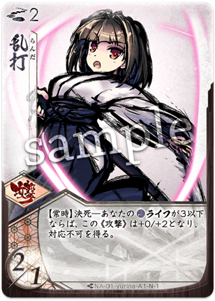
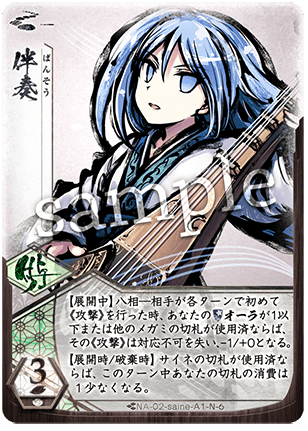
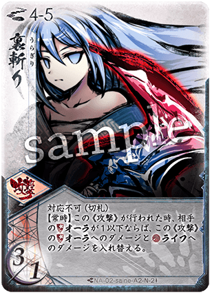
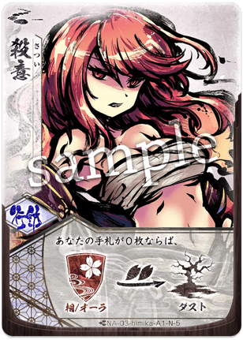
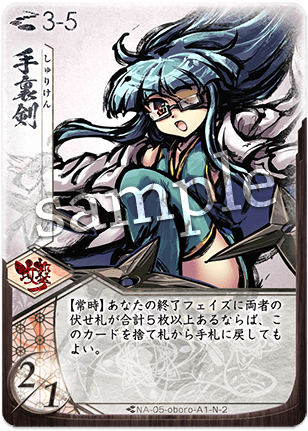

# 初心者への道：入門から決闘者へ

一つのコンセプトを学ぶためにデザインされた、厳選されたペアのカリキュラムです。
各ステップでは、具体的なデッキレシピと立ち回りのガイドを提供します。これらはあくまで一例ですが、そのペアの強みを理解する良い出発点となるでしょう。

## ステップ 1: 目覚め (刀薙 - ユリナ/サイネ)

-   

-   

[ユリナ](../megami/index.md) Cards:

-   

-   

-   

-   

-   

-   

-   

-   

-   

-   

-   

[サイネ](../megami/index.md) Cards:

-   

-   

-   

-   

-   

-   

-   

-   

-   

-   

-   

テーマ: 基礎と攻撃
フォーカスペア: 刀 ([ユリナ](../megami/index.md)) + 薙 ([サイネ](../megami/index.md))
*   コンセプト: [前進](../mechanics/index.md)し、攻撃し、リソース（[オーラ](../mechanics/index.md)/[ライフ](../mechanics/index.md)）管理を学ぶ。
*   なぜ？: [ユリナ](../megami/index.md)は「殴れば強い」という単純明快さを、[サイネ](../megami/index.md)は中距離の安定性と対応（防御）を教えます。合わせて「倒れるまで殴り合う」という、最初のゲームに最適なスタイルになります。
*   重要レッスン: 「[間合](../mechanics/index.md)の管理」。[ユリナ](../megami/index.md)は[間合](../mechanics/index.md)3-4、[サイネ](../megami/index.md)は[間合](../mechanics/index.md)4-5が得意です。この「スイートスポット」に出入りする動きを覚えましょう。

### おすすめデッキ構成
[通常札](../mechanics/index.md):
*   斬 ([ユリナ](../megami/index.md)): 基本攻撃。[間合](../mechanics/index.md)3-4。
*   一閃 ([ユリナ](../megami/index.md)): 高火力攻撃。[間合](../mechanics/index.md)3。
*   柄打ち ([ユリナ](../megami/index.md)): 近距離攻撃＆移動。[間合](../mechanics/index.md)2。
*   薙斬り ([サイネ](../megami/index.md)): 安定した中距離攻撃。[間合](../mechanics/index.md)4-5。
*   八方振り ([サイネ](../megami/index.md)): 条件付きで強力な2回攻撃。[間合](../mechanics/index.md)4-5。
*   見切り ([サイネ](../megami/index.md)): 対応札。相手の攻撃を避ける。
*   圏域 ([サイネ](../megami/index.md)): [前進](../mechanics/index.md)のためのリソース確保。

[切札](../mechanics/index.md):
*   月影落 ([ユリナ](../megami/index.md)): 超必殺技。当たれば勝ち。
*   浦波嵐 ([ユリナ](../megami/index.md)): 強力な防御＆反撃。
*   律動弧戟 ([サイネ](../megami/index.md)): 攻防一体の連撃。

### 立ち回りガイド
1.  序盤: `圏域`などを使いながら[前進](../mechanics/index.md)し、[間合](../mechanics/index.md)4-5を目指します。`薙斬り`で牽制しましょう。
2.  中盤: [間合](../mechanics/index.md)3-4に入り、`斬`や`一閃`で[ライフ](../mechanics/index.md)を削ります。相手の攻撃には`見切り`や`浦波嵐`で対応し、ダメージを最小限に抑えます。
3.  終盤: 相手の[ライフ](../mechanics/index.md)が残り少なくなったら、[フレア](../mechanics/index.md)（気）を消費して`月影落`を叩き込みましょう。[ユリナ](../megami/index.md)の[ライフ](../mechanics/index.md)が3以下（[決死](../mechanics/index.md)）になると攻撃が強化されるので、ピンチはチャンスです。

---

## ステップ 2: 平衡 (刀扇 - ユリナ/トコヨ)

-   

-   

[ユリナ](../megami/index.md) Cards:

-   

-   

-   

-   

-   

-   

-   

-   

-   

-   

-   

[トコヨ](../megami/index.md) Cards:

-   

-   

-   

-   

-   

-   

-   

-   

-   

-   

テーマ: 攻防のバランス
フォーカスペア: 刀 ([ユリナ](../megami/index.md)) + 扇 ([トコヨ](../megami/index.md))
*   コンセプト: 防御とカウンターを学ぶ。
*   なぜ？: [トコヨ](../megami/index.md)は「対応」（攻撃された時に使うカード）の概念を導入します。ただ殴るだけでなく、守ることも覚えます。
*   重要レッスン: 「リソース効率」。全力攻撃して隙をさらすのではなく、[トコヨ](../megami/index.md)の強力な[切札](../mechanics/index.md)（久遠ノ花）のために[フレア](../mechanics/index.md)を残す動きを学びます。

### おすすめデッキ構成
[通常札](../mechanics/index.md):
*   斬 ([ユリナ](../megami/index.md)): 基本攻撃。
*   一閃 ([ユリナ](../megami/index.md)): 高火力攻撃。
*   居合 ([ユリナ](../megami/index.md)): 全力攻撃。高いダメージ。
*   梳流し ([トコヨ](../megami/index.md)): [境地](../mechanics/index.md)（[集中力](../mechanics/index.md)2）で山札に戻る攻撃。リソース維持に役立つ。
*   雅打ち ([トコヨ](../megami/index.md)): 対応攻撃。相手の攻撃を無効化しつつ反撃。
*   詩舞 ([トコヨ](../megami/index.md)): 回避＆移動。
*   要返し ([トコヨ](../megami/index.md)): 山札回復＆対応。

[切札](../mechanics/index.md):
*   月影落 ([ユリナ](../megami/index.md)): 決定打。
*   久遠ノ花 ([トコヨ](../megami/index.md)): 最強クラスの防御＆攻撃。
*   無窮ノ風 ([トコヨ](../megami/index.md)): 相手の手札を捨てさせる攻撃。

### 立ち回りガイド
1.  [境地](../mechanics/index.md): [トコヨ](../megami/index.md)を使う時は「[集中力](../mechanics/index.md)」を2に保つ「[境地](../mechanics/index.md)」状態を意識しましょう。これにより`梳流し`や`雅打ち`が真価を発揮します。
2.  カウンター: 自分から攻めるだけでなく、相手が攻撃してきたところに`雅打ち`を合わせる「待ち」の戦術を練習します。
3.  鉄壁: 危ない時は`久遠ノ花`で確実にターンを生き延び、返しに`月影落`や`一閃`で反撃して勝利を掴みます。

---

## ステップ 3: 制御 (薙扇 - サイネ/トコヨ)

-   

-   

[サイネ](../megami/index.md) Cards:

-   

-   

-   

-   

-   

-   

-   

-   

-   

-   

-   

[トコヨ](../megami/index.md) Cards:

-   

-   

-   

-   

-   

-   

-   

-   

-   

-   

テーマ: 忍耐とカウンター
フォーカスペア: 薙 ([サイネ](../megami/index.md)) + 扇 ([トコヨ](../megami/index.md))
*   コンセプト: 攻撃せずに勝つ（コントロール）。
*   なぜ？: どちらも防御と「待ち」が得意です。相手のミスを待ち、[サイネ](../megami/index.md)の対応や・[トコヨ](../megami/index.md)の[境地](../mechanics/index.md)で返り討ちにする戦術です。
*   重要レッスン: 「待ちの姿勢」。鉄壁の[オーラ](../mechanics/index.md)で相手のリソースを枯渇させ、相手が息切れした瞬間に反撃します。

### おすすめデッキ構成
[通常札](../mechanics/index.md):
*   薙斬り ([サイネ](../megami/index.md)): メイン攻撃。
*   八方振り ([サイネ](../megami/index.md)): カウンター時の爆発力。
*   見切り ([サイネ](../megami/index.md)): 対応。
*   梳流し ([トコヨ](../megami/index.md)): 継続的な攻撃手段。
*   雅打ち ([トコヨ](../megami/index.md)): 強力な対応攻撃。
*   要返し ([トコヨ](../megami/index.md)): デッキ回復。長期戦用。
*   風舞台 ([トコヨ](../megami/index.md)): [間合](../mechanics/index.md)コントロール。

[切札](../mechanics/index.md):
*   律動弧戟 ([サイネ](../megami/index.md)): 攻防一体。
*   久遠ノ花 ([トコヨ](../megami/index.md)): 絶対防御。
*   無窮ノ風 ([トコヨ](../megami/index.md)): 相手のリソース破壊。

### 立ち回りガイド
1.  [間合](../mechanics/index.md)維持: 相手が嫌がる[間合](../mechanics/index.md)（主に4-5）を維持し続けます。`風舞台`や`見切り`で相手の得意な[間合](../mechanics/index.md)に行かせないようにします。
2.  リソース差: `梳流し`でコツコツ攻撃しつつ、相手の大技は`久遠ノ花`や`雅打ち`で完封します。焦って攻める必要はありません。
3.  [八相](../mechanics/index.md)の爆発: 相手が攻め疲れてこちらの[オーラ](../mechanics/index.md)が減った時（[八相](../mechanics/index.md)状態）、`八方振り`などの強化されたカードで一気に逆転します。

---

## ステップ 4: 距離 (銃扇 - ヒミカ/トコヨ)

-   

-   

[ヒミカ](../megami/index.md) Cards:

-   

-   

-   

-   

-   

-   

-   

-   

-   

[トコヨ](../megami/index.md) Cards:

-   

-   

-   

-   

-   

-   

-   

-   

-   

-   

テーマ: ゾーニングと射程支配
フォーカスペア: 銃 ([ヒミカ](../megami/index.md)) + 扇 ([トコヨ](../megami/index.md))
*   コンセプト: 遠距離から一方的に殴る。
*   なぜ？: [ヒミカ](../megami/index.md)は[間合](../mechanics/index.md)8（スナイパー）から攻撃します。相手が近づこうとする間、ずっと攻撃し続けられます。
*   重要レッスン: 「引き撃ち（Kiting）」。効果的な「[後退](../mechanics/index.md)」を行い、相手を寄せ付けずに[ライフ](../mechanics/index.md)を削り取る動きです。

### おすすめデッキ構成
[通常札](../mechanics/index.md):
*   シュート ([ヒミカ](../megami/index.md)): 遠距離基本攻撃。
*   ラピッドファイア ([ヒミカ](../megami/index.md)): [連火](../mechanics/index.md)（3枚目以降）で強力な攻撃。
*   マグナムカノン ([ヒミカ](../megami/index.md)): 相手の[ライフ](../mechanics/index.md)を削る。
*   バックステップ ([ヒミカ](../megami/index.md)): [後退](../mechanics/index.md)しつつドロー。距離を取る要。
*   バックドラフト ([ヒミカ](../megami/index.md)): 次の攻撃を強化＆相手のリソース縮小。
*   詩舞 ([トコヨ](../megami/index.md)): [後退](../mechanics/index.md)対応。
*   風舞台 ([トコヨ](../megami/index.md)): 大幅な距離確保。

[切札](../mechanics/index.md):
*   レッドバレット ([ヒミカ](../megami/index.md)): コスト0の追撃。
*   クリムゾンゼロ ([ヒミカ](../megami/index.md)): 最後の詰め。近距離でも戦える保険。
*   久遠ノ花 ([トコヨ](../megami/index.md)): 近づかれた時の切り札。

### 立ち回りガイド
1.  先制攻撃: 初手から`シュート`や`ラピッドファイア`で攻撃します。[ヒミカ](../megami/index.md)は「[連火](../mechanics/index.md)」により、1ターンに3枚カードを使うと強くなります。
2.  徹底的な拒絶: 相手が[前進](../mechanics/index.md)してきたら、`バックステップ`、`詩舞`、`風舞台`を駆使して、強引に元の遠距離（[間合](../mechanics/index.md)7-9）へ戻します。
3.  近中距離のカバー: もし近づかれても、[トコヨ](../megami/index.md)の要素（`雅打ち`など）や`クリムゾンゼロ`で迎撃できるのがこのペアの強みです。

---

## ステップ 5: 嵐 (薙銃 - サイネ/ヒミカ)

-   

-   

[サイネ](../megami/index.md) Cards:

-   

-   

-   

-   

-   

-   

-   

-   

-   

-   

-   

[ヒミカ](../megami/index.md) Cards:

-   

-   

-   

-   

-   

-   

-   

-   

-   

テーマ: アグロ・コンボ (赤と青)
フォーカスペア: 薙 ([サイネ](../megami/index.md)) + 銃 ([ヒミカ](../megami/index.md))
*   コンセプト: 多角的な攻撃の嵐。
*   なぜ？: [ヒミカ](../megami/index.md)が遠距離から弾幕を張り、近づいてきたところを[サイネ](../megami/index.md)が迎撃します。「二段構え」の攻撃です。
*   重要レッスン: 「バーストダメージ」。手札を溜め込み、一気に吐き出して大ダメージを与える「リーサルターン」の作り方を学びます。

### おすすめデッキ構成
[通常札](../mechanics/index.md):
*   薙斬り ([サイネ](../megami/index.md)): 中距離攻撃。
*   八方振り ([サイネ](../megami/index.md)): 爆発力担当。
*   シュート ([ヒミカ](../megami/index.md)): 遠距離牽制。
*   ラピッドファイア ([ヒミカ](../megami/index.md)): 主力火力。
*   バックステップ ([ヒミカ](../megami/index.md)): 手札調整＆移動。
*   バックドラフト ([ヒミカ](../megami/index.md)): コンボ始動パーツ。
*   見切り ([サイネ](../megami/index.md)): 防御。

[切札](../mechanics/index.md):
*   スカーレットイマジン ([ヒミカ](../megami/index.md)): カードを大量に引く。コンボの着火剤。
*   レッドバレット ([ヒミカ](../megami/index.md)): 火力の底上げ。
*   律動弧戟 ([サイネ](../megami/index.md)): 対応＆追撃。

### 立ち回りガイド
1.  セットアップ: 序盤は適度に攻撃しつつ、手札と[フレア](../mechanics/index.md)を整えます。`スカーレットイマジン`を使う準備をしましょう。
2.  バーストターン: 準備ができたら`スカーレットイマジン`発動。大量の手札から`バックドラフト`→`ラピッドファイア`→`薙斬り`など、[ヒミカ](../megami/index.md)と[サイネ](../megami/index.md)の攻撃を連続で叩き込みます。
3.  レンジスイッチ: 遠距離から始めて、カードの効果で自然と距離が縮まり、最後は[サイネ](../megami/index.md)の`薙斬り`の[間合](../mechanics/index.md)でフィニッシュする流れるような連携を目指します。

---

## ステップ 6: 衝撃 (刀忍 - ユリナ/オボロ)

-   

-   

[ユリナ](../megami/index.md) Cards:

-   

-   

-   

-   

-   

-   

-   

-   

-   

-   

-   

[オボロ](../megami/index.md) Cards:

-   

-   

-   

-   

-   

-   

-   

-   

-   

-   

テーマ: セットプレイと処刑
フォーカスペア: 刀 ([ユリナ](../megami/index.md)) + 忍 ([オボロ](../megami/index.md))
*   コンセプト: [設置](../mechanics/index.md)・誘導・必殺。
*   なぜ？: [オボロ](../megami/index.md)はカードを伏せて「[設置](../mechanics/index.md)」します。これが後のターンに発動し、[ユリナ](../megami/index.md)の攻撃と合わさって大ダメージになります。
*   重要レッスン: 「セットアップ」。カードを伏せるのは「何もしない」のではなく、「未来への投資」であることを学びます。

### おすすめデッキ構成
[通常札](../mechanics/index.md):
*   斬 ([ユリナ](../megami/index.md)): 基本攻撃。
*   一閃 ([ユリナ](../megami/index.md)): 必殺の一撃。
*   柄打ち ([ユリナ](../megami/index.md)): 近距離での手数。
*   鋼糸 ([オボロ](../megami/index.md)): [設置](../mechanics/index.md)対応攻撃。
*   影菱 ([オボロ](../megami/index.md)): [設置](../mechanics/index.md)でハンデス（手札破壊）＆ダメージ。
*   忍歩 ([オボロ](../megami/index.md)): [設置](../mechanics/index.md)で[間合](../mechanics/index.md)操作。
*   誘導 ([オボロ](../megami/index.md)): [設置](../mechanics/index.md)で相手の[オーラ](../mechanics/index.md)を剥がす。

[切札](../mechanics/index.md):
*   月影落 ([ユリナ](../megami/index.md)): フィニッシャー。
*   熊介 ([オボロ](../megami/index.md)): 全力攻撃。[設置](../mechanics/index.md)カードを一斉に起動。
*   鳶影 ([オボロ](../megami/index.md)): 任意の[設置](../mechanics/index.md)カードを使用済みにできる再利用札。

### 立ち回りガイド
1.  [設置](../mechanics/index.md)（Set）: 手札の`鋼糸`や`影菱`を伏せて「[設置](../mechanics/index.md)」します。これで次の相手ターンや自分のターン開始時に自動的に攻撃が発動します。
2.  誘導と月影: `誘導`を[設置](../mechanics/index.md)しておけば、相手の[オーラ](../mechanics/index.md)を強制的に剥がせます。[オーラ](../mechanics/index.md)が薄くなった相手に、本命の`月影落`や`一閃`をクリーンヒットさせましょう。
3.  必殺コンボ: 攻撃が重なると、相手は対応しきれません。[設置](../mechanics/index.md)攻撃が発動するターンに合わせて、手札からの攻撃も重ねる「ビッグターン」を作りましょう。

---

## ステップ 7: 戦略 (忍傘 - オボロ/ユキヒ)

-   

-   

[オボロ](../megami/index.md) Cards:

-   

-   

-   

-   

-   

-   

-   

-   

-   

-   

[ユキヒ](../megami/index.md) Cards:

-   

-   

-   

-   

-   

-   

-   

-   

-   

テーマ: 柔軟性と適応
フォーカスペア: 忍 ([オボロ](../megami/index.md)) + 傘 ([ユキヒ](../megami/index.md))
*   コンセプト: その場でプランを変える。
*   なぜ？: [ユキヒ](../megami/index.md)は傘の[開閉](../mechanics/index.md)で、[オボロ](../megami/index.md)は[設置](../mechanics/index.md)で、あらゆる[間合](../mechanics/index.md)に対応できます。操作は難しいですが、創造的なプレイが可能です。
*   重要レッスン: 「モード切替」。1枚のカードが状況によって複数の意味を持つことを理解します。

### おすすめデッキ構成 (壬蔓はらりゆき型)
[通常札](../mechanics/index.md):
*   鋼糸 ([オボロ](../megami/index.md)): 基本[設置](../mechanics/index.md)攻撃。
*   忍歩 ([オボロ](../megami/index.md)): 位置取り。
*   しこみび/ねぐら ([ユキヒ](../megami/index.md)): 攻防の要。
*   ふりはらい/たぐりよせ ([ユキヒ](../megami/index.md)): [間合](../mechanics/index.md)操作。
*   かさまわし ([ユキヒ](../megami/index.md)): 傘の[開閉](../mechanics/index.md)操作。
*   ひきあし/もぐりこみ ([ユキヒ](../megami/index.md)): 移動。
*   影菱 ([オボロ](../megami/index.md)): 相手への妨害。

[切札](../mechanics/index.md):
*   壬蔓 ([オボロ](../megami/index.md)): [設置](../mechanics/index.md)カードの再利用＆コスト軽減。
*   はらりゆき ([ユキヒ](../megami/index.md)): メイン火力。回して何度も撃つ。
*   くるりみ ([ユキヒ](../megami/index.md)): 防御＆傘操作。

### 立ち回りガイド
1.  傘の[開閉](../mechanics/index.md): [ユキヒ](../megami/index.md)のカードは傘が開いているか閉じているかで効果が変わります。`かさまわし`などで状態を管理し、必要な効果を引き出しましょう。
2.  クロックパーミッション: `壬蔓`を使って`はらりゆき`を何度も再利用する戦術が強力です。中距離を維持し、毎ターンのように攻撃を飛ばします。
3.  変幻自在: 相手が近づいてきたら「閉じた傘」で近距離戦、離れたら「開いた傘」で中距離戦と、相手の苦手な土俵で戦い続けましょう。

---

## ステップ 8: 撹乱 (薙書 - サイネ/シンラ)

-   

-   

[サイネ](../megami/index.md) Cards:

-   

-   

-   

-   

-   

-   

-   

-   

-   

-   

-   

[シンラ](../megami/index.md) Cards:

-   

-   

-   

-   

-   

-   

-   

-   

-   

テーマ: メタゲーム
フォーカスペア: 薙 ([サイネ](../megami/index.md)) + 書 ([シンラ](../megami/index.md))
*   コンセプト: [ライフ](../mechanics/index.md)ではなく、プレイヤーを攻める。
*   なぜ？: [シンラ](../megami/index.md)は相手の山札や手札を操作します。相手の手を封じ、[サイネ](../megami/index.md)で確実に仕留めます。
*   重要レッスン: 「情報アドバンテージ」。相手が「何ができないか」を知ることは、ダメージを与えることと同じくらい価値があります。

### おすすめデッキ構成 (森羅判証型)
[通常札](../mechanics/index.md):
*   薙斬り ([サイネ](../megami/index.md)): メイン攻撃。
*   衝音晶 ([サイネ](../megami/index.md)): 対応不可攻撃。
*   壮語 ([シンラ](../megami/index.md)): 相手の攻撃を牽制。
*   引用 ([シンラ](../megami/index.md)): 相手の山札を伏せ札にする（デッキ破壊）。
*   詭弁 ([シンラ](../megami/index.md)): 相手の付与札などに干渉。
*   立論 ([シンラ](../megami/index.md)): ドロー＆プランニング。
*   反論 ([シンラ](../megami/index.md)): 相手の攻撃を無効化。

[切札](../mechanics/index.md):
*   森羅判証 ([シンラ](../megami/index.md)): 究極の盤面支配。付与札がある限り攻撃が強化。
*   律動弧戟 ([サイネ](../megami/index.md)): フィニッシャー。
*   完全論破 ([シンラ](../megami/index.md)): 相手の切り札すら封じる可能性があります。

### 立ち回りガイド
1.  論破: `反論`や`壮語`を使って、相手のプランを崩します。相手がやりたいことをさせないことで、ペースを握ります。
2.  森羅判証: [切札](../mechanics/index.md)`森羅判証`を展開すると、盤面に「付与札」があるだけでダメージが発生するようになります。[サイネ](../megami/index.md)の`衝音晶`などの「付与」要素のある攻撃が、凶悪な確定ダメージソースに変わります。
3.  詰み: 相手は攻撃しても無効化され、守ろうとしても固定ダメージで削られるという「詰み」の状況を作り出しましょう。

---
次のステップへ:
これらすべてのペアを試した時、あなたはもう初心者ではありません。自分だけのオリジナルのペアを見つけ、[眼前構築](../mechanics/flow.md)（相手を見てからデッキを組む）の深淵へと足を踏み入れましょう。
