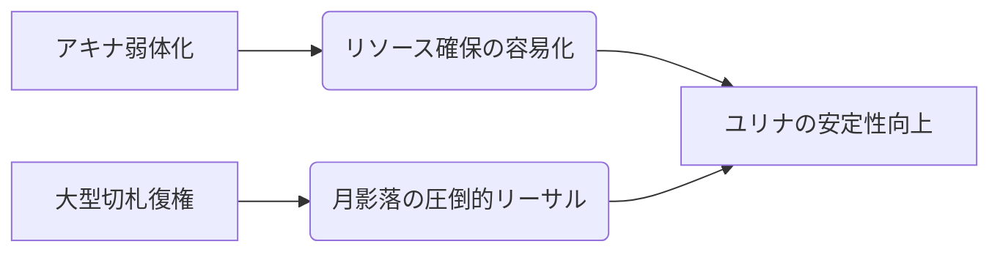

# ユリナ

  
  

    
【刀】ユリナ / Season 10

    

      難易度: ★☆☆☆☆
      [間合](../rules.md#range): 3-4
      タイプ: ビートダウン
      S10 Meta: Tier 1 (Center)
    

  

## S10 環境分析

> [!CAUTION]
> **初心者が陥る致命的な罠**
> - **無計画な[決死](../rules.md#kesshi)**: [ライフ](../rules.md#life)3は敵のキルゾーン。対応札（浦波嵐・浮舟宿）が手元にない状態での[決死](../rules.md#kesshi)入りは敗北。
> - **[フレア](../rules.md#flare)の浪費**: 『月影落』(7)の圧力を失うことは、ユリナの勝率を50%捨てることに等しい。

## 戦略的タイムライン

### Phase 1: 開幕 (Turn 1-2)
- **目的**: [フレア](../rules.md#flare)の種を蒔き、[間合](../rules.md#range)3-4へ潜り込む。
- **推奨挙動**: 
    - [宿し](../rules.md#yadoshi) > [前進](../rules.md#advance)
    - 相手の[2/1]攻撃を[ライフ](../rules.md#life)で受け、[フレア](../rules.md#flare)転換。

### Phase 2: 中盤 (Turn 3-5)
- **目的**: 相手の[オーラ](../rules.md#aura)を『斬』『圧気』で剥がし、[ライフ](../rules.md#life)4-5へ追い込む。
- **決戦準備**: [ライフ](../rules.md#life)4付近で[集中力](../rules.md#focus)2を維持し、いつでも[決死](../rules.md#kesshi)からリーサルを狙える構えを取る。

### Phase 3: 終盤 (リーサル)
- **目的**: 『月影落』または『天音揺波の底力』による強制決着。
- **コンボ**: `足捌き(3→2) > 居合[決死] (4/3) > 月影落 (8/4)` - 合計[ライフ](../rules.md#life)貫通力絶大。

## [通常札](../rules.md)性能マトリクス

| カード名 | 主な役割 | 通常時 | [決死](../rules.md#kesshi)時 | S10 特記事項 |
| :--- | :--- | :---: | :---: | :--- |
| [**斬**](cards.md#斬) | 主力削り | 3/1 | 3/2 | 基本性能の高さ。 |
| [**一閃**](cards.md#一閃) | [ライフ](../rules.md#life)奪取 | 2/2 | 3/3 | **リーサルパーツ**。 |
| [**柄打ち**](cards.md#柄打ち) | 妨害/加速 | 1/1 | 1/1 | **S10: ヒット時集中+1** |
| [**居合**](cards.md#居合) | 防御粉砕 | 3/2 | 4/3 | [足捌き](01_yurina.md#ashisabaki)とのコンボ推奨。 |
| [**足捌き**](cards.md#足捌き) | 位置調整 | 移動 | 移動 | **3→2の潜り込み**に必須。 |
| [**気炎万丈**](cards.md#気炎万丈)| 火力バフ | 強化 | 強化 | 月影落の対応不可領域を拡大. |
| [**圧気**](cards.md#圧気) | リソース破壊 | 納 | 納 | 相手の[オーラ](../rules.md#aura)管理を瓦解させる。 |

## [切札](../rules.md)：必殺の定義

| 名称 | コスト | 種別 | 解説 |
| :--- | :---: | :--- | :--- |
| **月影落** | 7 | 攻撃 | **フィニッシャー**。対応の有無、[ライフ](../rules.md#life)/[オーラ](../rules.md#aura)の択を強要する。 |
| **浦波嵐** | 3 | 対応 | **生命線**。[決死](../rules.md#kesshi)状態を安全に通過するためのクッション。 |
| **浮舟宿** | 2 | 行動 | **リソース補給**。[ダスト](../rules.md#dust)から[オーラ](../rules.md#aura)を増強し、判定勝ちへの導線。 |
| **底力** | 5 | 攻撃 | **逆転札**。最大[5/5]以上の[ライフ](../rules.md#life)ダメージを吐き出す。 |

## アンチメガミ・相性
- **得意**: 防御が薄い、または低速なメガミ（[サイネ](02_saine.md)などとの中距離戦）。
- **苦手**: 遠距離を維持し続ける「レンジロック」（[ハツミ](17_hatsumi.md)・[サリヤ](11_sariya.md)）。
- **対策**: 『足捌き』を全力で回し、1回のチャンスで『月影落』を叩き込む「ワンチャンス」戦術へ移行せよ。
