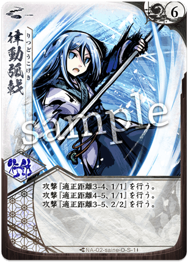

# [サイネ](index.md)

  
  

    <ul>
      <li><strong>権能</strong>: 薙刀 (Naginata)</li>
      <li><strong>難易度</strong>: ★★☆☆☆</li>
      <li><strong>得意[間合](../glossary.md)</strong>: 4-5</li>
    </ul>
  

!!! info "静寂を奏でる、氷の旋律"
    シーズン10（大[切札](../glossary.md)時代）において、[サイネ](index.md)は安定した中距離の覇者として君臨しています。

## 物語の起源：氷雨細音（ひさめ さいね）

> 「調べは静寂の中にこそ響く。あなたの[焦燥](../glossary.md#shousou)、私に奏でさせて」

[サイネ](index.md)の起源は、天音揺波の最良の友であり理解者であった少女、**氷雨細音**です。
名家「氷雨家」の令嬢として生まれた彼女は、規律と洗練を象徴する薙刀を手にしました。揺波の無邪気なまでの剣風を時に戒め、時に見守りながら、彼女もまた独自の[境地](../mechanics.md)へと至ります。
彼女が奏でる「奏鳴（そうめい）」の力は、世界を音色として捉え、歪みを正す力です。揺波と共に「八葉鏡」の儀式を成し遂げた彼女は、その魂をメガミへと昇華させ、奏でる神・[サイネ](index.md)となりました。
彼女のカードが持つ「対応」や「[八相](../glossary.md)」の効果は、静寂の中から生まれる一瞬の閃きと、不屈の精神を表現しています。

## キーワード能力: [八相](../glossary.md) (Hasso)

[サイネ](index.md)を使いこなす上で避けて通れないのが「[八相](../glossary.md)」の管理です。

*   **[八相](../glossary.md)の条件**: 自分の[オーラ](../glossary.md)が**1以下**の時に発動します。
*   **効果の性質**: [通常札](../glossary.md)の攻撃性能が劇的に向上し、追加のドローやリソース獲得が可能になります。
*   **戦略的意味**: 通常のメガミにとって「[オーラ](../glossary.md)が少ない」ことは敗北へのカウントダウンですが、[サイネ](index.md)にとっては「反撃の狼煙」です。相手が防御を固めていても、[八相](../glossary.md)状態の圧倒的なスペックでねじ伏せることができます。

{ .glightbox }

## 本質的な解説

シーズン10（大[切札](../glossary.md)時代）において、[サイネ](index.md)は安定した中距離の覇者として君臨しています。

*   **レンジロックの適性**: [ユキヒ](index.md)や[ヒミカ](index.md)と組み、[間合](../glossary.md)4-5を維持し続ける「レンジロック」戦術において、[サイネ](index.md)の『{ .glightbox }』や『{ .glightbox }』は中核を担います。
*   **対応札の価値向上**: 強力な[切札](../glossary.md)が増えた環境において、攻撃を無効化する『音無砕氷』や、リソースを狂わせる『響鳴共振』の重要度が増しています。

{ .glightbox }

## [通常札](../glossary.md)の一覧

### N1 { .glightbox }

{ align=left width=150 }

**{ .glightbox }**: 主力攻撃 / 牽制

*   **適正[間合](../glossary.md)**: 2-5
*   **ダメージ**: [3/1]
*   **解説**:
    [サイネ](index.md)の代名詞とも言える、非常に広い射程を持つ[通常札](../glossary.md)。中距離戦において、とりあえずこれを振るだけで相手の[オーラ](../glossary.md)を削り、[前進](../mechanics.md)を躊躇わせることができます。[ライフ](../glossary.md)ダメージは1と控えめですが、この「3点[オーラ](../glossary.md)ダメージ」を回避し続けるのは至難の業です。

 

### N2 { .glightbox }

{ align=left width=150 }

**{ .glightbox }**: [ライフ](../glossary.md)破壊 / [八相](../glossary.md)の暴力

*   **通常時**: [2/1]
*   **[八相](../glossary.md)時**: [3/3]
*   **解説**:
    通常時は平凡な性能ですが、[八相](../glossary.md)に入った瞬間に[3/3]という[通常札](../glossary.md)にあるまじき破壊力に変貌します。[サイネ](index.md)の勝利パターンの多くは、終盤に[八相](../glossary.md)状態でこの『{ .glightbox }』を[ライフ](../glossary.md)に叩き込むことで完結します。

 

### N3 { .glightbox }

{ align=left width=150 }

**{ .glightbox }**: フィールド支配 / 接近拒否

*   **解説**:
    展開型の付与札。展開中、相手が特定の[間合](../glossary.md)（主に近距離）へ入ろうとすると、その行動を制限したり、強制的に[間合](../glossary.md)を離したりします（※バージョンにより詳細は異なりますが、基本は拒否設定です）。近距離アグロに対する最大のメタカードとなります。

 

### N4 { .glightbox }

{ align=left width=150 }

**{ .glightbox }**: 資源確保 / [集中力](../glossary.md)調整

*   **解説**:
    自傷や[オーラ](../glossary.md)管理を助ける一枚。[八相](../glossary.md)状態で使用することで、追加ドローや[集中力](../glossary.md)獲得などの恩恵を得ます。攻撃の合間にリソースを補充し、息切れを防ぐための「潤滑油」として機能します。

 

### N5 { .glightbox }

{ align=left width=150 }

**{ .glightbox }**: 移動攻撃 / 距離維持

*   **適正[間合](../glossary.md)**: 3-5
*   **効果**: [2/1]、攻撃後、[間合](../glossary.md)を1つ離す（[後退](../mechanics.md)）。
*   **解説**:
    攻撃しながら得意な[間合](../glossary.md)へと離脱できる、極めて優秀なユーティリティ札。相手が苦労して近づいてきたところにこれを当てて[間合](../glossary.md)を5に戻せば、相手の計算を大きく狂わせることができます。

 

### N6 { .glightbox }

{ align=left width=150 }

**{ .glightbox }**: 防御 / 急所保護

*   **効果**: 対応
*   **解説**:
    相手の致命的なダメージを[オーラ](../glossary.md)に肩代わりさせる、あるいは[ダスト](../glossary.md)から結晶を補充するなどの防御効果を持ちます。[ユリナ](index.md)の『月影落』のような一撃必殺から身を守るための盾であり、これを構えているだけで相手は迂闊な攻撃ができなくなります。

 

### N7 { .glightbox }

{ align=left width=150 }

**{ .glightbox }**: 防御崩し / リソース変換

*   **解説**:
    相手の[オーラ](../glossary.md)にある結晶を[フレア](../glossary.md)へ送る等、相手の「守り」を崩しながら、逆に相手に「使わせたくない[切札](../glossary.md)」を早めさせてしまう（[フレア](../glossary.md)が増えるため）、あるいは自分のリソースに変換するテクニカルな攻撃です。

 

{ .glightbox }

## 切り札の一覧

### S1 律動弧戟

{ align=left width=150 }

**コスト**: 5
**種別**: 攻撃 (連続攻撃)

**解説**:
[1/1][1/1][2/1][2/2]といった、段階的に威力が上がる四連撃（※構成は版により微調整あり）。
[サイネ](index.md)のフィニッシャーその1。相手の[オーラ](../glossary.md)が削れている時に放つことで、最後の数点を一気に削り取ります。[オーラ](../glossary.md)ダメージを刻むため、相手の対応札（ステップなど）を誘発させやすく、本命を通すための「露払い」としても優秀です。

 

### S2 響鳴共振

{ align=left width=150 }

**コスト**: 2
**種別**: 行動

**解説**:
相手のリソースを強制的に変動させる、嫌烈な妨害[切札](../glossary.md)。相手の[フレア](../glossary.md)を奪う、あるいは[オーラ](../glossary.md)を空にするなどの心理的・物理的圧力を与えます。低コストで撃てるため、中盤の立ち回りを優位に進めるために頻用されます。

 

### S3 音無砕氷

{ align=left width=150 }

**コスト**: 2
**種別**: 行動 / 対応

**解説**:
**[サイネ](index.md)の[守護](../glossary.md)神。**
相手の攻撃を「なかったこと」にする強力な打ち消し効果（版により効果範囲は異なりますが、攻撃の無効化が主です）。
相手が全リソースを賭けた一撃をこの一枚で透かした瞬間、勝負の天秤は[サイネ](index.md)に大きく傾きます。

 

### S4 氷雨細音の果ての果て

{ align=left width=150 }

**コスト**: 4
**種別**: 攻撃 (終焉)

**解説**:
特定の条件（[八相](../glossary.md)など）を満たした時に放てる、美しくも残酷な終焉の技。
[ライフ](../glossary.md)への直接打点が高く、相手に「対応」の猶予を与えずに幕を引くためのカードです。『響鳴共振』などで相手のリソースを枯らした後に静かに奏でられます。

 

{ .glightbox }

## おすすめの組み合わせ

### [ユリナ](01_yurina.md) (刀薙)
**「黄金の双璧」**
全方位対応のスタンダード構成。[サイネ](index.md)が外側, [ユリナ](index.md)が内側を担当し、相手を逃がさない。
→ [詳細な攻略（刀薙）](../strategy.md#yurina-saine)

### [シンラ](07_shinra.md) (薙書)
**「論理的完封」**
[サイネ](index.md)の防御カードと[シンラ](index.md)の付与・妨害カードを組み合わせ、相手に「何もさせない」勝利を目指す。
→ [詳細な攻略（薙書）](../strategy.md#saine-shinra)

{ .glightbox }

## 戦術の核心

### 主要アーキタイプ

### 1. レンジロック・コントロール
**「近づけず、削る。」**
[間合](../glossary.md)4-5を絶対防衛圏とし、相手をレンジ（射程）に閉じ込めるスタイル。

*   **基本戦術**:
    1. 『{ .glightbox }』と『{ .glightbox }』で[間合](../glossary.md)を維持。
    2. 相手が近づこうとしたら『{ .glightbox }』や[基本動作](../glossary.md)（[後退](../mechanics.md)）で拒否。
    3. 少しずつ[オーラ](../glossary.md)を削り、[切札](../glossary.md)の連撃で[ライフ](../glossary.md)を奪う。
*   **推奨パートナー**: [ヒミカ](index.md)(銃)、[トコヨ](index.md)(扇)

### 2. [八相](../glossary.md)カウンタービート
**「隙を見せ、刺す。」**
序盤は守りに徹し、あえて[オーラ](../glossary.md)を剥がされた（あるいは自分で[宿し](../mechanics.md)た）後に、[八相](../glossary.md)状態の圧倒的火力で逆転するスタイル。

*   **基本戦術**:
    1. 序盤はリソースを貯める。
    2. [八相](../glossary.md)（[オーラ](../glossary.md)1以下）圏内でターンを迎え、『{ .glightbox }』や強化された[通常札](../glossary.md)を連打。
    { .glightbox }
*   **推奨パートナー**: [ユリナ](index.md)(刀)、[ライラ](index.md)(爪)

{ .glightbox }

## おすすめの組み合わせ

### [ユリナ](01_yurina.md) (刀薙)
**「黄金の双璧」**
全方位対応のスタンダード構成。[サイネ](index.md)が外側、[ユリナ](index.md)が内側を担当し、相手を逃がさない。

### [シンラ](07_shinra.md) (薙書)
**「論理的完封」**
[サイネ](index.md)の防御カードと[シンラ](index.md)の付与・妨害カードを組み合わせ、相手に「何もさせない」勝利を目指す。

### [ユキヒ](06_yukihi.md) (薙傘)
**「氷雪のテンポ盤面」**
[ユキヒ](index.md)の「閉」攻撃で隙を埋めつつ、[間合](../glossary.md)5-7を維持して一方的に殴り続けるミッドレンジ構成。
[サイネ](index.md)のリソース不足を[ユキヒ](index.md)が補い、[八相](../glossary.md)状態の火力を最大限に活かします。

{ .glightbox }

## 戦術の核心

!!! caution "[八相](../glossary.md)の「罠」"
    [八相](../glossary.md)は強力ですが、[オーラ](../glossary.md)1以下であるということは、相手の微々たる攻撃（1/1など）すら[ライフ](../glossary.md)に直撃することを意味します。
    **「[八相](../glossary.md)で攻めるターン」と「[オーラ](../glossary.md)を纏って耐えるターン」を明確に切り替えてください。**
    漫然と[八相](../glossary.md)を維持し続けるのは、自殺行為に等しいです。

!!! tip "対応札で「リズム」を狂わせる"
    [サイネ](index.md)の真価は、自分のターンではなく「相手のターン」にあります。
    相手が「この攻撃を通せば勝てる」と確信した瞬間に『{ .glightbox }』や『音無砕氷』を合わせることで、相手の精神的なリズムを崩すことができます。
    [サイネ](index.md)使いは、常にポーカーフェイスで「対応札を持っているぞ」という無言の圧力をかけ続けてください。
