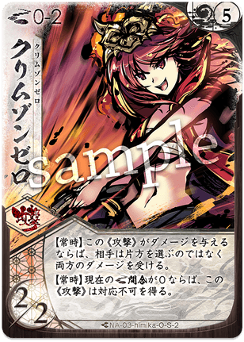

# ヒミカ

  
  

    <ul>
      <li><strong>権能</strong>: 銃 (Gun)</li>
      <li><strong>難易度</strong>: ★★☆☆☆</li>
      <li><strong>得意[間合](../mechanics.md#range)</strong>: 5-10</li>
    </ul>
  

!!! info "彼方より降り注ぐ、紅蓮の弾丸"
    シーズン10においても、中距離・遠距離の支配力は健在であり、特定のペア（銃鎌など）では[眼前構築](../mechanics.md#construction)段階で規制されるほどの爆発力を誇ります。

## 物語の起源：ヒミカ

> 「情熱は弾丸となって、天をも焦がすのよ！」

ヒミカは、かつて銃を手に戦場の空を駆けた熱き魂の具現です。
彼女の起源は、飽くなき好奇心と「速さ」への渇望にあります。彼女が操る紅蓮の銃火は、単なる破壊の道具ではなく、停滞した世界を打ち破るための情熱の輝きです。
物語において、彼女は自由奔放な性格で場をかき乱しながらも、ここぞという場面で決定的な一撃を放つ、頼もしき（あるいは恐ろしき）突破口となります。
彼女の「[連火](../mechanics.md#renka)」は、その溢れんばかりの情熱が連続した閃光となり、相手を圧倒する様を表現しています。

## キーワード能力: [連火](../mechanics.md#renka) (Renka)

ヒミカの銃撃は、重ねるほどに鋭さを増します。

*   **[連火](../mechanics.md#renka)の条件**: このターン中に、このカードを含めて**3枚目以降**のカード（[通常札](../mechanics.md)・[切札](../mechanics.md)を問わず）を使用している時に発動します。
*   **効果の性質**: ダメージの増加、追撃の発生、リソースの再利用などが可能になります。
*   **戦略的意味**: ヒミカの運用は「いかにして手札を溜め込み、1つのターンに爆発させるか」に集約されます。1ターンに2〜3枚のカードを使うのは当たり前、時には5枚以上のカードを叩き込み、一気に[ライフ](../mechanics.md#life)を削り取ります。

---

## 本質的な解説

シーズン10（大[切札](../mechanics.md)時代）において、ヒミカは「速攻の象徴」としての地位を確立しています。

*   **規制の中心**: ヒミカと[ウツロ](13_utsuro.md)の組み合わせにおける『レッドバレット』は、そのあまりの理不尽な打点効率から継続的に規制対象となっています。
*   **大型[切札](../mechanics.md)へのカウンター**: 相手が重量級の[切札](../mechanics.md)を準備するためにリソースを貯めている隙に、圧倒的な手数でゲームを終わらせるアンチ・メタとしての役割も担います。

---

## [通常札](../mechanics.md)の一覧

### N1 { .glightbox }

{ align=left width=150 }

役割: 基本攻撃 / 削り

*   **適正[間合](../mechanics.md#range)**: 1-10
*   **ダメージ**: [2/1]
*   **解説**:
    銃でありながら至近距離までカバーする驚異的な汎用札。ダメージは標準的ですが、適正[間合](../mechanics.md#range)の広さゆえに腐ることがありません。[連火](../mechanics.md#renka)のカウント稼ぎとしても重宝し、あらゆる局面で初手として投げやすい一枚です。

 

### N2 { .glightbox }

{ align=left width=150 }

役割: 連続攻撃 / [連火](../mechanics.md#renka)の主役

*   **適正[間合](../mechanics.md#range)**: 5-8
*   **ダメージ**: [2/1]
*   **[連火](../mechanics.md#renka)時**: 【[連火](../mechanics.md#renka)】もう一度このカードを使用する（※版により調整あり）。
*   **解説**:
    一発の重みではなく、数で圧倒する弾幕。[連火](../mechanics.md#renka)条件を満たすことで実質的な手札消費なしでの二連撃が可能になります。相手の[オーラ](../mechanics.md#aura)を剥ぎ取り、本命の「マグナムカノン」への道を作ります。

 

### N3 { .glightbox }

{ align=left width=150 }

役割: フィニッシャー / 重量弾

*   **適正[間合](../mechanics.md#range)**: 5-8
*   **ダメージ**: [3/2]
*   **解説**:
    [通常札](../mechanics.md)としては最高クラスのダメージ効率を持つ。相手に[ライフ](../mechanics.md#life)受けを強要させる重い弾丸です。ヒミカのターンにおいて、これが何発飛んでくるか（再利用手段の有無）が勝敗の分かれ目となります。

 

### N4 { .glightbox }

{ align=left width=150 }

役割: 範囲制圧 / 大火力

*   **適正[間合](../mechanics.md#range)**: 5-10
*   **ダメージ**: [3/1]
*   **[連火](../mechanics.md#renka)時**: [オーラ](../mechanics.md#aura)・[ライフ](../mechanics.md#life)・[フレア](../mechanics.md#flare)・[ダスト](../mechanics.md#dust)すべてにダメージ（または追加打点）。
*   **解説**:
    最大射程を持つ。[連火](../mechanics.md#renka)時の追加効果は壮絶で、相手のリソース全体に甚大な被害を及ぼします。

 

### N5 { .glightbox }

{ align=left width=150 }

役割: 移動 / 手札補充

*   **効果**: [間合](../mechanics.md#range)を1つ離し、カードを1枚引く。
*   **解説**:
    攻防一体の潤滑油。自分の得意な遠距離へ逃げながら、連続攻撃に必要なパーツを引き込みます。このカードがあるおかげで、ヒミカは「攻めながら逃げる」ことが可能になっています。

 

### N6 { .glightbox }

{ align=left width=150 }

役割: 火力バフ / [連火](../mechanics.md#renka)サポート

*   **解説**:
    次に使用する攻撃カードを+1/+1強化します。[決死](../mechanics.md#kesshi)を待たずとも高火力を出せるヒミカにとって、このバフを乗せた「マグナムカノン」4/3や「レッドバレット」は、もはや災害レベルの脅威となります。

 

### N7 { .glightbox }

{ align=left width=150 }

役割: 妨害 / 防御削り

*   **解説**:
    相手の[オーラ](../mechanics.md#aura)にある結晶を強制的に排除します。納（なふ）の効果により、一時的に相手の防御を無効化し、後続の銃弾を確実に[ライフ](../mechanics.md#life)へ通すための視界不良を作り出します。

 

---

## 切り札の一覧

### S1 レッドバレット

{ align=left width=150 }

**コスト**: 0
**種別**: 攻撃

**解説**:
**コスト0で放たれる奇跡の[3/1]。**
使用条件（[連火](../mechanics.md#renka)など）はありますが、リソースを消費せずに高いダメージを叩き出せるため、コンボの締めに最適です。対応カードで防がれにくい性質（対応不可付与など）を併せ持つことが多く、確実に[ライフ](../mechanics.md#life)1点を削る「最後の一押し」としてこれ以上のカードはありません。

 

### S2 スカーレットイマジン

{ align=left width=150 }

**コスト**: 3
**種別**: 行動

**解説**:
「追放されたカードを回収する」「山札から大量に引く」といった、常識外れのリソース獲得手段。
この[切札](../mechanics.md)を起点に、本来1ターンで使い切るはずの手札を倍増させ、爆発的なOTKコンボへと繋げます。

 

### S3 ルルララリ

{ align=left width=150 }

**コスト**: 4
**種別**: 攻撃

**解説**:
特殊な勝利条件や、盤面全体への甚大なリソース破壊を企図する戦略的[切札](../mechanics.md)。
使いこなすには相方のメガミとの高度なシナジーが必要ですが、決まった時の破壊力はまさに「破滅の歌」です。

 

### S4 クリムゾンゼロ

{ align=left width=150 }

**コスト**: 5
**種別**: 攻撃 (近距離)

**解説**:
「銃なのになぜか[間合](../mechanics.md#range)0-2で撃てる」という、ヒミカの唯一の弱点であるクリンチ（密着）に対する回答。
相手が「ヒミカなら近づけば安全だ」と油断して懐に入ってきたところに叩き込み、返り討ちにするための秘密兵器です。[ユキヒ](06_yukihi.md)の『ゆらりび』と組み合わせるコンボは「クリムゾンゆらりび」として恐れられています。

 

---

## 戦術の核心

### 主要アーキタイプ

### 1. 遠距離バースト (OTKプラン)
**「触れさせず、沈める。」**
手札を限界まで貯め込み、一気に[間合](../mechanics.md#range)10から5への連続射撃で[ライフ](../mechanics.md#life)を0にする。

*   **基本戦術**:
    1. 序盤は一切攻撃せず、ひたすらドローと[宿し](../mechanics.md#yadoshi)に徹する。
    2. キーパーツ（スカーレットイマジン、バックドラフト、マグナムカノン等）が揃った瞬間に仕掛ける。
    3. 「バックステップ」で適宜距離を離し、相手の反撃レンジ外から一方的に撃つ。
*   **推奨パートナー**: [トコヨ](04_tokoyo.md)(扇)、[サイネ](02_saine.md)(薙)

### 2. 近距離クリムゾン (奇襲プラン)
**「裏をかき、灼き尽くす。」**
相手の接近を利用し、近距離カードと『クリムゾンゼロ』で仕留める変則アグロ。

*   **基本戦術**:
    1. [前進](../mechanics.md#advance)してくる相手を適度に牽制。
    2. 密着状態になった瞬間に、本来不利なはずの[間合](../mechanics.md#range)0-2で高火力[切札](../mechanics.md)を解放。
*   **推奨パートナー**: [ユキヒ](06_yukihi.md)(傘)、[ライラ](12_laila.md)(爪)

---

## おすすめの組み合わせ

### [トコヨ](04_tokoyo.md) (銃扇)
**「完璧なるレンジロック」**
[トコヨ](04_tokoyo.md)の防御力で時間を稼ぎ, ヒミカが理想的な手札を揃えるまで耐える構成。一旦コンボが始まれば、相手に逃げ道はありません。
→ [詳細な攻略（銃扇）](../strategy.md#himika-tokoyo)

### [ユキヒ](06_yukihi.md) (銃傘)
**「全域支配の弾幕」**
遠距離はヒミカ, 中近距離は[ユキヒ](06_yukihi.md)が担当。どの[間合](../mechanics.md#range)にいても死角がない、攻撃特化のペアです。
→ [詳細な攻略（薙銃）](../strategy.md#saine-himika) (※薙銃での運用例)

---

## 戦術ガイド

!!! warning "「[連火](../mechanics.md#renka)」の不発に注意"
    ヒミカの最大の敵は、自分自身の「手札不足」です。
    [連火](../mechanics.md#renka)を狙うあまり、序盤から[通常札](../mechanics.md)を投げすぎて、本命のターンに3枚目のカードが出せない……というミスは致命的です。
    「このターンは準備、次のターンは決戦」というメリハリを意識し、リソースの吐き出し時を正確に見極めてください。

!!! tip "「[間合](../mechanics.md#range)10」はヒミカの聖域"
    ふるよににおいて[間合](../mechanics.md#range)10から攻撃できるメガミは限られています。
    相手が[前進](../mechanics.md#advance)するのに必要な結晶（[オーラ](../mechanics.md#aura)）を「シュート」や「フルバースト」で削り続けることで、相手を「近づくこともできず、リサイクルダメージだけが蓄積する」絶望的な状況（レンジロック）へ追い込むことができます。

!!! question "『フルバースト』の返しに『フルバースト』は撃てるか？"
    銃ミラー（ヒミカ対面）において、後攻1ターン目に相手が『フルバースト』を撃ってきた場合、先攻2ターン目に自分も『フルバースト』を撃ち返すべきでしょうか？
    **答えは「YES（条件付き）」です。**
    お互いに[オーラ](../mechanics.md#aura)が空の状態になりますが、こちらの[ライフ](../mechanics.md#life)が1残る計算なら、[再構成](../mechanics.md#reconstruction)なしでターンが返ってきます。
    この時、[フレア](../mechanics.md#flare)等のリソースが十分で、かつ「このターン中に相手を倒しきれる（8点以上のダメージが見える）」ならば、迷わず撃ち返してリーサルを狙いましょう。
    逆に倒しきれない場合は、自殺行為となるので厳禁です。計算力が試される上級者向けの判断です。
