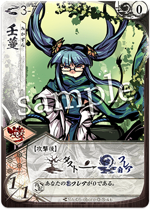

# オボロ

  
  

    <ul>
      <li><strong>権能</strong>: 忍 (Shinobi)</li>
      <li><strong>難易度</strong>: ★★★★☆</li>
      <li><strong>得意[間合](../mechanics.md)</strong>: 2-3</li>
    </ul>
  

!!! info "影より出でて、盤面を攪乱する暗殺の職人"
    シーズン10においても、ユキヒやユリナとの相性は抜群で、バーストダメージの代名詞として恐れられ続けています。

## 物語の起源：オボロ

> 「姿なき影が、死角を貫く。……それが、忍の世界の理だ」

オボロは、影から世界を観測し、必要とあらば音もなく刃を振るう「忍」のメガミです。
彼女の起源は、己を律し続けるストイックな探求心と、目に見えぬ「繋がり」を操る技巧にあります。彼女はメガミでありながらも、人々の営みを冷徹かつ情熱的に観察する生物学者のような一面も持ち合わせています。
物語では、騒がしいメガミたちの間で苦労を背負い込みながらも、徹底した実利主義と深い洞察で事態を収束させる影の立役者となります。
彼女の「[設置](../mechanics.md)」は、事前に仕掛けられた微細な金属糸や緻密な[計略](../mechanics.md)が、時を経て必殺の罠へと変貌する「忍」の卓越した戦闘スタイルを体現しています。

## キーワード能力: [設置](../mechanics.md) (Setchi)

オボロの攻撃は、常に「影」の中から放たれます。

*   **[設置](../mechanics.md)の仕組み**: [通常札](../mechanics.md)を使用する代わりに、手札から「伏せ札」として置きます。
*   **発動タイミング**: **[再構成](../mechanics.md)時**（山札のリシャッフル時）や、**【対応】**によって自分のターン以外で発動することが可能です。
*   **戦略的意味**: [設置](../mechanics.md)されたカードは、その瞬間にコストを支払う必要がなく、後のターンで「手札消費なしでカードをプレイできる」という強力なテンポ・アドバンテージを生みます。

---

## 本質的な解説

シーズン10（大[切札](../mechanics.md)時代）において、オボロは「コンボの接着剤」としての価値を再認識されています。

*   **[フレア](../mechanics.md)供給の要**: [切札](../mechanics.md)『壬蔓（みかづら）』による[フレア](../mechanics.md)サポート能力は、重量級の[切札](../mechanics.md)が多い現代のメタゲームにおいて、相方の火力を底上げするために欠かせない要素となっています。
*   **手札破壊の脅威**: [設置](../mechanics.md)『{ .glightbox }』によるハンデス（手札破壊）は、複雑なコンボを狙う相手の計算を狂わせ、大[切札](../mechanics.md)時代における強力なメタ戦術として機能します。

---

## [通常札](../mechanics.md)の一覧

### N1 { .glightbox }

{ align=left width=150 }

**{ .glightbox }**: 主力攻撃 / [設置](../mechanics.md)コンボ

*   **適正[間合](../mechanics.md)**: 2-4
*   **解説**:
    オボロの基本攻撃。[設置](../mechanics.md)から発動させることで、自分のターン開始時に手札消費なしで[3/1]攻撃を放ちます。これにより、本来1ターンに振れる攻撃の限界を超えた弾数を叩き込むことができます。

 

### N2 { .glightbox }

{ align=left width=150 }

**{ .glightbox }**: 手札破壊 / 妨害

*   **適正[間合](../mechanics.md)**: 2-4
*   **[設置](../mechanics.md)時効果**: ヒット時、相手は手札を1枚選んで捨てる。
*   **解説**:
    オボロを象徴する嫌烈な一枚。[設置](../mechanics.md)から発動し、相手のターン開始時に手札を奪うことで、相手が用意していたコンボや防御プランを台無しにします。

 

### N3 { .glightbox }

{ align=left width=150 }

**{ .glightbox }**: バースト火力 / [設置](../mechanics.md)高打点

*   **適正[間合](../mechanics.md)**: 2-3
*   **解説**:
    [間合](../mechanics.md)は2-3と狭いですが、[3/2]という高い打点を持ちます。[設置](../mechanics.md)からこれを発動させ、手札からの攻撃と合わせることで、1ターンに5〜6点の[ライフ](../mechanics.md)ダメージを狙うバースト・ルートの核となります。

 

### N4 { .glightbox }

{ align=left width=150 }

**{ .glightbox }**: 移動 / 潜入

*   **効果**: [間合](../mechanics.md)を1つ近づける。[設置](../mechanics.md)から発動可能。
*   **解説**:
    [再構成](../mechanics.md)時に自動的に一歩踏み込むことで、手札からの攻撃が届く理想的な位置取りを無償で確保します。

 

### N5 { .glightbox }

{ align=left width=150 }

**{ .glightbox }**: [オーラ](../mechanics.md)奪取 / 距離制御

*   **解説**:
    相手の[オーラ](../mechanics.md)を一つ空にしながら、[間合](../mechanics.md)を近づける（あるいは遠ざける）などの操作を行います。防御を剥ぎ取りながら懐に入る、忍らしい嫌らしい移動札です。

 

### N6 { .glightbox }

{ align=left width=150 }

**{ .glightbox }**: コンボ増幅 / 連続使用

*   **解説**:
    [設置](../mechanics.md)されている、あるいは捨て札にあるカードをコピーして使用します。強力な『{ .glightbox }』を2回放ったり、『{ .glightbox }』を重ねたりすることで、1ターンの火力を限界突破させます。

 

### N7 { .glightbox }

{ align=left width=150 }

**{ .glightbox }**: リソース補充 / [集中力](../mechanics.md)調整

*   **解説**:
    付与札の寿命を延ばしたり、[集中力](../mechanics.md)を得たりと、コンボを成立させるための「最後の一押し」をサポートする補助札です。

 

---

## 切り札の一覧

### S1 壬蔓 (みかづら)

{ align=left width=150 }

**コスト**: 2
**種別**: 行動

**解説**:
**オボロの心臓。**
消費した[フレア](../mechanics.md)を一定条件下で回収する、あるいは再利用するなどの効果により、相方の重い[切札](../mechanics.md)の使用を大幅にサポートします。このカードがあるだけで、本来撃てるはずのない回数の[切札](../mechanics.md)を乱舞させることが可能になります。

 

### S2 鳶影 (とびかげ)

{ align=left width=150 }

**コスト**: 2
**種別**: 行動 / 対応

**解説**:
**「相手のターン中に手札を使う」という禁忌を可能にする札。**
相手が攻撃してきた瞬間に[設置](../mechanics.md)された（あるいは手札の）[通常札](../mechanics.md)を発動させます。相手の攻撃に『{ .glightbox }』でカウンターして手札を破壊したり、『{ .glightbox }』で返り討ちにしたりと、対応の王道を行く一枚です。

 

### S3 虚魚 (うろくず)

{ align=left width=150 }

**コスト**: 3
**種別**: 行動

**解説**:
[設置](../mechanics.md)のバリューを高め、オボロのコンボをより確実なものにするための補助[切札](../mechanics.md)。

 

### S4 熊介 (くますけ)

{ align=left width=150 }

**コスト**: 5
**種別**: 攻撃 (究極奥義)

**解説**:
[設置](../mechanics.md)の枚数に応じて威力が跳ね上がる、オボロの最終兵器。
盤面が整った終盤、影から現れるこの一撃は、どんなに強固な[オーラ](../mechanics.md)も貫き、相手を文字通り粉砕します。

---

## 戦術の核心

### 主要アーキタイプ

### 1. [設置](../mechanics.md)バーストコンボ
**「溜めて、解き放つ。」**
2〜3ターンかけてカードを[設置](../mechanics.md)し、一斉に発動させて一撃でゲームを終わらせるスタイル。

*   **基本戦術**:
    1. 『{ .glightbox }』『{ .glightbox }』を丁寧に[設置](../mechanics.md)に回す。
    2. [再構成](../mechanics.md)の直前のターンにさらに攻撃札を溜める。
    3. [再構成](../mechanics.md)と手札の同時発動により、1ターンに4〜5枚の攻撃を叩き込む。
*   **推奨パートナー**: ユキヒ(傘)、ユリナ(刀)

### 2. 妨害・ハンデス忍
**「奪い、狂わせる。」**
[設置](../mechanics.md)『{ .glightbox }』を『{ .glightbox }』や『鳶影』で繰り返し発動させ、相手にまともなプレイングを許さないコントロールスタイル。

*   **基本戦術**:
    1. 相手のターンの要所で『{ .glightbox }』を発動させる。
    2. 相手の手札を破壊し続け、テンポを奪う。
*   **推奨パートナー**: トコヨ(扇)、サイネ(薙)

---

## おすすめの組み合わせ

### [ユキヒ](06_yukihi.md) (忍傘)
**「通称：みかはらり」**
[設置](../mechanics.md)と[開閉](../mechanics.md)のシナジー。[設置](../mechanics.md)札で相手の[オーラ](../mechanics.md)を剥がし、無防備なところにユキヒの『ゆらりび』を叩き込む黄金コンボ。
→ [詳細な攻略（忍傘）](../strategy.md#oboro-yukihi)

### [ユリナ](01_yurina.md) (刀忍)
**「旋風バースト」**
ユリナの高打点攻撃と、オボロの[設置](../mechanics.md)連撃を組み合わせたゴリ押し構成。1ターンで10点近いダメージを出すことも夢ではありません。
→ [詳細な攻略（刀忍）](../strategy.md#yurina-oboro)

---

## 戦術の核心

!!! caution "[設置](../mechanics.md)の「読み合い」"
    [設置](../mechanics.md)されたカードは相手にも「何かが伏せられている」ことがバレています。
    熟練の相手は、[再構成](../mechanics.md)のタイミング（[設置](../mechanics.md)発動の瞬間）に合わせて防御[切札](../mechanics.md)を構えてきます。
    **あえて攻撃札ではなく「移動」や「強化」を[設置](../mechanics.md)しておく、あるいは[再構成](../mechanics.md)を遅らせるなど、発動タイミングを意図的にズラす柔軟な思考が必要です。**

!!! tip "「壬蔓」こそがオボロの真の力"
    派手な[設置](../mechanics.md)攻撃に目が行きがちですが、オボロの本当の強さは『壬蔓』によるリソース支援にあります。
    相方の[切札](../mechanics.md)を1試合に2回、3回と撃たせることで、オボロ単体では出せない火力を間接的に生み出すのが、賢い忍の戦い方です。
