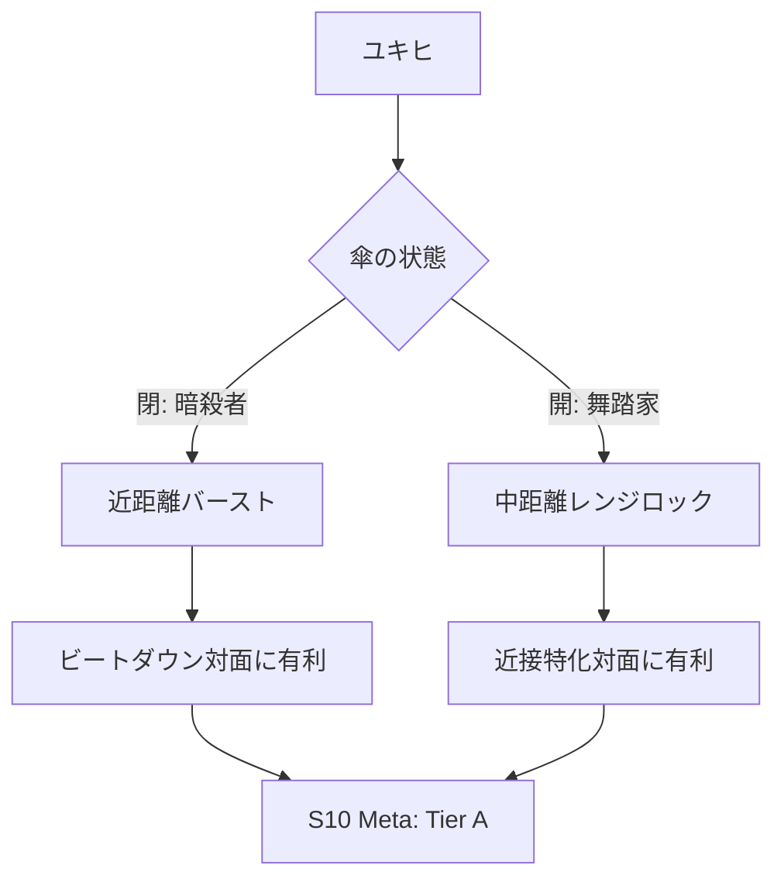

# ユキヒ

  
  

    <ul>
      <li><strong>権能</strong>: 傘 (Umbrella)</li>
      <li><strong>難易度</strong>: ★★★★☆</li>
      <li><strong>得意間合</strong>: 0-2 (閉) / 4-6 (開)</li>
      <li><strong>S10 Meta Tier</strong>: A</li>
    </ul>
  

!!! info "その傘は、盾となり、矛となる"
    相手のメガミやデッキタイプに合わせて、自分が「アグロ（攻撃重視）」になるか「コントロール（防御重視）」になるかを選択できる点が最大の強みです。

---

## 軌跡とSeason 10の環境

ユキヒは、その柔軟性ゆえに「環境に対応する側」のメガミとして長く君臨しています。S10環境においても、特定のメガミに極端に弱いということが少なく、安定した立ち位置を維持しています。

---

## 物語の起源：ユキヒ

> 「開くも閉じるも、私の自由。この傘が紡ぐのは、あなたへの引導よ」

ユキヒは、変幻自在の「傘」を操り、二つの顔を持つメガミです。彼女の起源は、移ろいゆく季節の境界や、物事の「表」と「裏」が交差する瞬間にあります。可憐な少女の如き微笑みの裏に、冷徹な暗殺者の鋭利な牙を隠し持っています。
「[開閉](../rules.md#kaihei)」という力は、彼女が状況に応じて己の在り方（距離感）を峻烈に変え、相手の計算を根底から裏切り続ける「変化」の美学を象徴しています。

---

## 初心者が陥りやすい罠

!!! caution "安易な「しこみび」自傷"
    『しこみび』は[4/3]という強烈な打点を持ちますが、自傷ダメージを伴います。相手のライフがまだ多い序盤に無理に振ると、自分の首を絞めることになります。これは「トドメの一撃」です。

!!! warning "「かさまわし」の使いすぎ"
    『かさまわし』は便利ですが、手札を1枚消費します。目的もなく毎ターン回していると、肝心な時の攻撃札や対応札が足りなくなります。「返しのターン、どちらの形態で耐えるべきか」を逆算して使いましょう。

---

## 戦略的タイムライン

### クリンチ型 (閉重視)
| 局面 | 目標 | 推奨アクション |
| :--- | :--- | :--- |
| **序盤** | 宿し・前進 | 間合2を目指してリソースを蓄える。 |
| **中盤** | 粘着・削り | 『たぐりよせ』で離脱を許さず、『しこみばり』でライフを削る。 |
| **終盤** | リーサル | 『ゆらりび』を叩き込む。 |

### レンジロック型 (開重視)
| 局面 | 目標 | 推奨アクション |
| :--- | :--- | :--- |
| **序盤** | 距離確保 | 『ひきあし』などで間合5-6を維持する。 |
| **中盤** | 牽制・磨耗 | 『ふりまわし』や相方の射撃で相手のオーラを削り続ける。 |
| **終盤** | 判定/磨耗勝 | リソース差で圧倒し、確実にライフを詰める。 |

---

## カード性能マトリックス

### 通常札 (Normal Cards)
| card | モード | S10 Relevance | 備考 |
| :--- | :--- | :--- | :--- |
| [**しこみばり**](cards.md#しこみばり) | 閉: 攻撃 / 開: 対応 | ★★★★☆ | 攻防の要。ふくみばり(開)のプレッシャーが強い。 |
| [**しこみび**](cards.md#しこみび) | 閉: 打点 / 開: 妨害 | ★★★☆☆ | リーサル用。ねこだまし(開)は間合0での妨害。 |
| [**たぐりよせ**](cards.md#たぐりよせ) | 閉: 吸引 / 開: 拒否 | ★★★★★ | ユキヒをユキヒたらしめる最重要カード。 |
| [**つきさし**](cards.md#つきさし) | 閉: 突進 / 開: 範囲 | ★★★☆☆ | 間合の穴を埋める。 |
| [**かさまわし**](cards.md#かさまわし) | 共通: スイッチ | ★★★★☆ | デッキを回す潤滑油。 |
| [**ひきあし**](cards.md#ひきあし) | 閉: 潜入 / 開: 離脱 | ★★★★☆ | 安全な間合調整に必須。 |
| [**えんむすび**](cards.md#えんむすび) | 共通: 支援 | ★★☆☆☆ | アナザー版や特定ペアでのコンボ用。 |

### 切札 (Trump Cards)
| card | Cost | S10 Evaluation | 備考 |
| :--- | :--- | :--- | :--- |
| **はらりゆき** | 1 | ★★★★★ | **S10強化(射程3-6)**。コスパ最強の1点。 |
| **ゆらりび** | 5 | ★★★★☆ | 相手を「ライフ受け不可」に追い込む絶対的な威圧。 |
| **くるりみ** | 2 | ★★★★☆ | 防御しつつ形態を変えられる。 |
| **ひらりおり** | 3 | ★★★☆☆ | 強力な一撃（月影落など）をスカすための天敵。 |

---

## おすすめの組み合わせ (Pairs)

-   **[オボロ](05_oboro.md) (忍傘)**: 設置と「ゆらりび」が噛み合った、ユキヒの真骨頂。
-   **[ヒミカ](03_himika.md) (銃傘)**: 「クリムゾンゼロ」からの「ゆらりび」コンボ、通称「クリムゾンゆらりび」。
-   **[トコヨ](04_tokoyo.md) (扇傘)**: 鉄壁。精神的な摩耗戦が得意。

---

## 関連リンク
- [全カードリスト](cards.md#yukihi)
- [基本ルール](../rules.md)
