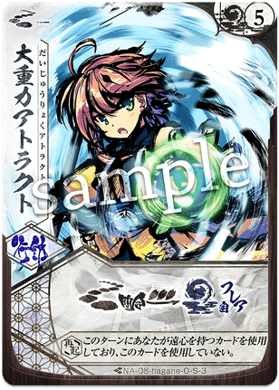

# ハガネ

  
  

    <ul>
      <li><strong>権能</strong>: 槌 (Hammer)</li>
      <li><strong>難易度</strong>: ★★★★☆</li>
      <li><strong>得意[間合](../mechanics.md#range)</strong>: 2-6</li>
    </ul>
  

!!! info "魂を震わせる、[遠心](../mechanics.md#enshin)力の破壊神"
    シーズン10においても、その一撃必殺のパワーは健在で、特に特定の距離から飛び込んでくるバースト火力は、全プレイヤーに「[間合](../mechanics.md#range)管理」の重要性を再認識させます。

## 物語の起源：ハガネ

> 「重さに勝る正義はない。……全力で振り抜く、それだけで十分だ！」

ハガネは、大地の重みと鋼の意思を[宿し](../mechanics.md#yadoshi)た「槌」を振るうメガミです。
彼女の起源は、鍛錬によって培われた不屈の精神と、物事の本質を「叩いて鍛え上げる」直情的な力強さにあります。彼女にとって、策を弄することは不要であり、己の全てを乗せた重い一撃こそが真実です。
物語では、実直で快活、かつ仲間の危機には身を挺して盾となる、頼もしき戦士として描かれます。彼女が振るう大槌は、加速とともに空間そのものを歪ませ、相手が築き上げた浅知恵（防御）を質量によって粉砕します。
「[遠心](../mechanics.md#enshin)」という力は、彼女が限界まで己を加速させ、運動エネルギーを暴力的な質量へと変換して叩きつける、小細工なしの真っ直ぐな戦闘哲学を象徴しています。

## キーワード能力: [遠心](../mechanics.md#enshin) (Enshin)

ハガネの攻撃の真価は、その「勢い」にあります。

*   **[遠心](../mechanics.md#enshin)の条件**: あなたがこのターン中に、[基本動作](../mechanics.md)やカード効果によって合計で**2以上の[間合](../mechanics.md#range)（移動）**を行っている時に発動します。
*   **効果の性質**: ダメージの劇的な増加（例：[3/2]→[5/3]）、ガード不能、リソース破壊などの超強力なバフが付加されます。
*   **戦略的意味**: ハガネのターンは「いかに効率よく2マス動いてから殴るか」というパズルになります。[宿し](../mechanics.md#yadoshi)や[前進](../mechanics.md#advance)をパズルの一部として組み込み、最大加速状態での一撃を常に狙います。

---

## シーズン10における立ち位置

シーズン10（大[切札](../mechanics.md)時代）において、ハガネは「不変のバースト役」として重宝されています。

*   **[オーラ](../mechanics.md#aura)剥ぎのプロ**: 『{ .glightbox }』や『[遠心](../mechanics.md#enshin)撃』により、相手にまとまったダメージを与えながら[オーラ](../mechanics.md#aura)をボロボロにできるため、相方のフィニッシャーを通すための露払いとして非常に優秀です。
*   **環境へのメタ**: 守りを固めるコントロール型のメガミに対し、[遠心](../mechanics.md#enshin)によるガード不能（あるいは高い[オーラ](../mechanics.md#aura)ダメージ）で強引に[ライフ](../mechanics.md#life)を削りにいけるため、膠着状態を打破する力があります。

---

## [通常札](../mechanics.md)解説

### N1 [遠心](../mechanics.md#enshin)撃

{ align=left width=150 }

役割: 最大火力 / ロマン砲

*   **通常時**: [3/2]
*   **[遠心](../mechanics.md#enshin)時**: [5/3]（※版により数値は変動しますが、概ね超強化されます）
*   **解説**:
    ハガネのすべてが詰まった一枚。[遠心](../mechanics.md#enshin)条件を満たした状態で放たれるこの一撃は、[ライフ](../mechanics.md#life)を3点削る「[通常札](../mechanics.md)とは思えない暴力」です。これを当てるために全力で移動し、当てた瞬間がハガネ使いの最高の多幸感となります。

 

### N2 { .glightbox }

{ align=left width=150 }

役割: 牽制 / リソース破壊

*   **[遠心](../mechanics.md#enshin)時**: ヒット時、相手は[オーラ](../mechanics.md#aura)を[ダスト](../mechanics.md#dust)へ送る、あるいは手札を捨てるなどの追加効果。
*   **解説**:
    [遠心](../mechanics.md#enshin)撃を当てるための「前振りの一撃」。相手の[オーラ](../mechanics.md#aura)を削り取り、本命の5/3を通すための道を作ります。

 

### N3 { .glightbox }

{ align=left width=150 }

役割: フィールド操作 / 資源供給

*   **解説**:
    [ダスト](../mechanics.md#dust)から結晶を自分の[オーラ](../mechanics.md#aura)や[フレア](../mechanics.md#flare)に移動させる、あるいは盤面全体を震わせてリソースを再配置する札。ハガネの燃費の悪さを補う重要なエンジンとなります。

 

### N4 { .glightbox }

{ align=left width=150 }

役割: 移動 / 加速装置

*   **解説**:
    **[遠心](../mechanics.md#enshin)成立のためのキーカード。**
    一気に[間合](../mechanics.md#range)を2動かす、あるいは自分のリソースを移動に変えることで、1アクションで[遠心](../mechanics.md#enshin)条件を達成させます。ハガネにとっての「ブースター」です。

 

### N5 { .glightbox }

{ align=left width=150 }

役割: 持続バフ / 連続攻撃

*   **解説**:
    展開中の攻撃札にバフを与える付与札。ハガネの連撃をより重くし、相手の[オーラ](../mechanics.md#aura)受けを許さないプレッシャーを与え続けます。

 

### N6 { .glightbox }

{ align=left width=150 }

役割: 至近距離防御崩し

*   **解説**:
    ハンマーの柄や側面で叩くようなイメージの、近距離攻撃。[遠心](../mechanics.md#enshin)撃が届かない至近距離（[間合](../mechanics.md#range)0-2など）での有効打として、クリンチしてくる相手への回答になります。

 

### N7 { .glightbox }

{ align=left width=150 }

役割: 捕獲 / 拘束

*   **解説**:
    相手を引き寄せる付与札。遠い[間合](../mechanics.md#range)いに逃げようとする相手を強制的にハガネの[間合](../mechanics.md#range)に引き戻し、逃げ場のない処刑場を作り出します。

 

---

## [切札](../mechanics.md)解説

### S1 大嵐

{ align=left width=150 }

**コスト**: 4
**種別**: 攻撃 (大規模)

**解説**:
**すべてをなぎ倒す暴風。**
全メガミ屈指の攻撃範囲と、ヒット時の圧倒的なリソース奪取能力を持ちます。相手の盤面を文字通り「大嵐」のように荒らし尽くし、再起不能なダメージを与えます。

 

### S2 大地が震える

{ align=left width=150 }

**コスト**: 2
**種別**: 行動

**解説**:
地響きを鳴らし、相手の手札や[オーラ](../mechanics.md#aura)に震動を与えるサポート[切札](../mechanics.md)。
低コストで相手のテンポを崩せるため、コンボの起点として汎用性が高いです。

 

### S3 未だ見ぬ明日

{ align=left width=150 }

**コスト**: 5
**種別**: 攻撃 (終焉)

**解説**:
ハガネが限界を超えてハンマーを振り抜く、終焉の技。
判定勝ちを狙う相手の喉元に突きつける、一発逆転の[ライフ](../mechanics.md#life)奪取力を備えています。

---

## 主要アーキタイプ

### 1. [遠心](../mechanics.md#enshin)超火力アグロ
**「三歩進んで、一撃で沈める。」**
移動を繰り返して常に[遠心](../mechanics.md#enshin)条件を維持し、重い攻撃を叩き込み続ける基本スタイル。

*   **基本戦術**:
    1. 『{ .glightbox }』や[宿し](../mechanics.md#yadoshi)、[纏い](../mechanics.md#matoy)を絡めて毎ターン[間合](../mechanics.md#range)2移動を確保。
    2. 加速が乗った『[遠心](../mechanics.md#enshin)撃』と『{ .glightbox }』を交互に叩き込む。
    3. [オーラ](../mechanics.md#aura)が剥がれたところに『大嵐』を投下。
*   **推奨パートナー**: [ライラ](12_laila.md)(爪)、[サリヤ](11_sariya.md)(騎)

### 2. { .glightbox }ロック (拘束プラン)
**「逃がさない、潰すまで。」**
『{ .glightbox }』で相手をハガネの射程圏外へ逃がさず、一方的に槌で叩き潰すスタイル。

*   **基本戦術**:
    1. 『{ .glightbox }』を維持。
    2. 相手が[後退](../mechanics.md#retreat)してもすぐに引き戻し、得意[間合](../mechanics.md#range)で殴り続ける。
*   **推奨パートナー**: [サイネ](02_saine.md)(薙)、[トコヨ](04_tokoyo.md)(扇)

---

## おすすめ of 組み合わせ (Pairs)

### [ライラ](12_laila.md) (槌爪)
**「震災級のバースト力」**
共に移動や手数を武器にする最高に相性の良いペア。移動だけで[ライラ](12_laila.md)のゲージが溜まり、ハガネの[遠心](../mechanics.md#enshin)が成立する。一瞬の隙から[ライフ](../mechanics.md#life)10点を削り切る全メガミ屈指の殺傷能力。

### [サリヤ](11_sariya.md) (槌騎)
**「鋼のエンジン」**
[サリヤ](11_sariya.md)の高速移動によって、ハガネの[遠心](../mechanics.md#enshin)がかつてない容易さで成立。戦場を縦横無尽に駆け抜ける蹂躙ペア。

---

## 戦術の核心

!!! danger "移動リソースの枯渇"
    ハガネは攻撃のために移動を必要としますが、移動（[前進](../mechanics.md#advance)・[後退](../mechanics.md#retreat)）には結晶（[オーラ](../mechanics.md#aura)や[ダスト](../mechanics.md#dust)）が必要です。
    **「[オーラ](../mechanics.md#aura)は移動に使うか、防御に残すか」というジレンマに常に直面します。**
    攻撃に全振して[オーラ](../mechanics.md#aura)0でターンを返すと、返しのワンショットで沈むリスクがあります。

!!! tip "「[遠心](../mechanics.md#enshin)」を見せ札にする"
    あえて1マスだけ動き、[遠心](../mechanics.md#enshin)を成立させないターンを作ることも重要です。
    相手は「次のターンは[遠心](../mechanics.md#enshin)撃が来る」と警戒して余計な[纏い](../mechanics.md#matoy)をしてリソースを消費します。
    その隙に[宿し](../mechanics.md#yadoshi)を行って[フレア](../mechanics.md#flare)を溜め、本命の[切札](../mechanics.md)を撃つ準備を整えるなど、ブラフを交えた立ち回りがハガネの奥深さです。
