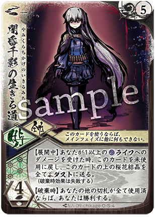

# [チカゲ](index.md)

  
  

    <ul>
      <li><strong>権能</strong>: [毒](../mechanics/glossary.md) (Poison)</li>
      <li><strong>難易度</strong>: ★★★★☆</li>
      <li><strong>得意[間合](../mechanics/glossary.md)</strong>: 1-4</li>
    </ul>
  

!!! info "姿なき凶器、心身を蝕む暗殺の[毒](../mechanics/glossary.md)"
    シーズン10においても、コンボデッキや手札を溜めるデッキに対する強力なアンチ・メタとして、その存在感は際立っています。

## 物語の起源：[チカゲ](index.md)

> 「[毒](../mechanics/glossary.md)は沈黙の中にあり。……あなたが気づいた時には、すべてが終わっているでしょう」

[チカゲ](index.md)は、影の中に潜み、音もなく対象を汚染する「[毒](../mechanics/glossary.md)」のメガミです。
彼女の起源は、戦場を裏から支配しようとする暗殺者の狡猾さと、心身を蝕む「目に見えぬ脅威」としての本質にあります。華やかさとは無縁の冷徹な効率主義者であり、勝利を確実にするためなら手段を選びません。
物語では、雇われの暗殺者や影の工作員として暗躍し、その卓越した[毒](../mechanics/glossary.md)の知識によって強大な敵を内側から崩壊させる恐るべき実力者として描かれます。彼女の振るう刃は肉体を切り裂くだけでなく、魂に消えぬ[毒](../mechanics/glossary.md)を刻み込みます。
「[毒](../mechanics/glossary.md)」という力は、彼女が相手の選択肢を奪い、じわじわと生命力を吸い取っていく「緩やかな死」の恐怖を体現しています。

## キーワード能力: [毒](../mechanics/glossary.md) (Poison)

[チカゲ](index.md)の真髄は、相手を内側から崩壊させることにあります。

*   **[毒](../mechanics/glossary.md)札の仕組み**: [チカゲ](index.md)は5種類の「[毒](../mechanics/glossary.md)」カードを持っています。これらを効果によって相手に渡します。
*   **[毒](../mechanics/glossary.md)の効果**: 
    1. **麻痺[毒](../mechanics/glossary.md)**: 手札にあるだけで[基本動作](../mechanics/glossary.md)を制限する。
    2. **衰弱[毒](../mechanics/glossary.md)**: 使用時に[オーラ](../mechanics/glossary.md)を減らす。
    3. **幻覚[毒](../mechanics/glossary.md)**: [集中力](../mechanics/glossary.md)や山札をランダムに削る。
    4. **弛緩[毒](../mechanics/glossary.md)**: [宿し](../mechanics/index.md)などのプラス動作を封じる。
*   **戦略的意味**: 相手が[毒](../mechanics/glossary.md)を使わずに持っていれば「手札枠を圧迫」し、使えば「自分に不利益な効果」が発生します。相手にとって「どちらを選んでも地獄」という状況を維持するのが[チカゲ](index.md)の基本です。

{ .glightbox }

## シーズン10における立ち位置

シーズン10（大[切札](../mechanics/glossary.md)時代）において、[チカゲ](index.md)は「環境のバランサー」としての地位を確立しています。

*   **大[切札](../mechanics/glossary.md)への間接メタ**: 超重量級の[切札](../mechanics/glossary.md)を準備するために手札を整理したい相手に対し、[毒](../mechanics/glossary.md)を送り込むことでその計画を根底から破壊します。
*   **低速環境での優位性**: 試合が長引くほど、蓄積された[毒](../mechanics/glossary.md)の効果が相手の[ライフ](../mechanics/glossary.md)をじわじわと削り取ります。判定勝ちを狙う相手の計算を狂わせる能力に長けています。

{ .glightbox }

## [通常札](../mechanics/glossary.md)解説

### N1 { .glightbox }

{ align=left width=150 }

**{ .glightbox }**: 削り / 追撃

*   **適正[間合](../mechanics/glossary.md)**: 2-10
*   **ダメージ**: [2/1]
*   **解説**:
    広い射程を持つ[チカゲ](index.md)の基本攻撃。どこにいても[ライフ](../mechanics/glossary.md)1点を確実に削りにいける安定感があります。他の攻撃で相手の[オーラ](../mechanics/glossary.md)を剥がした後のトドメとして多用されます。

 

### N2 [毒](../mechanics/glossary.md)針

{ align=left width=150 }

**{ .glightbox }**: 汚染の起点 / 嫌がらせ

*   **適正[間合](../mechanics/glossary.md)**: 1-3
*   **ダメージ**: [1/1]
*   **効果**: ヒット時、選んだ「[毒](../mechanics/glossary.md)」カード1枚を相手に渡す。
*   **解説**:
    ダメージよりも追加の「[毒](../mechanics/glossary.md)」こそが本命。至近距離での殴り合いの中で、[毒](../mechanics/glossary.md)を一本差し込むだけで、相手の次ターンの動きを大幅に制限できます。

 

### N3 { .glightbox }

{ align=left width=150 }

**{ .glightbox }**: 移動 / 回避

*   **効果**: 対応、[間合](../mechanics/glossary.md)を1つ離す（または近づける）。
*   **解説**:
    忍者らしいトリッキーな移動札。相手の適正[間合](../mechanics/glossary.md)から外れるための防御札として、あるいは自分の攻撃を当てるための位置調整として非常に優秀です。

 

### N4 { .glightbox }

{ align=left width=150 }

**{ .glightbox }**: 暗殺の一撃 / フィニッシャー

*   **適正[間合](../mechanics/glossary.md)**: 2-4
*   **ダメージ**: [4/3]
*   **条件**: 相手に[毒](../mechanics/glossary.md)が一定数たまっている、あるいは特定の状況下で発動。
*   **解説**:
    [チカゲ](index.md)の唯一無二の最大打点。[通常札](../mechanics/glossary.md)でありながら[4/3]という破壊力を持ち、[毒](../mechanics/glossary.md)によって弱りきった相手の息の根を止めるための一撃です。

 

### N5 [毒](../mechanics/glossary.md)霧

{ align=left width=150 }

**{ .glightbox }**: 広域汚染

*   **解説**:
    攻撃せずとも複数の[毒](../mechanics/glossary.md)を相手に送り込む行動札。相手が守りを固めていても関係なく内側を汚染し、「何もさせない」状況を強制的に作り出します。

 

### N6 { .glightbox }

{ align=left width=150 }

**{ .glightbox }**: 極低コスト移動

*   **解説**:
    [基本動作](../mechanics/glossary.md)を消費せずに位置を変えるための潤滑油。[チカゲ](index.md)は近接戦を挑む必要があるため、この1歩が非常に重要になります。

 

### N7 { .glightbox }

{ align=left width=150 }

**{ .glightbox }**: 環境支配 / 拘束

*   **解説**:
    「[前進](../mechanics/index.md)」や「[後退](../mechanics/index.md)」のコストを余計に要求する付与札。相手をハエ叩きのように盤面に釘付けにし、[毒](../mechanics/glossary.md)でじわじわと苦しめるための舞台を作り上げます。

 

{ .glightbox }

## [切札](../mechanics/glossary.md)解説

### S1 滅灯の魂[毒](../mechanics/glossary.md)

{ align=left width=150 }

**コスト**: 2
**種別**: 行動

**解説**:
相手の[フレア](../mechanics/glossary.md)に特別な「[毒](../mechanics/glossary.md)」を仕込み、[切札](../mechanics/glossary.md)の使用を抑制する、あるいは使用時に甚大な被害を与える札。大[切札](../mechanics/glossary.md)時代に対する[チカゲ](index.md)の最大の回答です。

 

### S2 残響の喉笛

{ align=left width=150 }

**コスト**: 4
**種別**: 攻撃

**解説**:
[3/2]程度の安定した打点を持ち、さらに[毒](../mechanics/glossary.md)に関連した追撃やバフを発生させます。中盤のダメージレースを優位に進めるために重宝します。

 

### S3 叛旗の纏[毒](../mechanics/glossary.md)

{ align=left width=150 }

**コスト**: 3
**種別**: 行動

**解説**:
自分の[オーラ](../mechanics/glossary.md)やリソースを[毒](../mechanics/glossary.md)に変換し、爆発的な汚染力を得る札。
短期決戦を狙う際に、相手の手札を一瞬で[毒](../mechanics/glossary.md)塗れにするために使用されます。

 

### S4 闇色の幻影

{ align=left width=150 }

**コスト**: 5
**種別**: 攻撃 (終焉)

**解説**:
幻影の中から放たれる必殺の刃。
相手の[ライフ](../mechanics/glossary.md)が減少しているほど威力を増し、[毒](../mechanics/glossary.md)で弱らせた相手への「情け無用の引導」となります。

{ .glightbox }

## 主要アーキタイプ

### 1. 汚染・ハンデス型 (ロックプラン)
**「[毒](../mechanics/glossary.md)を盛り、思考を止める。」**
相手に[毒](../mechanics/glossary.md)カードを送り続けることを最優先し、相手がコンボを組めないようにする。

*   **基本戦術**:
    1. 『[毒](../mechanics/glossary.md)針』と『[毒](../mechanics/glossary.md)霧』で相手の手札を埋める。
    2. 『{ .glightbox }』で相手の機動力を封じる。
    3. [毒](../mechanics/glossary.md)によるリソースロスを重ねさせ、最後に『{ .glightbox }』で仕留める。
*   **推奨パートナー**: [オボロ](index.md)(忍)、[シンラ](index.md)(書)

### 2. 暗殺アグロ型 (バーストプラン)
**「隙を見せれば、喉を掻き切る。」**
最小限の[毒](../mechanics/glossary.md)で相手の[オーラ](../mechanics/glossary.md)を剥がし、{ .glightbox }や高打点[切札](../mechanics/glossary.md)で早期決着を狙う。

*   **基本戦術**:
    1. 序盤から積極的に[間合](../mechanics/glossary.md)に入り、『[毒](../mechanics/glossary.md)針』で[オーラ](../mechanics/glossary.md)削りと[毒](../mechanics/glossary.md)の両立。
    2. 相手が[毒](../mechanics/glossary.md)の処理に手回っている隙に大打点を叩き込む。
*   **推奨パートナー**: [ユリナ](index.md)(刀)、[ライラ](index.md)(爪)

{ .glightbox }

## おすすめの組み合わせ (Pairs)

### [オボロ](05_oboro.md) (忍[毒](../mechanics/glossary.md))
**「通称：忍者[毒](../mechanics/glossary.md)」**
[設置](../mechanics/glossary.md)『{ .glightbox }』と『[毒](../mechanics/glossary.md)針』の二段構えによるハンデス特化。相手は手札を守るか[オーラ](../mechanics/glossary.md)を守るかの究極の選択を強いられます。

### [トコヨ](04_tokoyo.md) (扇[毒](../mechanics/glossary.md))
**「沈黙の舞奏」**
[トコヨ](index.md)の鉄壁の防御に加え、[チカゲ](index.md)の[毒](../mechanics/glossary.md)が相手の逆転の芽を摘み取る。最も判定勝ちに近い、盤石の壁。

{ .glightbox }

## 戦術の核心

!!! danger "「[毒](../mechanics/glossary.md)」は両刃の剣"
    [毒](../mechanics/glossary.md)を渡すことは強力ですが、渡すためにはカードを使用し、隙を晒す必要があります。
    **[毒](../mechanics/glossary.md)を盛りすぎて自分の手数が足りなくなり、相手を削りきれない「決定力不足」に陥ることがよくあります。**
    [毒](../mechanics/glossary.md)はあくまで手段であり、目的（[ライフ](../mechanics/glossary.md)10点を削る、あるいは判定で上回る）を忘れないでください。

!!! tip "「麻痺[毒](../mechanics/glossary.md)」の適切な投与"
    相手が[前進](../mechanics/index.md)したいデッキなら「麻痺[毒](../mechanics/glossary.md)」を。
    相手がコンボパーツを集めたいなら「幻覚[毒](../mechanics/glossary.md)」を。
    **「今、相手が最も嫌がる[毒](../mechanics/glossary.md)はどれか？」**という解を正確に選ぶことが、[チカゲ](index.md)使いの腕の見せ所です。
