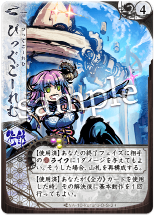
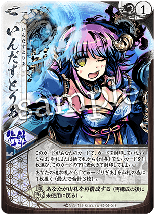

# [クルル](index.md)

  
  

    <ul>
      <li><strong>権能</strong>: 絡繰 (Karakuri / Machine)</li>
      <li><strong>難易度</strong>: ★★★★★</li>
      <li><strong>得意[間合](../mechanics.md)</strong>: 1-10</li>
    </ul>
  

!!! info "理を越えた発明、盤面を支配する絡繰の輝き"
    シーズン10においても、そのピーキーな性能は健在であり、使い手の技量が最も試されるメガミとして愛されています。

## 物語の起源：[クルル](index.md)

> 「{ .glightbox }♪ 発明は爆発なのです！ この世界をまるごと、私の絡繰にして差し上げます！」

[クルル](index.md)は、未知の技術と奇想天外な発想で「絡繰」を創り出す、天才（あるいは狂気）のメガミです。
彼女の起源は、常識を打ち破ろうとする止まらない知的好奇心と、万物を「理論と歯車」で再構築しようとする独創性にあります。彼女にとって、世界の理は難解なパズルのようなものであり、それを解き明かすために自らの発明品を惜しみなく投入します。
物語では、天真爛漫な（しかし周囲を振り回す）トラブルメーカーでありながら、その発明によって不可能を可能にする奇跡の立役者として描かれます。彼女が操るガジェットは、メガミの力さえも「部品」として組み込み、想像を絶する事象を引き起こします。
「[機巧](../mechanics.md)」という力は、彼女がバラバラの事象（カード種別）を緻密に連結させ、巨大な勝利の方程式へと組み上げていく「創造」のプロセスそのものを象徴しています。

## キーワード能力: [機巧](../mechanics.md) (Kiko / Mechanism)

[クルル](index.md)の強さは、彼女の「持ち物（カード種別）」の多様性に依存します。

*   **[機巧](../mechanics.md)の発動条件**: 自分の捨て札、使用済みの[切札](../mechanics.md)、または場にある付与札の中に、指定された**「カード種別（攻撃、行動、付与）」**や**「サブタイプ（対応、全力）」**が存在することで効果が発動します。
*   **戦略的意味**: 手札をただ使うのではなく、「どのカードを先に捨て札に送り、どの[機巧](../mechanics.md)を起動させるか」という緻密なシーケンス（手順）構築が求められます。

---

## シーズン10における立ち位置

シーズン10（大[切札](../mechanics.md)時代）において、[クルル](index.md)は「コンボの頂点」として君臨しています。

*   **大[切札](../mechanics.md)との親和性**: 相方のメガミが持つ強力な大[切札](../mechanics.md)をコピーしたり、再利用したりする能力に長けており、環境を定義するような巨大コンボの起点となります。
*   **機動性の向上**: 『{ .glightbox }』や『{ .glightbox }』といった補助札の調整により、以前よりも柔軟に盤面を構築できるようになっています。

---

## [通常札](../mechanics.md)解説

### N1 { .glightbox }

{ align=left width=150 }

**{ .glightbox }**: 主力攻撃 / [機巧](../mechanics.md)の核

*   **適正[間合](../mechanics.md)**: 1-10
*   **解説**:
    [機巧](../mechanics.md)条件を満たすことで、ダメージが跳ね上がる[クルル](index.md)の基本攻撃。[間合](../mechanics.md)を選ばないため、どんな距離からでも「発明品の雷」を落とすことができます。

 

### N2 { .glightbox }

{ align=left width=150 }

**{ .glightbox }**: 加速 / ドロー

*   **解説**:
    カードを引き、さらに[機巧](../mechanics.md)条件に応じて追加の行動を可能にする札。[クルル](index.md)の複雑なコンボを回すための重要なピニオンギア（歯車）です。

 

### N3 { .glightbox }

{ align=left width=150 }

**{ .glightbox }**: 再利用 / 回路修復

*   **解説**:
    使用済みのカードを再起させ、同じターン中に二度、三度と効果を使わせる札。[クルル](index.md)の「1ターンに何十手も動く」理不尽な動きの源泉です。

 

### N4 { .glightbox }

{ align=left width=150 }

**{ .glightbox }**: 範囲攻撃 / 盤面攪乱

*   **解説**:
    広い[間合](../mechanics.md)をカバーする攻撃。複数の[機巧](../mechanics.md)を組み合わせることで、相手の[オーラ](../mechanics.md)をボロボロにする連撃へと昇華します。

 

### N5 { .glightbox }

{ align=left width=150 }

**{ .glightbox }**: リソース回収 / 安定化

*   **解説**:
    捨て札から必要なパーツを回収する札。コンボが途切れるのを防ぎ、毎ターン高いバリューのカードを投げ続けることを可能にします。

 

### N6 { .glightbox }

{ align=left width=150 }

**{ .glightbox }**: モジュール強化 / 付与バフ

*   **解説**:
    展開することで後続の攻撃を強化する付与札。[クルル](index.md)の軽い手数を、決定打へと変えるための増幅器です。

 

### N7 { .glightbox }

{ align=left width=150 }

**{ .glightbox }**: サーチ / 索敵

*   **解説**:
    山札のトップを操作し、必要な[機巧](../mechanics.md)パーツを確実に手札に呼び込みます。

 

---

## [切札](../mechanics.md)解説

### S1 びっぐごーれむ

{ align=left width=150 }

**コスト**: 6
**種別**: 攻撃 (大規模)

**解説**:
**[クルル](index.md)のロマンの結晶。**
[機巧](../mechanics.md)条件が累積するほど威力を増し、最終的には[10/10]のような回避不能の致死ダメージを叩き出す巨大ロボット。これを発動させることこそが、多くの[クルル](index.md)使いの至上の喜びです。

 

### S2 いんだすとりあ

{ align=left width=150 }

**コスト**: 2
**種別**: 行動

**解説**:
**「コンボを工場化する」禁断の札。**
相手、あるいは自分の強力な[通常札](../mechanics.md)をコピーして自分の[切札](../mechanics.md)のように扱う、あるいは永続的に使用可能にする能力。相方のメガミの最強カードを量産する動きは、対戦相手にとって絶望以外の何物でもありません。

 

### S3 りさーち

{ align=left width=150 }

**コスト**: 3
**種別**: 行動

**解説**:
山札から特定のコンボパーツを釣り上げ、一気に絡繰を完成させるための研究成果。

 

### S4 らすとーりぞーと

{ align=left width=150 }

**コスト**: 4
**種別**: 攻撃 (終焉)

**解説**:
追い詰められた[クルル](index.md)が放つ、文字通りの最終手段。
複雑な計算の末に導き出された、最も効率的な解としてのフィニッシュブローです。

---

## 主要アーキタイプ

### 1. いんだすとりあ量産コンボ (工場プラン)
**「最強の札を、無限に送る。」**
強力な[通常札](../mechanics.md)（例：[ユリナ](index.md)の『{ .glightbox }』や[ヒミカ](index.md)の『{ .glightbox }』）をコピーし、毎ターン無償で叩き込み続ける。

*   **基本戦術**:
    1. 序盤はコンボ準備に徹し、[切札](../mechanics.md)のコピー対象を厳選。
    2. 『いんだすとりあ』でコピーを確立。
    3. 『{ .glightbox }』でリキャストを早め、1ターンに複数回の最強札を投げつける。
*   **推奨パートナー**: 有能な[通常札](../mechanics.md)を持つ全メガミ（[ユリナ](index.md)、[ヒミカ](index.md)、[ライラ](index.md)等）

### 2. びっぐごーれむ降臨型 (超火力プラン)
**「パズルを解き、勝利を召喚する。」**
あらゆる[機巧](../mechanics.md)を総動員して『びっぐごーれむ』のコストと威力をブーストし、一撃で[ライフ](../mechanics.md)10点を削る。

*   **基本戦術**:
    1. カードを捨て札に計画的に送り、[機巧](../mechanics.md)条件を網羅する。
    2. [集中力](../mechanics.md)とドローを管理し、最短でコストを宿す。
    3. パーフェクトなゴーレムで世界を粉砕する。
*   **推奨パートナー**: 多彩なカード種別を持つメガミ

---

## おすすめの組み合わせ (Pairs)

### [ユリナ](01_yurina.md) (刀絡)
**「絡繰{ .glightbox }」**
[ユリナ](index.md)の高い打点を[クルル](index.md)が倍増させる、わかりやすくも強力なペア。

### [サリヤ](11_sariya.md) (騎絡)
**「変幻自在のモビリティ」**
共にテクニカルな要素（燃料、[機巧](../mechanics.md)）を持つため、使いこなせば全距離で無双できる。

---

## 戦術の核心

!!! danger "「[機巧](../mechanics.md)」の破綻は死を意味する"
    [クルル](index.md)はパズルのピースひとつが欠けただけで、何の効果も持たないメガミに成り下がります。
    **「相手のハンデス（手札破壊）」や「付与札の除去」に対して極めて脆弱です。**
    自分の絡繰を守るための最低限の防御手段を常に意識してください。

!!! tip "「[機巧](../mechanics.md)」の可視化"
    熟練の[クルル](index.md)使いは、自分の捨て札の構成（攻撃が何枚、行動が何枚……）を完璧に把握しています。
    対戦中は、どの[機巧](../mechanics.md)が「今」アクティブなのか、どの[機巧](../mechanics.md)が「次」に必要か、メモを取るような感覚で整理しながら戦いましょう。
