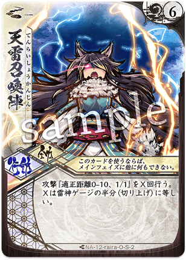

# [ライラ](index.md)

  
  

    <ul>
      <li><strong>権能</strong>: 爪 (Claw / Storm)</li>
      <li><strong>難易度</strong>: ★★★☆☆</li>
      <li><strong>得意[間合](../glossary.md)</strong>: 0-3</li>
    </ul>
  

!!! info "荒ぶる暴風、天を裂く雷鳴の獣姫"
    シーズン10においても、ゲージが溜まった後の『爆圧』性能は圧倒的で、一度エンジンがかかれば誰にも止められない爆発力を誇ります。

## 物語の起源：[ライラ](index.md)

> 「あははっ、もっと速く、もっと強く！ 私が戦場（ここ）で、一番の嵐になってやる！」

[ライラ](index.md)は、荒ぶる暴風と轟く雷鳴をその身に[宿し](../mechanics.md)た、天真爛漫な「爪」のメガミです。
彼女の起源は、飽くなき闘争本能と、強き者との決闘を純粋に楽しむ無邪気な好奇心にあります。彼女にとって戦いとは、己の魂を震わせ、限界を超えて「頂点」を目指すための最高にエキサイティングな遊びです。
物語では、自由奔放で誰にでも人懐っこい（しかし一度爪を振るえば手がつけられない）獣姫として描かれます。彼女の振るう爪は、空間を切り裂く暴風を呼び、その一撃は天から降り注ぐ雷光の如き速度で相手の防御を貫きます。
「風雷」という力は、彼女が自身の行動（攻防）そのものをエネルギーへと昇華させ、対局が終盤に進むほどにその存在が全土を飲み込む巨大な「嵐」へと進化していく様を象徴しています。

## キーワード能力: 風雷 (Wind / Thunder)

[ライラ](index.md)は戦えば戦うほど、その身に嵐を[纏い](../mechanics.md)ます。

*   **ゲージの蓄積**: 特定のカード（[通常札](../glossary.md)・[切札](../glossary.md)）を使用するたびに、「風」ゲージまたは「雷」ゲージが上昇します。
*   **効果の性質**: ゲージが一定値に達すると、攻撃札のダメージが増加したり、特殊な追加効果（バースト）が発生したりします。
*   **戦略的意味**: 序盤はあからさまなダメージを狙うよりも、まずは「ゲージを溜める」ための手数を重視します。1巡目にいかに効率よくゲージを稼げるかが、2巡目以降の勝敗を決定づけます。

{ .glightbox }

## シーズン10における立ち位置

シーズン10（大[切札](../glossary.md)時代）において、[ライラ](index.md)は「最高のフィニッシャー」として評価されています。

*   **大[切札](../glossary.md)とのシナジー**: [ライラ](index.md)自身が「カードを使うこと」自体をメリットとするため、コストの低い[切札](../glossary.md)を連打する戦術と非常に相性が良いです。
*   **短期決戦の覇者**: 環境が低速化する中、[ライラ](index.md)はあえて超高速でゲージを溜め、相手が準備を終える前に試合を終わらせる「アンチ・スローデッキ」としての{ .glightbox }を担います。

{ .glightbox }

## [通常札](../glossary.md)解説

### N1 { .glightbox }

{ align=left width=150 }

**{ .glightbox }**: ゲージ稼ぎ / 基本攻撃

*   **適正[間合](../glossary.md)**: 0-2
*   **ダメージ**: [3/1]
*   **解説**:
    [ライラ](index.md)の基本。ダメージもさることながら、このカードを振ることでゲージが溜まることこそが最大の目的です。近距離戦の幕開けを告げる鋭い爪痕です。

 

### N2 { .glightbox }

{ align=left width=150 }

**{ .glightbox }**: バースト火力 / フィニッシャー

*   **ダメージ**: [X/Y] (ゲージ量に依存)
*   **解説**:
    **[ライラ](index.md)の必殺技。**
    溜まったゲージをダメージに変換して放つ一撃。ゲージが最大値に近い状態でのこの攻撃は、[通常札](../glossary.md)でありながら[5/3]クラスの暴虐へと変貌し、[ライフ](../glossary.md)を直接粉砕します。

 

### N3 { .glightbox }

{ align=left width=150 }

**{ .glightbox }**: 連続攻撃 / コンボパーツ

*   **解説**:
    条件を満たすことで手札に戻る、あるいは再起する性質を持ち、1ターンに何度も振ることで爆速でゲージを稼ぐための「回転」の要です。

 

### N4 { .glightbox }

{ align=left width=150 }

**{ .glightbox }**: 移動 / 加速

*   **効果**: [間合](../glossary.md)を近づける、あるいは離す。
*   **解説**:
    風の如き速度で[間合](../glossary.md)を調整する移動札。攻撃を当てるための位置取りと、風ゲージの蓄積を同時に行います。

 

### N5 { .glightbox }

{ align=left width=150 }

**{ .glightbox }**: リソース調整 / ゲージブースト

*   **解説**:
    直接的な攻撃は行わず、精神を研ぎ澄ましてゲージを一気に上昇させたり、手札を整えたりする補助札。勝負のターンに向けた「溜め」のカードです。

 

### N6 { .glightbox }

{ align=left width=150 }

**{ .glightbox }**: 嵐の召喚 / サーチ

*   **解説**:
    山札から風雷に関連する強力なカードを呼び込み、コンボを完成させます。

 

### N7 { .glightbox }

{ align=left width=150 }

**{ .glightbox }**: 回避 / 攪乱

*   **解説**:
    空を飛ぶが如き挙動で相手の攻撃を空振りさせ、同時に風ゲージを稼ぐトリッキーな一枚。

 

{ .glightbox }

## [切札](../glossary.md)解説

### S1 天雷召喚陣

{ align=left width=150 }

**コスト**: 5
**種別**: 攻撃 (大規模)

**解説**:
空から無数の雷を降らせる広域制圧攻撃。
[ライラ](index.md)のゲージが溜まっていればいるほどヒット数や威力が増し、相手の[オーラ](../glossary.md)を一瞬で消滅させます。

 

### S2 風神雷神限定解除

{ align=left width=150 }

**コスト**: 2
**種別**: 行動 (変身)

**解説**:
**[ライラ](index.md)の真の姿。**
一定ターンの間、ゲージの蓄積をさらに加速させ、カードの使用制限を撤廃するなどの「リミッターカット」を行います。この状態の[ライラ](index.md)は、1ターンに[通常札](../glossary.md)を何枚も投げつける暴風雨へと変貌します。

 

### S3 風雷の果て

{ align=left width=150 }

**コスト**: 4
**種別**: 攻撃 (終焉)

**解説**:
嵐が通り過ぎた後の、絶対的な静寂。
ゲージが限界に達した時にのみ放てる究極の一撃で、どんな敵も塵に帰します。

{ .glightbox }

## 主要アーキタイプ

### 1. 超電磁連打 (バーストアグロ)
**「一瞬で溜め、一瞬で殺す。」**
手数の多い低コスト札を連打し、ゲージを最短でMAXにして『{ .glightbox }』を叩き込む。

*   **基本戦術**:
    1. 序盤から『{ .glightbox }』や他メガミの低コスト札を連打。
    2. 『{ .glightbox }』等でゲージを調整。
    3. MAX状態で『{ .glightbox }』＋『天雷召喚陣』のオーバーキル・コンボ。
*   **推奨パートナー**: [オボロ](index.md)(忍)、[サリヤ](index.md)(騎)

### 2. 暴風レンジロック (攪乱プラン)
**「捕まえられない嵐。」**
『{ .glightbox }』や『{ .glightbox }』を使い回し、相手の攻撃を躱しながら自分だけがゲージを貯める。

*   **基本戦術**:
    1. 相手の適正[間合](../glossary.md)の外を維持。
    2. ゲージが溜まったら一気に踏み込み、爪を振る。
*   **推奨パートナー**: [トコヨ](index.md)(扇)、[ハガネ](index.md)(槌)

{ .glightbox }

## おすすめの組み合わせ (Pairs)

### [ハガネ](08_hagane.md) (槌爪)
**「天変地異の破壊力」**
移動そのものがメリットになる二人。[ハガネ](index.md)の[遠心](../glossary.md)と[ライラ](index.md)の風ゲージが同時に溜まり、戦場は更地になります。

### [サリヤ](11_sariya.md) (騎爪)
**「神速のオーバーキル」**
共に手数と機動力を武器とする最強のアグロペア。1ターンでゲージ20以上を稼ぎ出すことも可能な、爆速のコンボ。

{ .glightbox }

## 戦術の核心

!!! danger "「空振り」の代償"
    [ライラ](index.md)の強化札はゲージを消費したり、特定の枚数を使った後に発動したりします。
    **「せっかく溜めたゲージを対応札一枚でスカされる」ことは、[ライラ](index.md)にとって致命的なテンポロスになります。**
    相手の伏せ札や対応[切札](../glossary.md)（{ .glightbox }、音無砕氷等）を正確に読み、本命を当てるための「エサ」を先に投げてください。

!!! tip "「[切札](../glossary.md)」はゲージのためのガソリン"
    [ライラ](index.md)にとって、[切札](../glossary.md)はダメージを与えるだけでなく「ゲージを1（またはそれ以上）上昇させる手段」です。
    コストの低い[切札](../glossary.md)がある相方を選ぶことで、実質的な最大火力を劇的に引き上げることができます。
    「[切札](../glossary.md)1枚＝ゲージ上昇＝[通常札](../glossary.md)の威力UP」の等式を常に意識しましょう。
