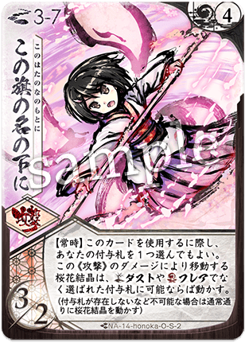

# [ホノカ](index.md)

  
  

    <ul>
      <li><strong>権能</strong>: 旗 (Banner / Faith)</li>
      <li><strong>難易度</strong>: ★★★☆☆</li>
      <li><strong>得意[間合](../mechanics/glossary.md)</strong>: 2-5</li>
    </ul>
  

!!! info "未来を紡ぐ少女、希望の旗に集う精霊たち"
    シーズン10においても、その「育てる楽しみ」と、完成した時の圧倒的な制圧力は多くのプレイヤーを魅了しています。

## 物語の起源：[ホノカ](index.md)

> 「信じています、みんなの力を。……希望の旗の下で、新しい物語を紡ぎましょう！」

[ホノカ](index.md)は、未来への希望と輝かしき再生の力を象徴する「旗」のメガミです。
彼女の起源は、絶望の淵にあっても明日を夢見る純粋な祈りと、周囲を奮い立たせる不屈の献身にあります。かつての苦難を乗り越え、彼女は自ら旗を掲げることで、消えかけていた精霊たちの声を集め、真の勇気へと変えていきます。
物語では、時に未熟で悩みながらも、仲間との絆を通じて飛躍的な成長を遂げる、象徴的な「希望のヒロイン」として描かれます。彼女が掲げる旗は、味方の士気を高めるだけでなく、世界そのものに新たな命（[開花](../mechanics/glossary.md)）を吹き込みます。
「[開花](../mechanics/glossary.md)」という力は、彼女が時間の経過とともに可能性を形に変え、脆弱な「精霊（現在）」を強大な「神霊（未来）」へと完成させていく、終わりなき「進化」と「希望」の物語を象徴しています。

## キーワード能力: [開花](../mechanics/glossary.md) (Kaikka / Evolution)

[ホノカ](index.md)のカードは、物語のように成長します。

*   **進化の仕組み**: 特定の[通常札](../mechanics/glossary.md)を使用、あるいは伏せ札から特定の効果（[再構成](../mechanics/glossary.md)など）によって、「より強力な別名のカード」に差し替えます。
*   **進化の段階**: 
    1. **{ .glightbox }**: 基本。
    2. **[守護](../mechanics/glossary.md)霊式 / { .glightbox }**: 強化。攻撃力や防御力が劇的に向上します。
    3. **神霊式**: 究極。[通常札](../mechanics/glossary.md)の枠を超えた[切札](../mechanics/glossary.md)級の性能を誇ります。
*   **戦略的意味**: 序盤の数ターンは「いかに効率よく進化（[開花](../mechanics/glossary.md)）を済ませるか」が重要です。一度[開花](../mechanics/glossary.md)が完了すれば、[通常札](../mechanics/glossary.md)の基本スペックで相手を圧倒できるようになります。

{ .glightbox }

## シーズン10における立ち位置

シーズン10（大[切札](../mechanics/glossary.md)時代）において、[ホノカ](index.md)は「安定感の象徴」として重宝されています。

*   **大[切札](../mechanics/glossary.md)への耐性**: [守護](../mechanics/glossary.md)霊式の高い防御性能や、『{ .glightbox }』による[ライフ](../mechanics/glossary.md)保護能力により、一撃必殺を狙う相手に対して粘り強く戦うことができます。
*   **コンボの柔軟性**: どのメガミと組んでも、自身が「自己完結した強力な[通常札](../mechanics/glossary.md)」へと進化するため、パートナーの自由度が非常に高いのが強みです。

{ .glightbox }

## [通常札](../mechanics/glossary.md)解説

### N1 { .glightbox } (→ [守護](../mechanics/glossary.md)霊式 → 神霊式)

{ align=left width=150 }

**{ .glightbox }**: 成長の核 / 主力攻撃

*   **解説**:
    [ホノカ](index.md)の成長の物語の始まり。最初は[2/2]程度の平凡な攻撃ですが、進化を重ねることで[3/2]、さらには[4/3]の必中攻撃（神霊式）へと成長し、相手に逃げ場のない死を突きつけます。

 

### N2 [守護](../mechanics/glossary.md)霊式

{ align=left width=150 }

**{ .glightbox }**: 防御 / 鉄壁の守り

*   **効果**: 対応
*   **解説**:
    相手の攻撃を無効化したり、自分の[オーラ](../mechanics/glossary.md)を大幅に回復する防御の要。これがあるおかげで、[ホノカ](index.md)は盤石の態勢で自分の成長を待つことができます。

 

### N3 { .glightbox }

{ align=left width=150 }

**{ .glightbox }**: 猛攻 / 加速

*   **効果**: 攻撃 ＋ [前進](../mechanics/index.md)など
*   **解説**:
    攻撃しながら[間合](../mechanics/glossary.md)を詰めるアグレッシブな札。相手の[オーラ](../mechanics/glossary.md)を強引に削り、本命のダメージを通すための道を作ります。

 

### N4 { .glightbox }

{ align=left width=150 }

**{ .glightbox }**: [守護](../mechanics/glossary.md) / [ライフ](../mechanics/glossary.md)保護

*   **解説**:
    次に受ける[ライフ](../mechanics/glossary.md)ダメージを軽減、あるいは無効化する付与札。一撃必殺を狙うメガミ（[ユリナ](index.md)等）にとって最悪のメタカードとなります。

 

### N5 { .glightbox }

{ align=left width=150 }

**{ .glightbox }**: 移動 / 優雅な舞い

*   **解説**:
    自分の得意な2-5の[間合](../mechanics/glossary.md)を維持するための移動札。[基本動作](../mechanics/glossary.md)よりも効率よく動けるため、位置取りのストレスを軽減します。

 

### N6 { .glightbox }

{ align=left width=150 }

**{ .glightbox }**: 統率 / 進化加速

*   **解説**:
    自分のカードを強制的に進化させる、あるいは[フレア](../mechanics/glossary.md)などの資源に変換する司令塔的札。コンボのスピードを上げるために不可欠です。

 

### N7 { .glightbox }

{ align=left width=150 }

**{ .glightbox }**: 加速支援 / フィールド支配

*   **解説**:
    自分、あるいは味方の移動を容易にする環境バフ。[サリヤ](index.md)や[ハガネ](index.md)など、移動を戦術とする相方とのシナジーを爆発的に高めます。

 

{ .glightbox }

## [切札](../mechanics/glossary.md)解説

### S1 胸に想いを

{ align=left width=150 }

**コスト**: 2
**種別**: 行動

**解説**:
[ホノカ](index.md)の祈りが形になる[切札](../mechanics/glossary.md)。山札から必要なカードを引き込み、同時に[開花](../mechanics/glossary.md)をトリガーさせるなど、中盤の安定性を保証します。

 

### S2 この旗の名の下に

{ align=left width=150 }

**コスト**: 4
**種別**: 攻撃 (大規模)

**解説**:
**[ホノカ](index.md)の軍勢の一斉攻撃。**
進化させた霊たちの力を合わせ、盤面全体に甚烈なダメージを与えます。発動時の爽快感は全メガミでもトップクラス。

 

### S3 四季は巡り

{ align=left width=150 }

**コスト**: 3
**種別**: 行動 (再誕)

**解説**:
すべての終わりを始まりに変える札。
使用済みのカードを再び利用可能な状態に戻すなど、リソースの無限循環を可能にします。

{ .glightbox }

## 主要アーキタイプ

### 1. 神霊式バースト (成長プラン)
**「未来を信じ、研鑽する。」**
序盤は守りに徹してカードを最大段階まで進化させ、終盤に手がつけられない高スペック札で蹂躙する。

*   **基本戦術**:
    1. 『{ .glightbox }』や『胸に想いを』で最速進化を狙う。
    2. 『{ .glightbox }』や『[守護](../mechanics/glossary.md)霊式』で、進化が終わるまで[ライフ](../mechanics/glossary.md)を守る。
    3. 進化完了後、[3/2]や[4/3]の[通常札](../mechanics/glossary.md)を連射。
*   **推奨パートナー**: [トコヨ](index.md)(扇)、[サイネ](index.md)(薙)

### 2. 旗の進撃ビートダウン (アグロプラン)
**「仲間と共に、道を切り拓く。」**
『{ .glightbox }』や『{ .glightbox }』による移動補助を活かし、パートナーの攻撃を適切な[間合](../mechanics/glossary.md)で連発させる。

*   **基本戦術**:
    1. [前進](../mechanics/index.md)能力を活かして有利な[間合](../mechanics/glossary.md)へ。
    2. 相方の大型攻撃をサポート。
*   **推奨パートナー**: 有能な攻撃札を持つメガミ（[ユリナ](index.md)、[ハガネ](index.md)等）

{ .glightbox }

## おすすめの組み合わせ (Pairs)

### [ユリナ](01_yurina.md) (刀旗)
**「王道にして至高」**
高い攻撃力を持つ[ユリナ](index.md)を、[ホノカ](index.md)の防御と移動補助が支える完璧なペア。初心者から上級者まで愛される安定の組み合わせ。

### [サリヤ](11_sariya.md) (騎旗)
**「旗印の加速」**
[ホノカ](index.md)の『{ .glightbox }』が[サリヤ](index.md)の移動コストを劇的に下げ、[サリヤ](index.md)の燃料管理に余裕を持たせる。戦場を支配するスピードペア。

{ .glightbox }

## 戦術の核心

!!! danger "進化の「遅れ」は敗北"
    [ホノカ](index.md)のカードは未進化の状態では明らかに弱いです。
    **「進化させる前に[ライフ](../mechanics/glossary.md)を削りきられる」のが[ホノカ](index.md)の典型的な負けパターンです。**
    対戦相手が速攻デッキの場合は、進化の手間を惜しんででも防御札を先に構える勇気が必要です。

!!! tip "「お守り」のタイミング"
    『{ .glightbox }』は強力ですが、相手に「お守りがあるから今は攻撃しないでおこう」とリソースを溜める時間を与えてしまう側面もあります。
    相手の[集中力](../mechanics/glossary.md)や[フレア](../mechanics/glossary.md)を見て、「今この瞬間にお守りがあれば、相手の最大打点を無駄にできる」という急所で見せつけるのがスマートな[ホノカ](index.md)使いです。
