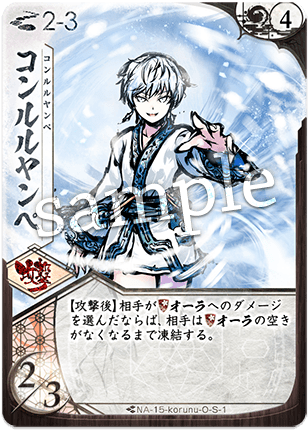

# [コルヌ](index.md)

  
  

    <ul>
      <li><strong>権能</strong>: 鎌 (Scythe / Frost)</li>
      <li><strong>難易度</strong>: ★★★★☆</li>
      <li><strong>得意[間合](../glossary.md)</strong>: 1-4</li>
    </ul>
  

!!! info "氷獄の鎖、魂まで凍てつかせる北境の冬"
    [コルヌ](index.md)は相手のリソース（[オーラ](../glossary.md)や[フレア](../glossary.md)）を物理的に「[凍結](../glossary.md)」させ、使用不能にするデバフ特化のコントロールメガミです。
    彼女の最大の特徴は、独自のトークン**「[凍結](../glossary.md)」**を相手の結晶の上に置く能力です。
    凍りついた結晶は、溶けるまで[宿し](../mechanics.md)や[前進](../mechanics.md)に使用できず、相手は潤沢な[フレア](../glossary.md)を持っていながら[切札](../glossary.md)を撃てないという絶望的な状況（ハメ）に陥ります。
    シーズン10においても、その「リソース・ロック」性能は際立っており、特にリソースの回転を重視するデッキに対する強力なストッパーとなります。

## 物語の起源：[コルヌ](15_korunu.md)

> 「騒がしいですね、この世界は。……私の氷の中で、永久（とわ）の静寂に浸りなさい」

[コルヌ](index.md)は、北境の地で冬の静寂を守り続ける、氷の化身たるメガミです。
彼女の起源は、物事をありのままに留めておきたいという保存の願いと、変化を拒み純粋な平穏を求める「止まった時間」の本質にあります。彼女にとって、命の躍動や熱気は美しき秩序を乱すノイズに過ぎず、氷こそが万物を最も美しく完成させる終着点です。
物語では、感情を排した（ように見える）北の番人として描かれますが、その瞳には凍てついた大地を見守る冷徹かつ深い慈愛が宿っています。彼女が振るう鎌は熱を奪い、凍てつく冷気は相手の脈動（結晶）を直接凍らせて、その自由な連鎖を断ち切ります。
「[凍結](../glossary.md)」という力は、彼女が相手の選択肢（未来）を一つずつ凍りつかせていき、最終的に世界を真っ白な「永遠の冬」へと塗り替えていく静かな圧力を象徴しています。

## キーワード能力: [凍結](../glossary.md) (Freeze)

[コルヌ](index.md)の冷気は、戦場そのものを沈黙させます。

*   **[凍結](../glossary.md)の仕組み**: 相手の[オーラ](../glossary.md)や[フレア](../glossary.md)にある結晶の上に「[凍結](../glossary.md)トークン」を置きます。
*   **効果の性質**: [凍結](../glossary.md)された結晶は、[基本動作](../glossary.md)やカードコストとして支払うことができません。[凍結](../glossary.md)を解除するには、[集中力](../glossary.md)を消費したり、特定の行動をとる必要があります。
*   **戦略的意味**: 相手の「次のターンの動き」をピンポイントで予測して凍らせます。例えば、[フレア](../glossary.md)を凍らせれば[切札](../glossary.md)を封じ、[オーラ](../glossary.md)を凍らせれば[前進](../mechanics.md)を封じることができます。

{ .glightbox }

## シーズン10における立ち位置

シーズン10（大[切札](../glossary.md)時代）において、[コルヌ](index.md)は「沈黙の番人」としての{ .glightbox }を全うしています。

*   **大[切札](../glossary.md)へのカウンター**: 大[切札](../glossary.md)を撃つためには大量の[フレア](../glossary.md)が必要ですが、[コルヌ](index.md)はその[フレア](../glossary.md)を片端から凍らせていくことで、相手のフィニッシュプランを数ターン遅らせることができます。
*   **近接メタの強化**: [間合](../glossary.md)1-2での[凍結](../glossary.md)手段が充実しており、接近戦を挑んでくるアグロメガミを文字通り「氷漬け」にして立ち往生させることが可能です。

{ .glightbox }

## [通常札](../glossary.md)解説

### N1 凍てつく足影

{ align=left width=150 }

**{ .glightbox }**: 移動妨害 / 基礎汚染

*   **解説**:
    [前進](../mechanics.md)しながら相手の[間合](../glossary.md)結晶を凍らせるなど、足元から冷気を浴びせる札。相手は近づくため、あるいは逃げるために余計な労力（[集中力](../glossary.md)の消費など）を強いられます。

 

### N2 霜降らし

{ align=left width=150 }

**{ .glightbox }**: 広域[凍結](../glossary.md) / 防御崩し

*   **解説**:
    相手の[オーラ](../glossary.md)にある複数の結晶を一気に凍らせる補助札。[オーラ](../glossary.md)が凍ることで、相手は「[纏い](../mechanics.md)」による防御回復ができなくなり、[コルヌ](index.md)の攻撃が通りやすい土壌が整います。

 

### N3 雪渡り

{ align=left width=150 }

**{ .glightbox }**: 位置調整 / 冷却

*   **解説**:
    雪の上を滑るように[間合](../glossary.md)を変える移動札。自分の有利な距離を維持しながら、ついでに相手を凍らせる、[コルヌ](index.md)らしい効率的な動きを支えます。

 

### N4 氷の棘

{ align=left width=150 }

**{ .glightbox }**: 威力増強 / 削り

*   **適正[間合](../glossary.md)**: 2-5
*   **ダメージ**: [3/1] ([凍結](../glossary.md)数によりバフ)
*   **解説**:
    相手が凍れば凍るほど鋭くなる氷の刃。[通常札](../glossary.md)でありながら[ライフ](../glossary.md)を直接削るプレッシャーを与え、相手に「[凍結](../glossary.md)を解除するか、ダメージを受けるか」の選択を迫ります。

 

### N5 氷柱

{ align=left width=150 }

**{ .glightbox }**: 常時デバフ / 環境汚染

*   **解説**:
    展開中、相手が[基本動作](../glossary.md)を行うたびにペナルティ（さらなる[凍結](../glossary.md)やリソース喪失）を課す付与札。相手を「何もしない方がマシ」という思考停止の状態に追い込みます。

 

### N6 { .glightbox }り払い

{ align=left width=150 }

**{ .glightbox }**: 至近距離防衛

*   **解説**:
    鎌による広範囲の薙ぎ払い。[凍結](../glossary.md)で動きが鈍った相手を容赦なく叩き伏せ、[間合](../glossary.md)を離すための時間を稼ぎます。

 

### N7 氷の床

{ align=left width=150 }

**{ .glightbox }**: トラップ / 滑走

*   **解説**:
    盤面に「氷の床」を[設置](../glossary.md)し、足を踏み入れた相手を思わぬ方向へ滑らせます。意図しない[間合](../glossary.md)変化は、コンボメガミにとって最大の脅威です。

 

{ .glightbox }

## [切札](../glossary.md)解説

### S1 凍天 (とうてん)

{ align=left width=150 }

**コスト**: 4
**種別**: 行動

**解説**:
**この世のすべてを凍りつかせる。**
相手の[オーラ](../glossary.md)、[フレア](../glossary.md)、[間合](../glossary.md)にあるすべての結晶を一定期間完全に[凍結](../glossary.md)させる、究極のロックカード。発動した次のターン、相手は文字通り「何もできない」カカシとなります。

 

### S2 霜の帳

{ align=left width=150 }

**コスト**: 3
**種別**: 対応 / 防御

**解説**:
冷気の壁で身を守る札。
攻撃を無効化しつつ、攻撃してきた相手の手元（[オーラ](../glossary.md)）を凍らせる。守りながら攻める、[コルヌ](index.md)の神髄です。

 

### S3 極夜の鎌

{ align=left width=150 }

**コスト**: 5
**種別**: 攻撃 (終焉)

**解説**:
氷漬けになった魂を刈り取る、一撃必殺の鎌。
相手が受けている[凍結](../glossary.md)の数だけ威力を増し、凍りついたままの相手を冷たく葬り去ります。

{ .glightbox }

## 主要アーキタイプ

### 1. 完全沈黙ロック (フリーズ・コントロール)
**「指一本、動かさせない。」**
[オーラ](../glossary.md)と[フレア](../glossary.md)の両面を[凍結](../glossary.md)し続け、相手に「ふるよに」というゲームをさせないスタイル。

*   **基本戦術**:
    1. 序盤から『霜降らし』で[オーラ](../glossary.md)を凍らせ、[纏い](../mechanics.md)を封じる。
    2. [フレア](../glossary.md)が貯まりそうなタイミングで『凍天』を投入。
    3. 相手が解凍にリソースを割いている間に、安全圏から削る。
*   **推奨パートナー**: [シンラ](index.md)(書)、[ウツロ](index.md)(鎌)

### 2. 氷結追撃ビートダウン
**「凍らせて、砕く。」**
[凍結](../glossary.md)をダメージバフとして活用し、高打点の『氷の棘』や[切札](../glossary.md)で一気に決着を狙う。

*   **基本戦術**:
    1. 最低限の[凍結](../glossary.md)を維持し、攻撃札の条件を満たす。
    2. 相手が[凍結](../glossary.md)解除を優先した隙に、メイン火力を叩き込む。
*   **推奨パートナー**: 有能な攻撃札を持つメガミ（[ユリナ](index.md)、[ハガネ](index.md)等）

{ .glightbox }

## おすすめの組み合わせ (Pairs)

### [シンラ](07_shinra.md) (書鎌)
**「論理的沈黙」**
[シンラ](index.md)の{ .glightbox }による手札ロックと、[コルヌ](index.md)の[凍結](../glossary.md)によるリソースロックの二重苦。相手は思考することも動くことも許されない、最も「嫌われる」が「最強」に近いペア。

### [ウツロ](13_utsuro.md) (鎌鎌)
**「空虚な氷獄」**
[ウツロ](index.md)が[オーラ](../glossary.md)を[ダスト](../glossary.md)へ送り、残った僅かな[オーラ](../glossary.md)を[コルヌ](index.md)が凍らせる。リソースが完全に消滅する、終焉の組み合わせ。

{ .glightbox }

## 戦術の核心

!!! danger "「解凍」という名の逆転"
    相手は[凍結](../glossary.md)を解除するために[集中力](../glossary.md)や手札を消費しますが、それは同時に相手に「リソースを綺麗にする（必要な結晶をフリーにする）」機会を与えていることでもあります。
    **「凍らせたから安心」ではなく、凍らせているその数ターンの間に、有効な[ライフ](../glossary.md)ダメージを与えきることが[コルヌ](index.md)の絶対命題です。**

!!! tip "「[フレア](../glossary.md)」を優先して凍らせろ"
    [オーラ](../glossary.md)を凍らせるのは防御崩しに有効ですが、最も相手の計算を狂わせるのは「[フレア](../glossary.md)の[凍結](../glossary.md)」です。
    相手が[切札](../glossary.md)を撃とうと[フレア](../glossary.md)を5溜めた瞬間に、そのうち2つを凍らせる。
    それだけで、相手の必勝プランは瓦解します。
