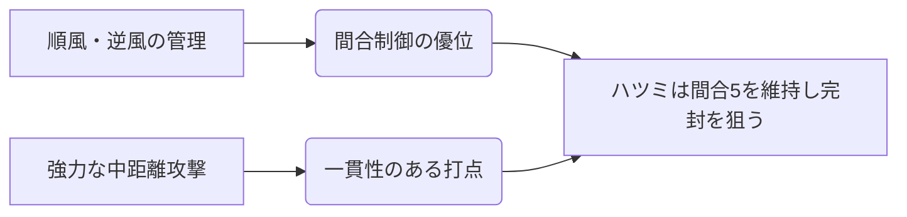

# ハツミ

  
  

    
【櫂】ハツミ / Season 10

    

      難易度: ★★☆☆☆
      [間合](../mechanics.md#range): 3-5
      タイプ: レンジロック・中距離
      S10 Meta: Tier 2 (Stable)
    

  

## S10 環境分析

> [!CAUTION]
> **初心者が陥る罠**
> - **逆風での立ち回り**: 逆風時は攻撃力が大幅に低下する。無理に攻めず、順風に戻すための調整（宿し・纏い）に徹することが重要。

## 戦略の要点

### 順風維持
常に「順風」状態でターンを迎えることで、通常札のバリューを最大化する。相方には[間合](../mechanics.md#range)変化を助けるメガミが推奨される。

### レンジロック
[間合](../mechanics.md#range)5を維持し続けることで、近距離ビートダウン（ユリナ等）の攻撃を一切許さない立ち回りが基本。

---

!!! note "出典"
    [「ハツミガイド」（ねをん）](https://note.com/fair_hebe229/n/nad7b13366c3e) を参考にしています。
