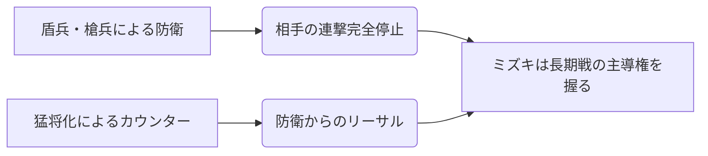

# ミズキ

  
  

    
【兜】ミズキ / Season 10

    

      難易度: ★★☆☆☆
      [間合](../rules.md#range): 0-5
      タイプ: 要塞・防衛
      S10 Meta: Tier 1 (Defender)
    

  

## S10 環境分析

> [!IMPORTANT]
> **S10 変更点**
> - 『気炎万丈』の効果範囲が全攻撃に拡大。ライフダメージバフが以前の強力な仕様に回帰。

## 戦略的タイムライン

### Phase 1: 序盤
- **目的**: 『陣頭』を使用し、兵士を配置。

### Phase 2: 中盤
- **目的**: 盾兵でダメージを最小化し、[フレア](../rules.md#flare)を貯める。

### Phase 3: 終盤
- **目的**: 三重膝丸櫓などの強力な一撃。

## [通常札](../rules.md)

| カード名 | 主な役割 | 特徴 |
| :--- | :--- | :--- |
| [**陣頭**](cards.md#陣頭) | 展開 | 兵士配置の起点。 |
| [**三重膝丸櫓**](cards.md#三重膝丸櫓) | 火力 | 条件達成で3/1攻撃。 |
| [**防壁**](cards.md#防壁) | 防御 | 盾兵によるダメージ軽減。 |

## 概要

| 項目 | 内容 |
|:---|:---|
| **権能** | 兜（Helm） |
| **得意[間合](../rules.md#range)** | 2〜4 |
| **固有リソース** | 兵員 |
| **戦術の核心** | 「対応」で相手の攻撃を受け止め、兵員を活用した堅実な立ち回りで勝つ。 |

---

## 戦略の概要

ミズキは「対応」に特化したメガミです。[通常札](../rules.md)の価値が上がり、大型[切札](../rules.md)の価値が下がった現環境において、低コストで手札数枚分の仕事ができる[切札](../rules.md)群が高く評価されています。

### 強み（出典: [いず](https://izu24furuyoni.hatenablog.com/entry/2025/12/24/173544)）
- **「大手楯無門」**: 3[フレア](../rules.md#flare)から手札3枚分くらいの仕事ができる。
- **「防壁」**: 1枚で相手の手札2枚分ほどの動きを否定できる。
- **「三重膝丸櫓」**: 2[フレア](../rules.md#flare)から3/1の出力が可能。
- **「反攻」**: [前進](../rules.md#advance)しながら使える3/2は現代でも非常に強力。

### 弱み
- **陣頭の禁止**: 現環境では「陣頭」が禁止されており、勝てない対面に本当に勝てなくなっている。
- **ピーキーなカード**: 「戦場」「天主八龍閣」は強みの方向と逆を向いており、構築が難しい。

---

## カード採用指針（出典: いず解説記事）

| カード | 採用度 | 備考 |
|:---|:---|:---|
| 反攻 | ◎ほぼ確定 | [前進](../rules.md#advance)しながら3/2。抜けるなら強い兜 |
| 防壁 | ◎ほぼ確定 | 終端のデメリットが気にならなくなった |
| 制圧[前進](../rules.md#advance) | ○高い | 号令との選択。安定した立ち回り向き |
| 号令 | △状況次第 | 制圧[前進](../rules.md#advance)と排他。集中獲得は最低保証 |
| 撃ち落とし | △状況次第 | 環境高速化で打ち消しを狙いにくい |
| 陣頭 | ×禁止 | S10で禁止。メタ用途に強力だった |

---

## おすすめの組み合わせ

### 基本構成
「反攻」と「制圧[前進](../rules.md#advance)」（or「号令」）を添え、「大手楯無門」「防壁」「三重膝丸櫓」の3枚で[切札](../rules.md)を固めるのが基本形。

---

!!! tip "ミズキの歴史的変遷"
    S6でテコ入れされ実用化、S7-2で楯無門が大幅強化。しかしS7-2は「突撃霊式」、S8は[アキナ](23_akina.md)のリソース力と向かい風が続いた。S9の大規模優勝・S9-2での優勝準優勝を経て、S10で高い勝率を記録し、「陣頭」禁止にまで至った。

!!! note "出典"
    本ページの内容は [兜解説記事（いず）](https://izu24furuyoni.hatenablog.com/entry/2025/12/24/173544) を主な根拠としています。
