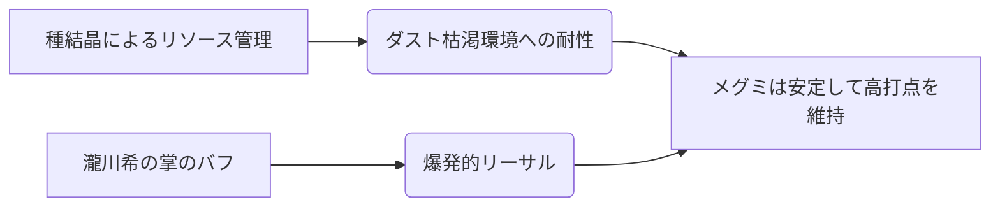

# メグミ（唐棹）

## 概要

| 項目 | 内容 |
|:---|:---|
| **権能** | 唐棹（Flail） |
| **戦術の核心** | 高い火力を持つアタッカー。「瀧川希の掌」によるバフで攻撃を強化する。 |

---

## 戦略の概要

メグミは唐棹（からさお）を象徴武器とするメガミです。唐棹は脱穀用農具であり、フレイルの原型でもあります。

## メグミ

  
  

    
【櫂】メグミ / Season 10

    

      難易度: ★★☆☆☆
      [間合](../rules.md#range): 3-5
      タイプ: ビートダウン
      S10 Meta: Tier 2 (火力特化)
    

  

## S10 環境分析

> [!CAUTION]
> **初心者が陥る致命的な罠**
> - **萌芽タイミングのミス**: 種結晶を乗せる「付与札」の展開順を間違えると、メイン火力である『打擲』のバフが乗らず、ただの1/1攻撃になってしまう。
> - **種の温存しすぎ**: [ダスト](../rules.md#dust)が十分な時でも、種結晶による「生育」を優先すべき場面が多い。

## 戦略的タイムライン

### Phase 1: 開幕 (Turn 1-2)
- **目的**: 付与札を展開し、種結晶を「萌芽」させる準備。
- **推奨挙動**: 『葦』で距離を取りつつ、種結晶を溜める。

### Phase 2: 中盤 (Turn 3-5)
- **目的**: 『鳳仙花』やバフの乗った『打擲』で[オーラ](../rules.md#aura)を剥ぎ取る。
- **決戦準備**: 『瀧川希の掌』を使用し、自身の全攻撃にバフを乗せる。

### Phase 3: 終盤 (リーサル)
- **目的**: バフ込みの『打擲』(3/2)を連打し、相手を圧倒する。

## [通常札](../rules.md)性能マトリクス

| カード名 | 主な役割 | 特徴 | S10 特記事項 |
| :--- | :--- | :--- | :--- |
| **打擲** | 主力攻撃 | 種結晶があれば3/2。 | メグミの魂。 |
| **鳳仙花** | 継続火力 | 生育1で相手ターンに2/1発生。 | テンポ維持に。 |
| **殻打ち** | 強化/リソース | 付与札に生育を乗せる。 | コンボの起点。 |
| **葦** | 位置調整 | 後退 + 種結晶使用で移動増。 | 間合制御の要。 |
| **根張** | 妨害 | 相手の行動を制限。 | 防御の一環。 |

## [切札](../rules.md)

| 名称 | コスト | 種別 | 解説 |
| :--- | :---: | :--- | :--- |
| **瀧川希の掌** | 4 | 付与 | **最強のバフ**。自身の全攻撃を+1/+1する。 |
| **結末の果実** | 2 | 行動 | リソース回収と追加効果。 |

## アンチメガミ・相性
- **得意**: 準備が遅いメガミ、または[ダスト](../rules.md#dust)を枯渇させてくるメガミ（種結晶で対応可能なため）。
- **苦手**: 圧倒的速攻を仕掛けてくるメガミ。
- **対策**: 『葦』と『瀧川希の掌』を軸に、自分の土俵（間合3-5）で一方的に殴り勝つ。

### 主要カード（出典: [ねをんでした](https://note.com/fair_hebe229/n/nad7b13366c3e)）
- **瀧川希の掌（たなごころ）**: バフ系[切札](../rules.md)。攻撃力を大幅に底上げする。
- **打擲（ちょうちゃく）**: 唐棹で叩く攻撃。
- **殻打ち**: 脱穀モチーフの攻撃。

### 強み
- **火力の高さ**: 全メガミ中でも随一の火力バカと評される。「瀧川希の掌」によるバフが乗ると破壊力が跳ね上がる。

### ロア的背景
メグミは元々[ハガネ](08_hagane.md)と[ハツミ](17_hatsumi.md)を宿すミコトであり、英雄の娘として神座桜の種を継いでメガミとなった。

---

!!! note "出典"
    本ページの内容は [「メグミというメガミと向き合う」（ねをんでした）](https://note.com/fair_hebe229/n/nad7b13366c3e) を主な根拠としています。
元記事はエッセイ形式であり、戦術的な深掘りは限定的です。
