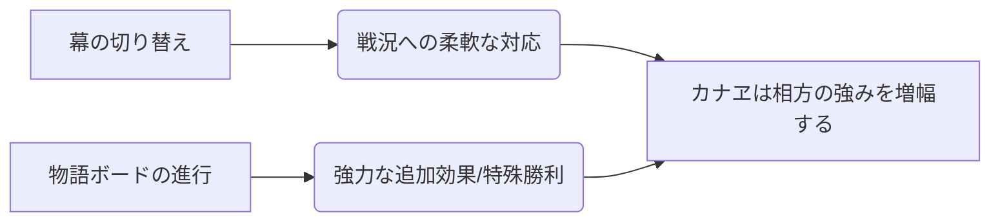

# カナヱ

  
  

    
【面】カナヱ / Season 10

    

      難易度: ★★★★★
      [間合](../rules.md#range): 可変
      タイプ: 物語・物語構築
      S10 Meta: Tier 3 (Utility)
    

  

## S10 環境分析

> [!IMPORTANT]
> **S10 変更点**
> - カナヱは強化対象となり、競技環境での柔軟性が向上。終幕ルートの安定性も改善。

## 戦略的タイムライン

### Phase 1: 序盤
- **目的**: 構想を準備し、幕を進める準備。

### Phase 2: 中盤
- **目的**: 戦況に合わせ「赤」または「緑」の幕を活用。

### Phase 3: 終盤
- **目的**: 終幕による勝利、または物語完了による圧倒的バフ。

---

!!! note "出典"
    本ページの内容は [「カナヱ解説」（かなめ）](https://you10kaname.hatenablog.com/entry/2025/12/09/003635) 等を参考にしています。

## 概要

| 項目 | 内容 |
|:---|:---|
| **権能** | 不明（要確認） |
| **戦術の核心** | 詳細な戦術情報は現在調査中です。 |

---

## 戦略の概要

カナヱは[起源戦レギュレーション](https://main-bakafire.ssl-lolipop.jp/furuyoni/na/)で使用可能な14柱の1つとして確認されています。

---

!!! warning "情報の不足"
    本ページはカナヱに関する詳細な攻略記事が見つかっていないため、情報が限定的です。
    詳細な戦術や推奨ペアについては、今後の記事や公式情報を基に更新予定です。
