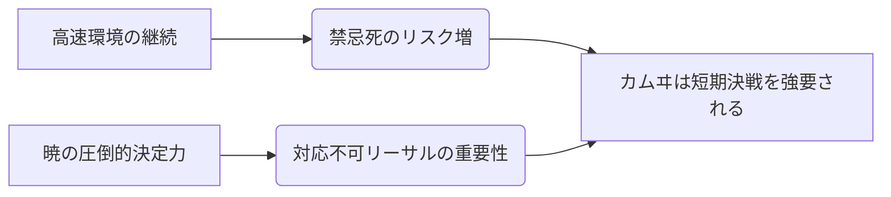

# カムヰ

  
  

    
【剣】カムヰ / Season 10

    

      難易度: ★★★★☆
      [間合](../mechanics.md#range): 2-4
      タイプ: 速攻ビートダウン
      S10 Meta: Tier 2 (Burst)
    

  

## S10 環境分析

> [!CAUTION]
> **初心者が陥る致命的な罠**
> - **無計画な通常札連打**: カムヰの通常札は振るだけで「禁忌」が加速する。リーサル計算なしに振り続けると、相手の[ライフ](../mechanics.md#life)を削り切る前に自滅（禁忌死）する。
> - **リソース管理の欠如**: 攻撃に手札を使い切るため、[纏い](../mechanics.md#matoy)が疎かになりやすい。

## 戦略的タイムライン

### Phase 1: 開幕 (Turn 1-3)
- **目的**: 『理』の展開と、得意[間合](../mechanics.md#range)3-4での牽制。
- **推奨挙動**: 禁忌を3-5程度まで進めつつ、相方の札でリソースを整え、カムヰのフルバースト準備。

### Phase 2: 中盤 (Turn 4-5)
- **目的**: 『散華刃』や『紅刃』で相手の[オーラ](../mechanics.md#aura)を剥ぎ、[ライフ](../mechanics.md#life)4-5まで追い込む。
- **決戦準備**: 『灯』を使用し、『暁』を使える状態へ。

### Phase 3: 終盤 (リーサル)
- **目的**: 『暁』によるリーサル。禁忌ゲージが14-15のギリギリで踏み抜くのが理想。

## [通常札](../mechanics.md)性能マトリクス

| カード名 | 主な役割 | 特徴 | S10 特記事項 |
| :--- | :--- | :--- | :--- |
| **{ .glightbox }** | 主力削り | 禁忌+1。特定条件下でバフ。 | メイン火力。 |
| **{ .glightbox }** | リソース破壊 | 禁忌+1。相手[オーラ](../mechanics.md#aura)を自身の[オーラ](../mechanics.md#aura)へ。 | テンポ奪取の要。 |
| **{ .glightbox }** | 追撃 | 禁忌+1。全力で追加攻撃。 | リーサルパーツ。 |
| **{ .glightbox }** | 柔軟性 | [間合](../mechanics.md#range)に応じて効果変化。 | レンジロック対策。 |
| **{ .glightbox }** | 万能札 | 複数の効果から2つ選択。 | 状況対応力が高い。 |
| **{ .glightbox }** | 対応 | 禁忌+2。ダメージ無効化。 | 緊急回避用。 |
| **{ .glightbox }** | 禁忌加速 | 山札回復＋禁忌進行。 | 覚醒までの時間短縮。 |

## [切札](../mechanics.md)：必殺の定義

| 名称 | コスト | 種別 | 解説 |
| :--- | :---: | :--- | :--- |
| **{ .glightbox }** | 2 | 攻撃 | **フィニッシャー**。6/4の疑似対応不可。 |
| **{ .glightbox }** | 5 | 付与 | 強力な盤面干渉。 |
| **{ .glightbox }** | 1 | 行動 | 禁忌管理の起点。 |
| **{ .glightbox }** | 4 | 攻撃 | [ライフ](../mechanics.md#life)を直接削る必殺の一撃。 |

## カード個別解説

### N10 紅刃
禁忌進行により火力が上がる主力通常札。

### N10 散華刃
相手の[オーラ](../mechanics.md#aura)を奪う強力な妨害札。

### N10 四剣乱刃
リーサル時の追撃に最適な全力攻撃。

### N10 棘縫い
[間合](../mechanics.md#range)制御に長けた柔軟な攻撃。

### N10 血晶乱流
状況に応じて効果を選べる万能札。

### N10 斬り払い
禁忌を進めつつ相手の攻撃を防ぐ[対応](#対応)札。

### N10 血習い
禁忌を加速させ、自身の山札を修復する。

### S10 灯 / 暁
カムヰの存在理由とも言える最強の[切札](../mechanics.md)。

### S10 阡
勝利は遠のくが、盤面を完全に支配する[切札](../mechanics.md)。

### S10 理
禁忌管理の中核を担い、バフを付与する。

### S10 証
禁忌の果てに放たれる、勝利への渇望。

## アンチメガミ・相性
- **得意**: 防御が薄いメガミ、または準備に時間がかかるメガミ。
- **苦手**: 禁忌ゲージを管理させながら時間を稼ぐコントロール（[トキヨ](04_tokoyo.md)など）。
- **対策**: 『理』による盤面干渉を維持し、相手が中盤の陣形を整える前に『暁』まで駆け抜けろ。

---

!!! note "出典"
    本ページの内容は [「カムヰちゃんをヨシヨシする方法」（かなめ）](https://you10kaname.hatenablog.com/entry/2025/12/09/003635) を主な根拠としています。
