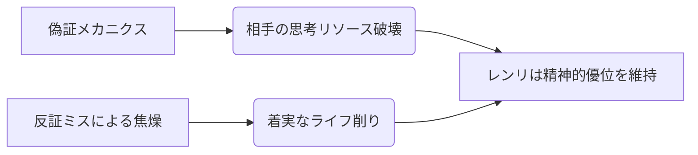

# レンリ

  
  

    
【衣】レンリ / Season 10

    

      難易度: ★★★★★
      [間合](../rules.md#range): 2-5
      タイプ: 偽証・コントロール
      S10 Meta: Tier 2 (Trickster)
    

  

## S10 環境分析

> [!CAUTION]
> **初心者が陥る致命的な罠**
> - **バレバレの偽証**: 状況的に「それしか手がない」場面での偽証は即座に反証され、無駄に手札を捨てることになる。
> - **反証の恐怖**: 相手の偽証を恐れすぎて反証を全くしないと、一方的にテンポを奪われ続ける。

## 戦略的タイムライン

### Phase 1: 序盤 (布石)
- **目的**: 通常札を伏せ、「遺物」の神授を待つ、あるいは本物の威圧感を作る。

### Phase 2: 中盤 (心理戦)
- **目的**: 本物と偽物を混ぜ、相手に「反証」の択を強いる。

### Phase 3: 終盤 (リーサル)
- **目的**: 『都度討ち』や神授された遺物札でトドメ。

## [通常札](../rules.md)

| カード名 | 主な役割 | 特徴 |
| :--- | :--- | :--- |
| **嘘突き** | メイン火力 | ライフダメージか反証かを強いる。 |
| **都度討ち** | 追撃 | 表の通常札枚数でバフ。 |
| **魚吊り** | 妨害 | 相手の対応を阻害。 |

## [切札](../rules.md)

| 名称 | コスト | 解説 |
| :--- | :---: | :--- |
| **欺瞞の霧** | 3 | 偽証の成功率を劇的に高める。 |
| **最初の桜鈴** | 1 | 遺物管理の要。 |

---

!!! note "出典"
    本ページの内容は [「アナザーレンリ解説」（かなめ）](https://you10kaname.hatenablog.com/entry/2025/12/09/003635) 等を参考にしています。
