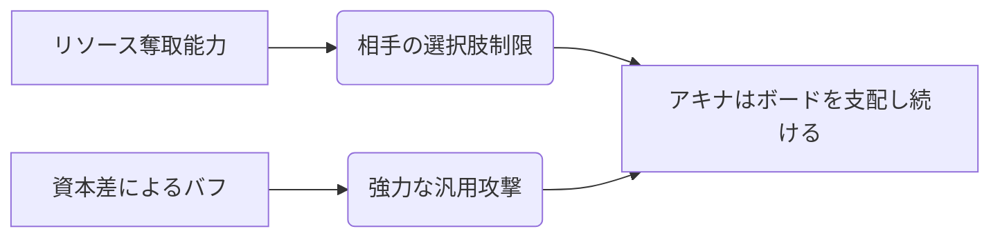

# アキナ（算盤）

## 概要

| 項目 | 内容 |
|:---|:---|
| **権能** | 算盤（Abacus） |
| **固有リソース** | 算盤玉、投資権、相場 |
| **戦術の核心** | リソース操作の王。「回収」「投資」「相場」で経済的に支配し、攻防両面で優位を築く。 |

---

## 戦略の概要（出典: [ぷれ](https://pure4183.hatenadiary.com/entry/SANOKOSAIKYO)）

### 算盤の強み

#### 攻撃面
- **開方冥式切取法**: 相手[フレア](../rules.md#flare)がない場合や対応がない相手に対して、どの[間合](../rules.md#range)からでもリーサルが取れる。
- **恫喝**: 「投資権」を持っているため、対応で避けられても「回収」でリソース面で優位に立てる。

#### リソース面
- **算法**: 強力なステップ対応。相手は[前進](../rules.md#advance)を強制される。
- **大衍算顆手打表**: 低コストで[オーラ](../rules.md#aura)を増やす対応。
- **直接金融 / 源上安岐那の御明算**: 折衝（序盤戦）で使えるカードで、折衝で優位に立ちやすい。
- **回収 / 投機**: 反撃しながら自[オーラ](../rules.md#aura)回復を行える。
- **盤狂わせ**: 相手[フレア](../rules.md#flare)や相手[オーラ](../rules.md#aura)を奪取し、相手の[切札](../rules.md)・全力札を使いにくくする。
## アキナ

  
  

    
【算】アキナ / Season 10

    

      難易度: ★★★★☆
      [間合](../rules.md#range): 2-4
      タイプ: 資源管理・コントロール
      S10 Meta: Tier 1 (Manager)
    

  

## S10 環境分析

> [!CAUTION]
> **初心者が陥る致命的な罠**
> - **回収タイミングの誤認**: 「投資」した結晶を回収する前にゲームが終わってしまう、あるいは回収による[オーラ](../rules.md#aura)供給が間に合わず敗北するケースが多い。
> - **相手のオーラ管理の無視**: アキナの『直接金融』は相手の[オーラ](../rules.md#aura)が薄いほど強力になるが、相手が[オーラ](../rules.md#aura)を固めている時の代替プランを欠くと失速する。

## 戦略的な立ち回り

### Phase 1: 開幕 (投資)
- **目的**: 『直接金融』やカード効果で「投資」を行い、資本を蓄積する。
- **推奨挙動**: 相方の低コスト札を使いつつ、アキナの投資券付与札を優先。

### Phase 2: 中盤 (回収と資本差)
- **目的**: 蓄積した資本を「回収」し、自身の[オーラ](../rules.md#aura)や[ライフ](../rules.md#life)を補強。
- **決戦準備**: 資本差を2以上付け、『恫喝』をいつでも撃てる状態にする。

### Phase 3: 終盤 (決算)
- **目的**: 『開方冥式切取法』による高火力リーサル。

## [通常札](../rules.md)性能マトリクス

| カード名 | 主な役割 | 特徴 | S10 特記事項 |
| :--- | :--- | :--- | :--- |
| [**直接金融**](cards.md#直接金融) | リソース奪取 | 相手のオーラを奪う。 | 最重要カード。 |
| [**恫喝**](cards.md#恫喝) | 牽制/バースト | 資本差があれば強力な攻撃。 | メイン火力。 |
| [**算法**](cards.md#算法) | 加速/調整 | 投資回収を円滑にする。 | コンボの潤滑油。 |
| [**盤狂わせ**](cards.md#盤狂わせ) | 妨害 | ダストを生成し、強引に投資を可能にする。 | 盤面制御。 |
| [**御明算**](cards.md#御明算) | 回復 | 資本差をライフに変換。 | 粘り強く戦うために。 |

## [切札](../rules.md)

| 名称 | コスト | 種別 | 解説 |
| :--- | :---: | :--- | :--- |
| **開方冥式切取法** | 5 | 攻撃 | **フィニッシャー**。資本差をダメージに。 |
| **流転の算盤** | 2 | 行動 | 投資回収のサイクルをリセット/加速。 |

## アンチメガミ・相性
- **得意**: 防御が薄い、またはリソース管理が限定的なメガミ。
- **苦手**: 奪ったリソースを上回るバースト火力を出してくるメガミ（[ユリナ](01_yurina.md)等）。
- **対策**: 『直接金融』で相手にリソースを貯めさせず、常に劣勢（資本欠乏）を強いることで一方的に有利な取引を続けろ。

---

!!! note "出典"
    本ページの内容は「アキナ概論」（ぷれ）等を参考にしています。

### まとめ
> 算盤は折衝が強く、[オーラ](../rules.md#aura)回復と対応で硬い。切取法と回収の打点があるからこそ強い。リソースの王。

---

## おすすめの組み合わせ

### [シスイ](24_shisui.md)（算鋸）
**「毎期最強」と評される凶悪ペア。** 裂傷や回収で手札を使わずに[オーラ](../rules.md#aura)を削り、[オーラ](../rules.md#aura)が少ない相手に対する打点を最大化する。折衝でも徹底抗戦でお仕置きが可能。

---

!!! note "出典"
    本ページの内容は「算鋸が強すぎたから解説してみた」（ぷれ）を主な根拠としています。
