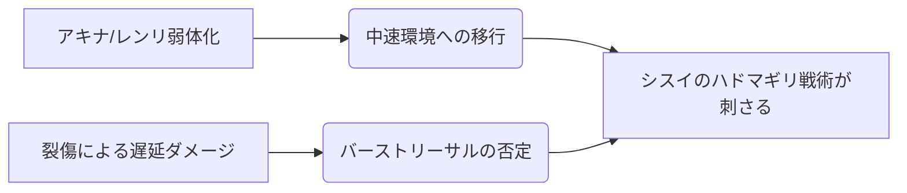

# シスイ

  
  

    
【鋸】シスイ / Season 10

    

      難易度: ★★★☆☆
      [間合](../mechanics.md#range): 2-3
      タイプ: ビートダウン
      S10 Meta: Tier 1 (Aggro)
    

  

## S10 環境分析

> [!CAUTION]
> **初心者が陥る致命的な罠**
> - **無計画な自傷**: シスイは自ら「裂傷」を負うことで火力を出すが、[ライフ](../mechanics.md#life)5以下での過度な自傷はセルフリーサルを招く。
> - **ハドマギリの温存しすぎ**: [フレア](../mechanics.md#flare)2で撃てるこの札は、中盤のダメージレースを優位に進めるために早期使用も選択肢。

## 戦略的タイムライン

### Phase 1: 開幕 (Turn 1-2)
- **目的**: 『徹底抗戦』や『刻み込み』で相手に「裂傷」を植え付ける。
- **推奨挙動**: [前進](../mechanics.md#advance)を優先し、[間合](../mechanics.md#range)3をキープ。

### Phase 2: 中盤 (Turn 3-5)
- **目的**: 相手の[オーラ](../mechanics.md#aura)上限を裂傷で削り、[ライフ](../mechanics.md#life)への通りを良くする。
- **決戦準備**: 自身の裂傷を『反乱撃』でバフに変換し、高火力のプレッシャーをかける。

### Phase 3: 終盤 (リーサル)
- **目的**: 『ハドマギリ』による裂傷即時発動で、相手の計算を狂わせて落とす。

## [通常札](../mechanics.md)性能マトリクス

| カード名 | 主な役割 | 特徴 | S10 特記事項 |
| :--- | :--- | :--- | :--- |
| **鋸斬り** | 主力攻撃 | 2/2 相手に裂傷付与 | 基本性能の塊。 |
| **刻み刃** | 継続火力 | 1/1 攻撃後、裂傷を深める | オーラを剥がした後に有効。 |
| **茨道** | 位置調整 | 移動 + 相手に裂傷 | レンジロック対策の要。 |
| **反乱撃** | 自己強化 | 自身の裂傷を火力に変換 | **リーサルパーツ**。 |
| **金屑纏い** | リソース | 相手リソース奪取 + 自オーラ回復 | 粘り強く戦うために。 |
| **徹底抗戦** | 妨害 | 攻撃を裂傷化して与える | 相手の「構築」を狂わせる。 |

## [切札](../mechanics.md)：必殺の定義

| 名称 | コスト | 種別 | 解説 |
| :--- | :---: | :--- | :--- |
| **ハドマギリ** | 2 | 攻撃 | **フィニッシャー**。裂傷ダメージを即座に処理する。 |
| **ウバラザキ** | 5 | 攻撃 | [フレア](../mechanics.md#flare)裂傷によるリソース破壊。 |
| **アブダグイ** | 3 | 対応 | **防御の要**。致命傷を避けるためのクッション。 |

## アンチメガミ・相性
- **得意**: 耐久力の低いメガミ、またはリソース供給が細いメガミ（[アキナ](23_akina.md)等とのリソース合戦）。
- **苦手**: 圧倒的バースト火力の[ユリナ](01_yurina.md)や、レンジロックの[ハツミ](17_hatsumi.md)。
- **対策**: 『茨道』で強引に詰め、『ハドマギリ』のコスパを活かした早めの決着を目指せ。

---

!!! note "出典"
    本ページの内容は [「算鋸が強すぎたから解説してみた」（ぷれ）](https://pure4183.hatenadiary.com/entry/SANOKOSAIKYO) を主な根拠としています。
