# 全カード一覧

## ユリナ {: #yurina }

-   [:external-link: ](../assets/images/card/cards/na_01_o_n/na_01_o_n_1.png){ .glightbox }

-   [:external-link: ](../assets/images/card/cards/na_01_o_n/na_01_o_n_2.png){ .glightbox }

-   [:external-link: ](../assets/images/card/cards/na_01_o_n/na_01_o_n_3.png){ .glightbox }

-   [:external-link: ](../assets/images/card/cards/na_01_o_n/na_01_o_n_4.png){ .glightbox }

-   [:external-link: ](../assets/images/card/cards/na_01_o_n/na_01_o_n_5.png){ .glightbox }

-   [:external-link: ](../assets/images/card/cards/na_01_o_n/na_01_o_n_6.png){ .glightbox }

-   [:external-link: ](../assets/images/card/cards/na_01_o_n/na_01_o_n_7.png){ .glightbox }

## サイネ {: #saine }

-   [:external-link: ](../assets/images/card/cards/na_02_o_n/na_02_o_n_1.png){ .glightbox }

-   [:external-link: 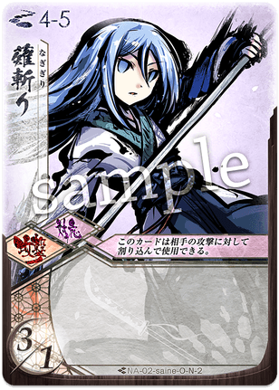](../assets/images/card/cards/na_02_o_n/na_02_o_n_2.png){ .glightbox }

-   [:external-link: ](../assets/images/card/cards/na_02_o_n/na_02_o_n_3.png){ .glightbox }

-   [:external-link: ](../assets/images/card/cards/na_02_o_n/na_02_o_n_4.png){ .glightbox }

-   [:external-link: 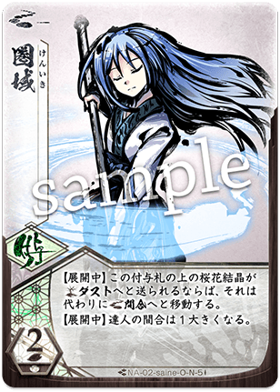](../assets/images/card/cards/na_02_o_n/na_02_o_n_5.png){ .glightbox }

-   [:external-link: 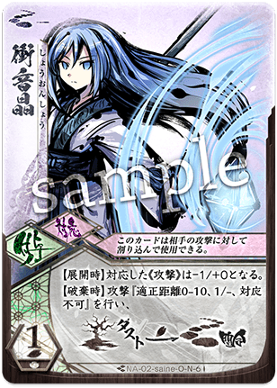](../assets/images/card/cards/na_02_o_n/na_02_o_n_6.png){ .glightbox }

-   [:external-link: ](../assets/images/card/cards/na_02_o_n/na_02_o_n_7.png){ .glightbox }

## ヒミカ {: #himika }

-   [:external-link: ](../assets/images/card/cards/na_03_o_n/na_03_o_n_1.png){ .glightbox }

-   [:external-link: ](../assets/images/card/cards/na_03_o_n/na_03_o_n_2.png){ .glightbox }

-   [:external-link: ](../assets/images/card/cards/na_03_o_n/na_03_o_n_3.png){ .glightbox }

-   [:external-link: ](../assets/images/card/cards/na_03_o_n/na_03_o_n_4.png){ .glightbox }

-   [:external-link: ](../assets/images/card/cards/na_03_o_n/na_03_o_n_5.png){ .glightbox }

-   [:external-link: ](../assets/images/card/cards/na_03_o_n/na_03_o_n_6.png){ .glightbox }

-   [:external-link: ](../assets/images/card/cards/na_03_o_n/na_03_o_n_7.png){ .glightbox }

## トコヨ {: #tokoyo }

-   [:external-link: ](../assets/images/card/cards/na_04_o_n/na_04_o_n_1.png){ .glightbox }

-   [:external-link: ](../assets/images/card/cards/na_04_o_n/na_04_o_n_2.png){ .glightbox }

-   [:external-link: 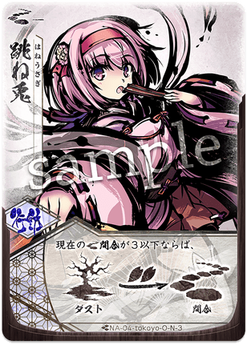](../assets/images/card/cards/na_04_o_n/na_04_o_n_3.png){ .glightbox }

-   [:external-link: ](../assets/images/card/cards/na_04_o_n/na_04_o_n_4.png){ .glightbox }

-   [:external-link: ](../assets/images/card/cards/na_04_o_n/na_04_o_n_5.png){ .glightbox }

-   [:external-link: ](../assets/images/card/cards/na_04_o_n/na_04_o_n_6.png){ .glightbox }

-   [:external-link: ](../assets/images/card/cards/na_04_o_n/na_04_o_n_7.png){ .glightbox }

## オボロ {: #oboro }

-   [:external-link: ](../assets/images/card/cards/na_05_o_n/na_05_o_n_1.png){ .glightbox }

-   [:external-link: 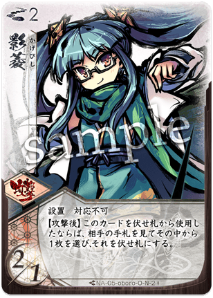](../assets/images/card/cards/na_05_o_n/na_05_o_n_2.png){ .glightbox }

-   [:external-link: ](../assets/images/card/cards/na_05_o_n/na_05_o_n_3.png){ .glightbox }

-   [:external-link: 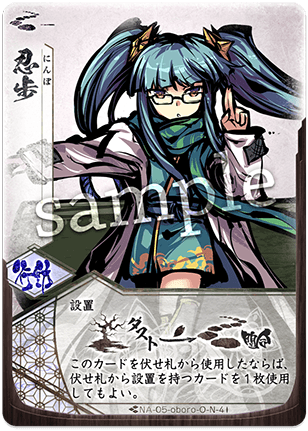](../assets/images/card/cards/na_05_o_n/na_05_o_n_4.png){ .glightbox }

-   [:external-link: ](../assets/images/card/cards/na_05_o_n/na_05_o_n_5.png){ .glightbox }

-   [:external-link: 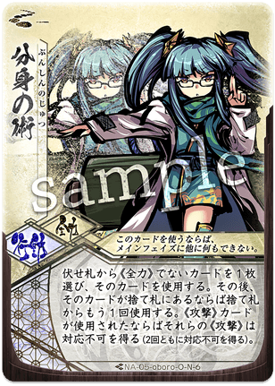](../assets/images/card/cards/na_05_o_n/na_05_o_n_6.png){ .glightbox }

-   [:external-link: ](../assets/images/card/cards/na_05_o_n/na_05_o_n_7.png){ .glightbox }

## ユキヒ {: #yukihi }

-   [:external-link: ](../assets/images/card/cards/na_06_o_n/na_06_o_n_1.png){ .glightbox }

-   [:external-link: ](../assets/images/card/cards/na_06_o_n/na_06_o_n_2.png){ .glightbox }

-   [:external-link: ](../assets/images/card/cards/na_06_o_n/na_06_o_n_3.png){ .glightbox }

-   [:external-link: 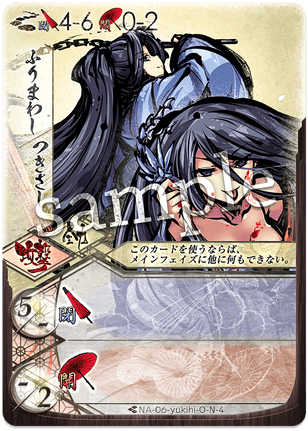](../assets/images/card/cards/na_06_o_n/na_06_o_n_4.png){ .glightbox }

-   [:external-link: ](../assets/images/card/cards/na_06_o_n/na_06_o_n_5.png){ .glightbox }

-   [:external-link: ](../assets/images/card/cards/na_06_o_n/na_06_o_n_6.png){ .glightbox }

-   [:external-link: ](../assets/images/card/cards/na_06_o_n/na_06_o_n_7.png){ .glightbox }

## シンラ {: #shinra }

-   [:external-link: ](../assets/images/card/cards/na_07_o_n/na_07_o_n_1.png){ .glightbox }

-   [:external-link: ](../assets/images/card/cards/na_07_o_n/na_07_o_n_2.png){ .glightbox }

-   [:external-link: ](../assets/images/card/cards/na_07_o_n/na_07_o_n_3.png){ .glightbox }

-   [:external-link: ](../assets/images/card/cards/na_07_o_n/na_07_o_n_4.png){ .glightbox }

-   [:external-link: ](../assets/images/card/cards/na_07_o_n/na_07_o_n_5.png){ .glightbox }

-   [:external-link: ](../assets/images/card/cards/na_07_o_n/na_07_o_n_6.png){ .glightbox }

-   [:external-link: 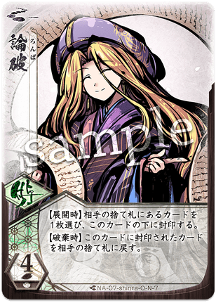](../assets/images/card/cards/na_07_o_n/na_07_o_n_7.png){ .glightbox }

## ハガネ {: #hagane }

-   [:external-link: ](../assets/images/card/cards/na_08_o_n/na_08_o_n_1.png){ .glightbox }

-   [:external-link: ](../assets/images/card/cards/na_08_o_n/na_08_o_n_2.png){ .glightbox }

-   [:external-link: ](../assets/images/card/cards/na_08_o_n/na_08_o_n_3.png){ .glightbox }

-   [:external-link: ](../assets/images/card/cards/na_08_o_n/na_08_o_n_4.png){ .glightbox }

-   [:external-link: ](../assets/images/card/cards/na_08_o_n/na_08_o_n_5.png){ .glightbox }

-   [:external-link: ](../assets/images/card/cards/na_08_o_n/na_08_o_n_6.png){ .glightbox }

-   [:external-link: ](../assets/images/card/cards/na_08_o_n/na_08_o_n_7.png){ .glightbox }

## チカゲ {: #chikage }

-   [:external-link: ](../assets/images/card/cards/na_09_o_n/na_09_o_n_1.png){ .glightbox }

-   [:external-link: ](../assets/images/card/cards/na_09_o_n/na_09_o_n_2.png){ .glightbox }

-   [:external-link: ](../assets/images/card/cards/na_09_o_n/na_09_o_n_3.png){ .glightbox }

-   [:external-link: ](../assets/images/card/cards/na_09_o_n/na_09_o_n_4.png){ .glightbox }

-   [:external-link: ](../assets/images/card/cards/na_09_o_n/na_09_o_n_5.png){ .glightbox }

-   [:external-link: ](../assets/images/card/cards/na_09_o_n/na_09_o_n_6.png){ .glightbox }

-   [:external-link: ](../assets/images/card/cards/na_09_o_n/na_09_o_n_7.png){ .glightbox }

## クルル {: #kururu }

-   [:external-link: ](../assets/images/card/cards/na_10_o_n/na_10_o_n_1.png){ .glightbox }

-   [:external-link: 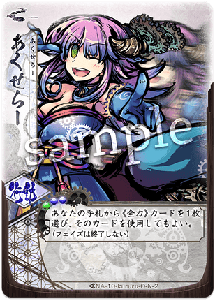](../assets/images/card/cards/na_10_o_n/na_10_o_n_2.png){ .glightbox }

-   [:external-link: 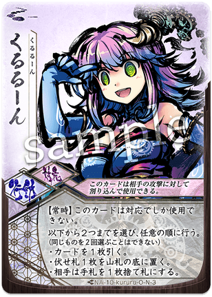](../assets/images/card/cards/na_10_o_n/na_10_o_n_3.png){ .glightbox }

-   [:external-link: ](../assets/images/card/cards/na_10_o_n/na_10_o_n_4.png){ .glightbox }

-   [:external-link: 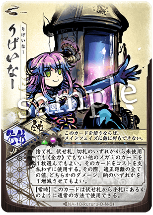](../assets/images/card/cards/na_10_o_n/na_10_o_n_5.png){ .glightbox }

-   [:external-link: ](../assets/images/card/cards/na_10_o_n/na_10_o_n_6.png){ .glightbox }

-   [:external-link: ](../assets/images/card/cards/na_10_o_n/na_10_o_n_7.png){ .glightbox }

## サリヤ {: #sariya }

-   [:external-link: 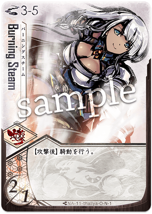](../assets/images/card/cards/na_11_o_n/na_11_o_n_1.png){ .glightbox }

-   [:external-link: ](../assets/images/card/cards/na_11_o_n/na_11_o_n_2.png){ .glightbox }

-   [:external-link: 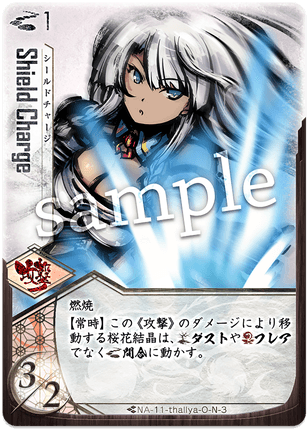](../assets/images/card/cards/na_11_o_n/na_11_o_n_3.png){ .glightbox }

-   [:external-link: 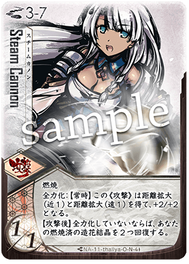](../assets/images/card/cards/na_11_o_n/na_11_o_n_4.png){ .glightbox }

-   [:external-link: ](../assets/images/card/cards/na_11_o_n/na_11_o_n_5.png){ .glightbox }

-   [:external-link: ](../assets/images/card/cards/na_11_o_n/na_11_o_n_6.png){ .glightbox }

-   [:external-link: 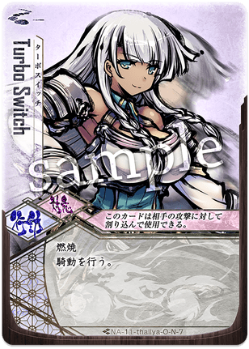](../assets/images/card/cards/na_11_o_n/na_11_o_n_7.png){ .glightbox }

## ライラ {: #laila }

-   [:external-link: ](../assets/images/card/cards/na_12_o_n/na_12_o_n_1.png){ .glightbox }

-   [:external-link: 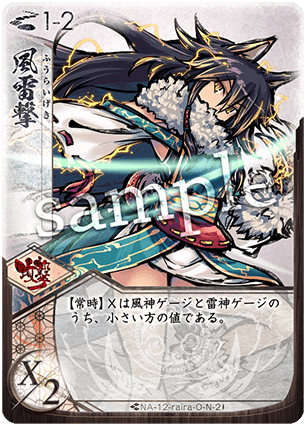](../assets/images/card/cards/na_12_o_n/na_12_o_n_2.png){ .glightbox }

-   [:external-link: ](../assets/images/card/cards/na_12_o_n/na_12_o_n_3.png){ .glightbox }

-   [:external-link: 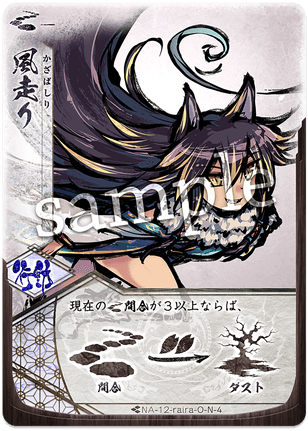](../assets/images/card/cards/na_12_o_n/na_12_o_n_4.png){ .glightbox }

-   [:external-link: ](../assets/images/card/cards/na_12_o_n/na_12_o_n_5.png){ .glightbox }

-   [:external-link: ](../assets/images/card/cards/na_12_o_n/na_12_o_n_6.png){ .glightbox }

-   [:external-link: ](../assets/images/card/cards/na_12_o_n/na_12_o_n_7.png){ .glightbox }

## ウツロ {: #utsuro }

-   [:external-link: ](../assets/images/card/cards/na_13_o_n/na_13_o_n_1.png){ .glightbox }

-   [:external-link: ](../assets/images/card/cards/na_13_o_n/na_13_o_n_2.png){ .glightbox }

-   [:external-link: ](../assets/images/card/cards/na_13_o_n/na_13_o_n_3.png){ .glightbox }

-   [:external-link: 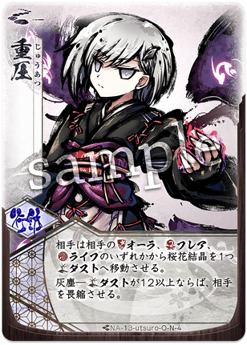](../assets/images/card/cards/na_13_o_n/na_13_o_n_4.png){ .glightbox }

-   [:external-link: ](../assets/images/card/cards/na_13_o_n/na_13_o_n_5.png){ .glightbox }

-   [:external-link: ](../assets/images/card/cards/na_13_o_n/na_13_o_n_6.png){ .glightbox }

-   [:external-link: ](../assets/images/card/cards/na_13_o_n/na_13_o_n_7.png){ .glightbox }

## ホノカ {: #honoka }

-   [:external-link: 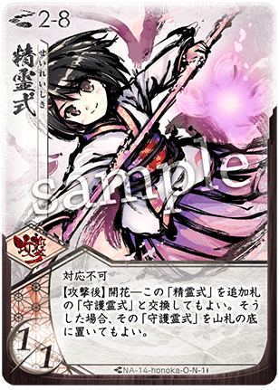](../assets/images/card/cards/na_14_o_n/na_14_o_n_1.png){ .glightbox }

-   [:external-link: 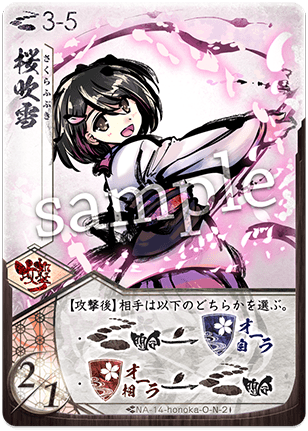](../assets/images/card/cards/na_14_o_n/na_14_o_n_2.png){ .glightbox }

-   [:external-link: ](../assets/images/card/cards/na_14_o_n/na_14_o_n_3.png){ .glightbox }

-   [:external-link: ](../assets/images/card/cards/na_14_o_n/na_14_o_n_4.png){ .glightbox }

-   [:external-link: ](../assets/images/card/cards/na_14_o_n/na_14_o_n_5.png){ .glightbox }

-   [:external-link: ](../assets/images/card/cards/na_14_o_n/na_14_o_n_6.png){ .glightbox }

-   [:external-link: ](../assets/images/card/cards/na_14_o_n/na_14_o_n_7.png){ .glightbox }

## コルヌ {: #korunu }

-   [:external-link: ](../assets/images/card/cards/na_15_o_n/na_15_o_n_1.png){ .glightbox }

-   [:external-link: 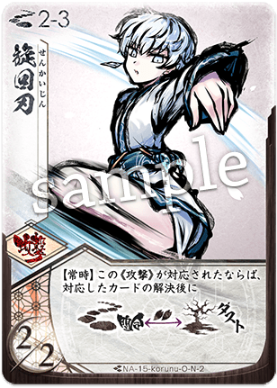](../assets/images/card/cards/na_15_o_n/na_15_o_n_2.png){ .glightbox }

-   [:external-link: ](../assets/images/card/cards/na_15_o_n/na_15_o_n_3.png){ .glightbox }

-   [:external-link: ](../assets/images/card/cards/na_15_o_n/na_15_o_n_4.png){ .glightbox }

-   [:external-link: ](../assets/images/card/cards/na_15_o_n/na_15_o_n_5.png){ .glightbox }

-   [:external-link: ](../assets/images/card/cards/na_15_o_n/na_15_o_n_6.png){ .glightbox }

-   [:external-link: ](../assets/images/card/cards/na_15_o_n/na_15_o_n_7.png){ .glightbox }

## ヤツハ {: #yatsuha }

-   [:external-link: ](../assets/images/card/cards/na_16_o_n/na_16_o_n_1.png){ .glightbox }

-   [:external-link: ](../assets/images/card/cards/na_16_o_n/na_16_o_n_2.png){ .glightbox }

-   [:external-link: ](../assets/images/card/cards/na_16_o_n/na_16_o_n_3.png){ .glightbox }

-   [:external-link: ](../assets/images/card/cards/na_16_o_n/na_16_o_n_4.png){ .glightbox }

-   [:external-link: 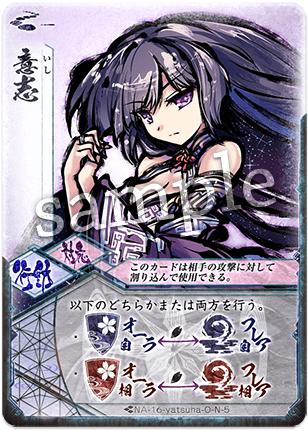](../assets/images/card/cards/na_16_o_n/na_16_o_n_5.png){ .glightbox }

-   [:external-link: ](../assets/images/card/cards/na_16_o_n/na_16_o_n_6.png){ .glightbox }

-   [:external-link: 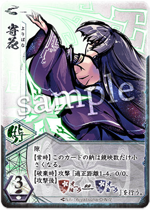](../assets/images/card/cards/na_16_o_n/na_16_o_n_7.png){ .glightbox }

## ハツミ {: #hatsumi }

-   [:external-link: ](../assets/images/card/cards/na_17_o_n/na_17_o_n_1.png){ .glightbox }

-   [:external-link: ](../assets/images/card/cards/na_17_o_n/na_17_o_n_2.png){ .glightbox }

-   [:external-link: 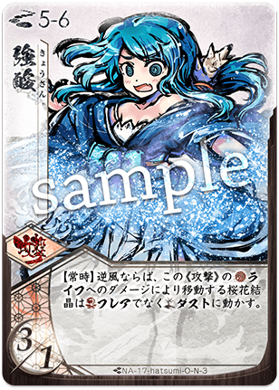](../assets/images/card/cards/na_17_o_n/na_17_o_n_3.png){ .glightbox }

-   [:external-link: ](../assets/images/card/cards/na_17_o_n/na_17_o_n_4.png){ .glightbox }

-   [:external-link: 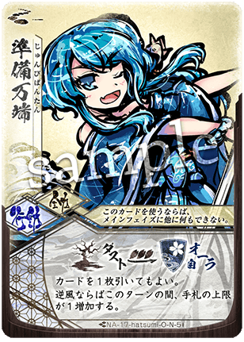](../assets/images/card/cards/na_17_o_n/na_17_o_n_5.png){ .glightbox }

-   [:external-link: 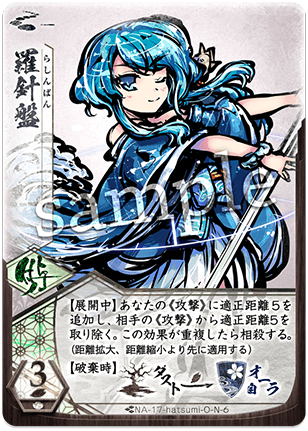](../assets/images/card/cards/na_17_o_n/na_17_o_n_6.png){ .glightbox }

-   [:external-link: 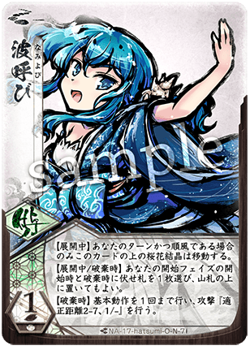](../assets/images/card/cards/na_17_o_n/na_17_o_n_7.png){ .glightbox }

-   [:external-link: ](../assets/images/card/cards/na_17_o_s/na_17_o_s_1.png){ .glightbox }

-   [:external-link: ](../assets/images/card/cards/na_17_o_s/na_17_o_s_2.png){ .glightbox }

-   [:external-link: 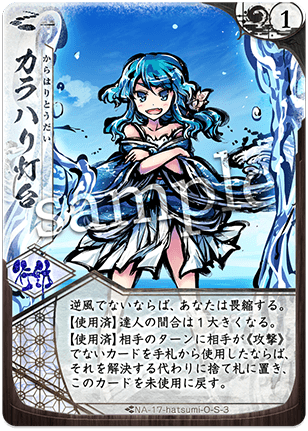](../assets/images/card/cards/na_17_o_s/na_17_o_s_3.png){ .glightbox }

## ミズキ {: #mizuki }

-   [:external-link: ](../assets/images/card/cards/na_18_o_n/na_18_o_n_1.png){ .glightbox }

-   [:external-link: ](../assets/images/card/cards/na_18_o_n/na_18_o_n_2.png){ .glightbox }

-   [:external-link: 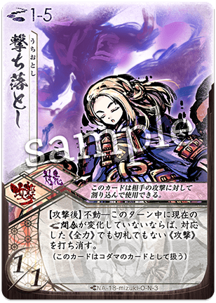](../assets/images/card/cards/na_18_o_n/na_18_o_n_3.png){ .glightbox }

-   [:external-link: 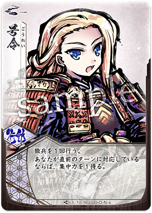](../assets/images/card/cards/na_18_o_n/na_18_o_n_4.png){ .glightbox }

-   [:external-link: 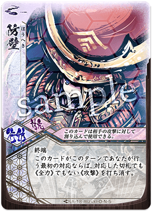](../assets/images/card/cards/na_18_o_n/na_18_o_n_5.png){ .glightbox }

-   [:external-link: 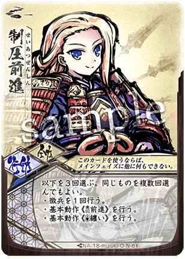](../assets/images/card/cards/na_18_o_n/na_18_o_n_6.png){ .glightbox }

-   [:external-link: 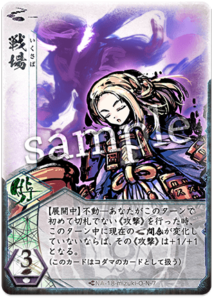](../assets/images/card/cards/na_18_o_n/na_18_o_n_7.png){ .glightbox }

-   [:external-link: ](../assets/images/card/cards/na_18_o_s/na_18_o_s_1.png){ .glightbox }

-   [:external-link: ](../assets/images/card/cards/na_18_o_s/na_18_o_s_2.png){ .glightbox }

-   [:external-link: 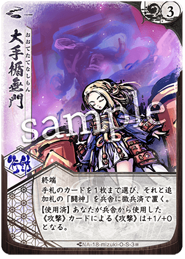](../assets/images/card/cards/na_18_o_s/na_18_o_s_3.png){ .glightbox }

## メグミ {: #megumi }

-   [:external-link: ](../assets/images/card/cards/na_19_o_n/na_19_o_n_1.png){ .glightbox }

-   [:external-link: 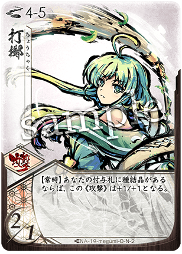](../assets/images/card/cards/na_19_o_n/na_19_o_n_2.png){ .glightbox }

-   [:external-link: ](../assets/images/card/cards/na_19_o_n/na_19_o_n_3.png){ .glightbox }

-   [:external-link: 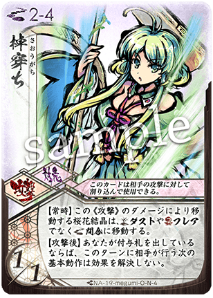](../assets/images/card/cards/na_19_o_n/na_19_o_n_4.png){ .glightbox }

-   [:external-link: 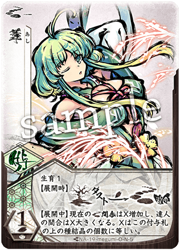](../assets/images/card/cards/na_19_o_n/na_19_o_n_5.png){ .glightbox }

-   [:external-link: 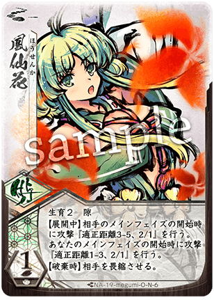](../assets/images/card/cards/na_19_o_n/na_19_o_n_6.png){ .glightbox }

-   [:external-link: ](../assets/images/card/cards/na_19_o_n/na_19_o_n_7.png){ .glightbox }

-   [:external-link: 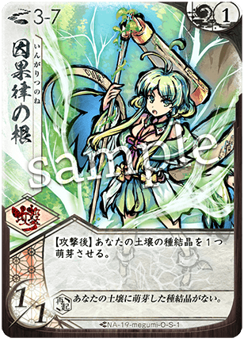](../assets/images/card/cards/na_19_o_s/na_19_o_s_1.png){ .glightbox }

-   [:external-link: ](../assets/images/card/cards/na_19_o_s/na_19_o_s_2.png){ .glightbox }

-   [:external-link: 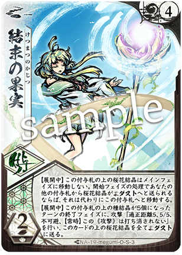](../assets/images/card/cards/na_19_o_s/na_19_o_s_3.png){ .glightbox }

## カナヱ {: #kanawe }

-   [:external-link: ](../assets/images/card/cards/na_20_o_n/na_20_o_n_1.png){ .glightbox }

-   [:external-link: ](../assets/images/card/cards/na_20_o_n/na_20_o_n_2.png){ .glightbox }

-   [:external-link: ](../assets/images/card/cards/na_20_o_n/na_20_o_n_3.png){ .glightbox }

-   [:external-link: 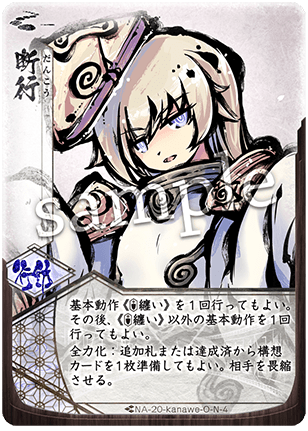](../assets/images/card/cards/na_20_o_n/na_20_o_n_4.png){ .glightbox }

-   [:external-link: 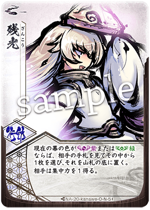](../assets/images/card/cards/na_20_o_n/na_20_o_n_5.png){ .glightbox }

-   [:external-link: 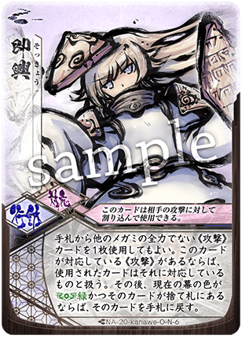](../assets/images/card/cards/na_20_o_n/na_20_o_n_6.png){ .glightbox }

-   [:external-link: 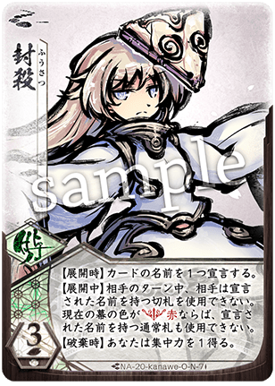](../assets/images/card/cards/na_20_o_n/na_20_o_n_7.png){ .glightbox }

-   [:external-link: ](../assets/images/card/cards/na_20_o_s/na_20_o_s_1.png){ .glightbox }

-   [:external-link: ](../assets/images/card/cards/na_20_o_s/na_20_o_s_2.png){ .glightbox }

-   [:external-link: 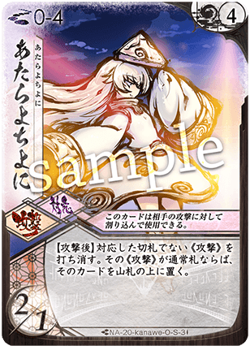](../assets/images/card/cards/na_20_o_s/na_20_o_s_3.png){ .glightbox }

## カムヰ {: #kamui }

-   [:external-link: ](../assets/images/card/cards/na_21_o_n/na_21_o_n_1.png){ .glightbox }

-   [:external-link: ](../assets/images/card/cards/na_21_o_n/na_21_o_n_2.png){ .glightbox }

-   [:external-link: 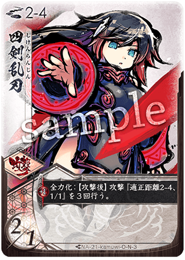](../assets/images/card/cards/na_21_o_n/na_21_o_n_3.png){ .glightbox }

-   [:external-link: ](../assets/images/card/cards/na_21_o_n/na_21_o_n_4.png){ .glightbox }

-   [:external-link: 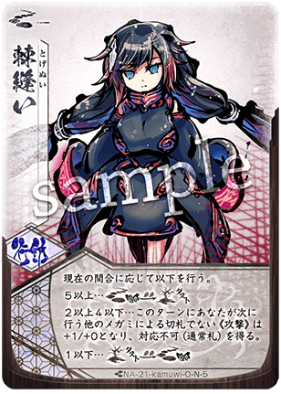](../assets/images/card/cards/na_21_o_n/na_21_o_n_5.png){ .glightbox }

-   [:external-link: ](../assets/images/card/cards/na_21_o_n/na_21_o_n_6.png){ .glightbox }

-   [:external-link: ](../assets/images/card/cards/na_21_o_n/na_21_o_n_7.png){ .glightbox }

-   [:external-link: ](../assets/images/card/cards/na_21_o_s/na_21_o_s_1.png){ .glightbox }

-   [:external-link: 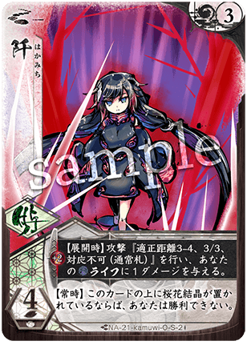](../assets/images/card/cards/na_21_o_s/na_21_o_s_2.png){ .glightbox }

-   [:external-link: ](../assets/images/card/cards/na_21_o_s/na_21_o_s_3.png){ .glightbox }

-   [:external-link: 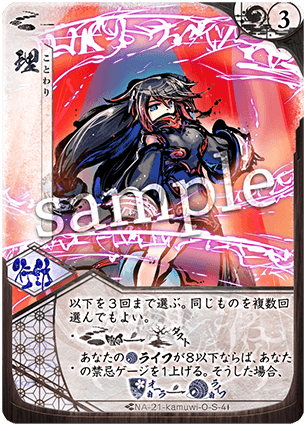](../assets/images/card/cards/na_21_o_s/na_21_o_s_4.png){ .glightbox }

## レンリ {: #renri }

-   [:external-link: ](../assets/images/card/cards/na_22_o_n/na_22_o_n_1.png){ .glightbox }

-   [:external-link: ](../assets/images/card/cards/na_22_o_n/na_22_o_n_2.png){ .glightbox }

-   [:external-link: ](../assets/images/card/cards/na_22_o_n/na_22_o_n_3.png){ .glightbox }

-   [:external-link: ](../assets/images/card/cards/na_22_o_n/na_22_o_n_4.png){ .glightbox }

-   [:external-link: ](../assets/images/card/cards/na_22_o_n/na_22_o_n_5.png){ .glightbox }

-   [:external-link: ](../assets/images/card/cards/na_22_o_n/na_22_o_n_6.png){ .glightbox }

-   [:external-link: ](../assets/images/card/cards/na_22_o_n/na_22_o_n_7.png){ .glightbox }

-   [:external-link: ](../assets/images/card/cards/na_22_o_s/na_22_o_s_1.png){ .glightbox }

-   [:external-link: ](../assets/images/card/cards/na_22_o_s/na_22_o_s_2.png){ .glightbox }

-   [:external-link: ](../assets/images/card/cards/na_22_o_s/na_22_o_s_3.png){ .glightbox }

## アキナ {: #akina }

-   [:external-link: ](../assets/images/card/cards/na_23_o_n/na_23_o_n_1.png){ .glightbox }

-   [:external-link: ](../assets/images/card/cards/na_23_o_n/na_23_o_n_2.png){ .glightbox }

-   [:external-link: ](../assets/images/card/cards/na_23_o_n/na_23_o_n_3.png){ .glightbox }

-   [:external-link: ](../assets/images/card/cards/na_23_o_n/na_23_o_n_4.png){ .glightbox }

-   [:external-link: ](../assets/images/card/cards/na_23_o_n/na_23_o_n_5.png){ .glightbox }

-   [:external-link: ](../assets/images/card/cards/na_23_o_n/na_23_o_n_6.png){ .glightbox }

-   [:external-link: ](../assets/images/card/cards/na_23_o_n/na_23_o_n_7.png){ .glightbox }

-   [:external-link: ](../assets/images/card/cards/na_23_o_s/na_23_o_s_1.png){ .glightbox }

-   [:external-link: ](../assets/images/card/cards/na_23_o_s/na_23_o_s_2.png){ .glightbox }

-   [:external-link: ](../assets/images/card/cards/na_23_o_s/na_23_o_s_3.png){ .glightbox }

## シスイ {: #shisui }

-   [:external-link: ](../assets/images/card/cards/na_24_o_n/na_24_o_n_1.png){ .glightbox }

-   [:external-link: ](../assets/images/card/cards/na_24_o_n/na_24_o_n_2.png){ .glightbox }

-   [:external-link: ](../assets/images/card/cards/na_24_o_n/na_24_o_n_3.png){ .glightbox }

-   [:external-link: ](../assets/images/card/cards/na_24_o_n/na_24_o_n_4.png){ .glightbox }

-   [:external-link: ](../assets/images/card/cards/na_24_o_n/na_24_o_n_5.png){ .glightbox }

-   [:external-link: ](../assets/images/card/cards/na_24_o_n/na_24_o_n_6.png){ .glightbox }

-   [:external-link: ](../assets/images/card/cards/na_24_o_n/na_24_o_n_7.png){ .glightbox }

-   [:external-link: ](../assets/images/card/cards/na_24_o_s/na_24_o_s_1.png){ .glightbox }

-   [:external-link: ](../assets/images/card/cards/na_24_o_s/na_24_o_s_2.png){ .glightbox }

-   [:external-link: ](../assets/images/card/cards/na_24_o_s/na_24_o_s_3.png){ .glightbox }

