# 全カード一覧

各メガミのタブから通常札と切札を確認できます。アナザー版ではオリジンと共通のカードは少し薄く表示されています。

## ユリナ {: #yurina }

=== "オリジン"

    ### 通常札

    

    -   [:external-link: 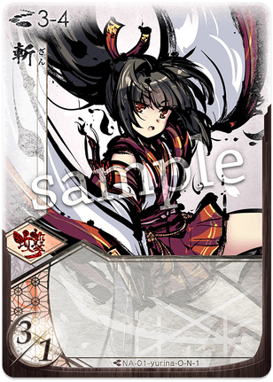](../assets/images/card/cards/na_01_o_n/na_01_o_n_1.png){ .glightbox  }

    -   [:external-link: 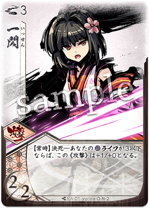](../assets/images/card/cards/na_01_o_n/na_01_o_n_2.png){ .glightbox  }

    -   [:external-link: 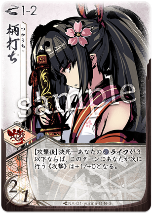](../assets/images/card/cards/na_01_o_n/na_01_o_n_3.png){ .glightbox  }

    -   [:external-link: 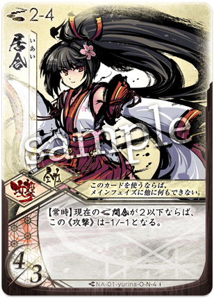](../assets/images/card/cards/na_01_o_n/na_01_o_n_4.png){ .glightbox  }

    -   [:external-link: 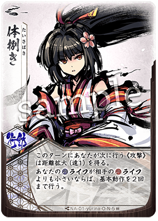](../assets/images/card/cards/na_01_o_n/na_01_o_n_5.png){ .glightbox  }

    -   [:external-link: 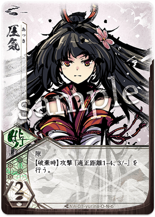](../assets/images/card/cards/na_01_o_n/na_01_o_n_6.png){ .glightbox  }

    -   [:external-link: 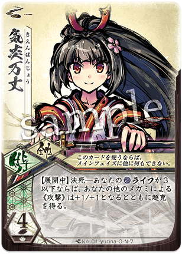](../assets/images/card/cards/na_01_o_n/na_01_o_n_7.png){ .glightbox  }

    

    ### 切札

    

    -   [:external-link: 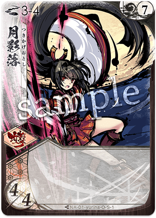](../assets/images/card/cards/na_01_o_s/na_01_o_s_1.png){ .glightbox  }

    -   [:external-link: 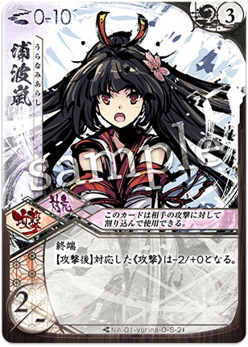](../assets/images/card/cards/na_01_o_s/na_01_o_s_2.png){ .glightbox  }

    -   [:external-link: 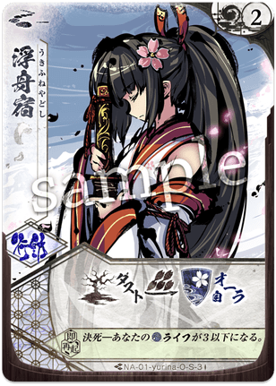](../assets/images/card/cards/na_01_o_s/na_01_o_s_3.png){ .glightbox  }

    -   [:external-link: 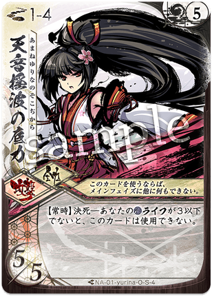](../assets/images/card/cards/na_01_o_s/na_01_o_s_4.png){ .glightbox  }

    

=== "アナザー1"

    ### 通常札

    

    -   [:external-link: 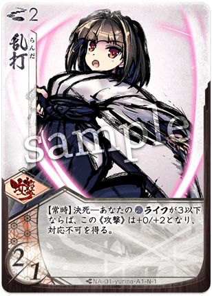](../assets/images/card/cards/na_01_o_n/na_01_a1_n_1.png){ .glightbox  }

    -   [:external-link: ](../assets/images/card/cards/na_01_o_n/na_01_o_n_2.png){ .glightbox  style="opacity: 0.8; filter: grayscale(20%);" }

    -   [:external-link: ](../assets/images/card/cards/na_01_o_n/na_01_o_n_3.png){ .glightbox  style="opacity: 0.8; filter: grayscale(20%);" }

    -   [:external-link: ](../assets/images/card/cards/na_01_o_n/na_01_o_n_4.png){ .glightbox  style="opacity: 0.8; filter: grayscale(20%);" }

    -   [:external-link: ](../assets/images/card/cards/na_01_o_n/na_01_o_n_5.png){ .glightbox  style="opacity: 0.8; filter: grayscale(20%);" }

    -   [:external-link: 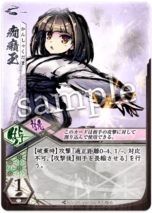](../assets/images/card/cards/na_01_o_n/na_01_a1_n_6.png){ .glightbox  }

    -   [:external-link: ](../assets/images/card/cards/na_01_o_n/na_01_o_n_7.png){ .glightbox  style="opacity: 0.8; filter: grayscale(20%);" }

    

    ### 切札

    

    -   [:external-link: ](../assets/images/card/cards/na_01_o_s/na_01_o_s_1.png){ .glightbox  style="opacity: 0.8; filter: grayscale(20%);" }

    -   [:external-link: ](../assets/images/card/cards/na_01_o_s/na_01_o_s_2.png){ .glightbox  style="opacity: 0.8; filter: grayscale(20%);" }

    -   [:external-link: ](../assets/images/card/cards/na_01_o_s/na_01_o_s_3.png){ .glightbox  style="opacity: 0.8; filter: grayscale(20%);" }

    -   [:external-link: ](../assets/images/card/cards/na_01_o_s/na_01_o_s_4.png){ .glightbox  style="opacity: 0.8; filter: grayscale(20%);" }

    

=== "アナザー2"

    ### 通常札

    

    -   [:external-link: ](../assets/images/card/cards/na_01_o_n/na_01_o_n_1.png){ .glightbox  style="opacity: 0.8; filter: grayscale(20%);" }

    -   [:external-link: ](../assets/images/card/cards/na_01_o_n/na_01_o_n_2.png){ .glightbox  style="opacity: 0.8; filter: grayscale(20%);" }

    -   [:external-link: 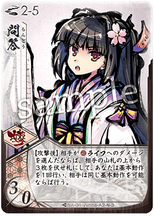](../assets/images/card/cards/na_01_o_n/na_01_a2_n_3.png){ .glightbox  }

    -   [:external-link: ](../assets/images/card/cards/na_01_o_n/na_01_o_n_4.png){ .glightbox  style="opacity: 0.8; filter: grayscale(20%);" }

    -   [:external-link: ](../assets/images/card/cards/na_01_o_n/na_01_o_n_5.png){ .glightbox  style="opacity: 0.8; filter: grayscale(20%);" }

    -   [:external-link: ](../assets/images/card/cards/na_01_o_n/na_01_o_n_6.png){ .glightbox  style="opacity: 0.8; filter: grayscale(20%);" }

    -   [:external-link: 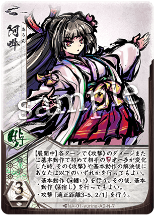](../assets/images/card/cards/na_01_o_n/na_01_a2_n_7.png){ .glightbox  }

    

    ### 切札

    

    -   [:external-link: ](../assets/images/card/cards/na_01_o_s/na_01_o_s_1.png){ .glightbox  style="opacity: 0.8; filter: grayscale(20%);" }

    -   [:external-link: ](../assets/images/card/cards/na_01_o_s/na_01_o_s_2.png){ .glightbox  style="opacity: 0.8; filter: grayscale(20%);" }

    -   [:external-link: ](../assets/images/card/cards/na_01_o_s/na_01_o_s_3.png){ .glightbox  style="opacity: 0.8; filter: grayscale(20%);" }

    -   [:external-link: ](../assets/images/card/cards/na_01_o_s/na_01_o_s_4.png){ .glightbox  style="opacity: 0.8; filter: grayscale(20%);" }

    

## サイネ {: #saine }

=== "オリジン"

    ### 通常札

    

    -   [:external-link: 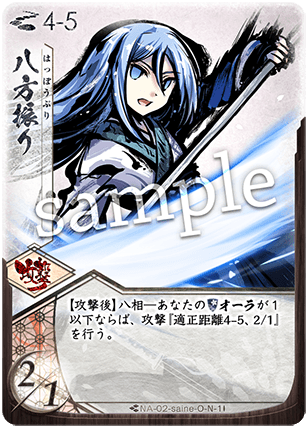](../assets/images/card/cards/na_02_o_n/na_02_o_n_1.png){ .glightbox  }

    -   [:external-link: 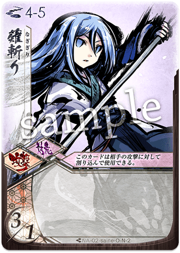](../assets/images/card/cards/na_02_o_n/na_02_o_n_2.png){ .glightbox  }

    -   [:external-link: 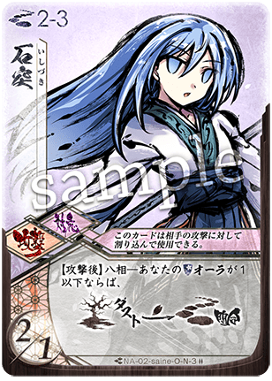](../assets/images/card/cards/na_02_o_n/na_02_o_n_3.png){ .glightbox  }

    -   [:external-link: 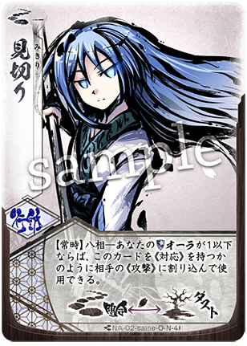](../assets/images/card/cards/na_02_o_n/na_02_o_n_4.png){ .glightbox  }

    -   [:external-link: 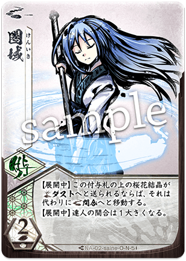](../assets/images/card/cards/na_02_o_n/na_02_o_n_5.png){ .glightbox  }

    -   [:external-link: 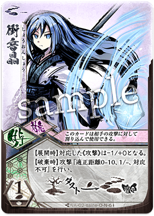](../assets/images/card/cards/na_02_o_n/na_02_o_n_6.png){ .glightbox  }

    -   [:external-link: 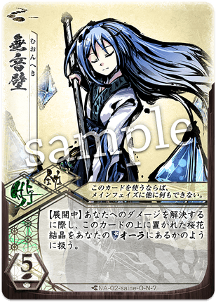](../assets/images/card/cards/na_02_o_n/na_02_o_n_7.png){ .glightbox  }

    

    ### 切札

    

    -   [:external-link: 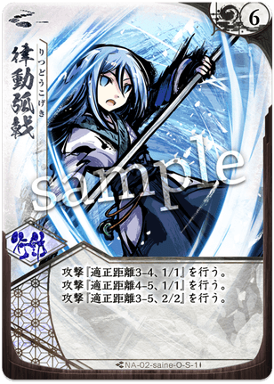](../assets/images/card/cards/na_02_o_s/na_02_o_s_1.png){ .glightbox  }

    -   [:external-link: 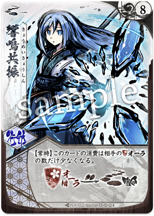](../assets/images/card/cards/na_02_o_s/na_02_o_s_2.png){ .glightbox  }

    -   [:external-link: 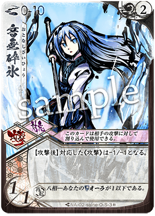](../assets/images/card/cards/na_02_o_s/na_02_o_s_3.png){ .glightbox  }

    -   [:external-link: 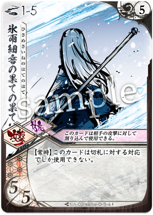](../assets/images/card/cards/na_02_o_s/na_02_o_s_4.png){ .glightbox  }

    

=== "アナザー1"

    ### 通常札

    

    -   [:external-link: ](../assets/images/card/cards/na_02_o_n/na_02_a1_n_1.png){ .glightbox  }

    -   [:external-link: ](../assets/images/card/cards/na_02_o_n/na_02_o_n_2.png){ .glightbox  style="opacity: 0.8; filter: grayscale(20%);" }

    -   [:external-link: ](../assets/images/card/cards/na_02_o_n/na_02_o_n_3.png){ .glightbox  style="opacity: 0.8; filter: grayscale(20%);" }

    -   [:external-link: ](../assets/images/card/cards/na_02_o_n/na_02_o_n_4.png){ .glightbox  style="opacity: 0.8; filter: grayscale(20%);" }

    -   [:external-link: ](../assets/images/card/cards/na_02_o_n/na_02_o_n_5.png){ .glightbox  style="opacity: 0.8; filter: grayscale(20%);" }

    -   [:external-link: 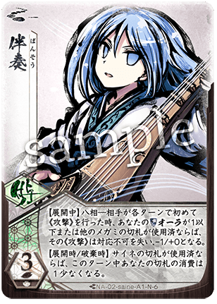](../assets/images/card/cards/na_02_o_n/na_02_a1_n_6.png){ .glightbox  }

    -   [:external-link: ](../assets/images/card/cards/na_02_o_n/na_02_o_n_7.png){ .glightbox  style="opacity: 0.8; filter: grayscale(20%);" }

    

    ### 切札

    

    -   [:external-link: ](../assets/images/card/cards/na_02_o_s/na_02_o_s_1.png){ .glightbox  style="opacity: 0.8; filter: grayscale(20%);" }

    -   [:external-link: ](../assets/images/card/cards/na_02_o_s/na_02_o_s_2.png){ .glightbox  style="opacity: 0.8; filter: grayscale(20%);" }

    -   [:external-link: ](../assets/images/card/cards/na_02_o_s/na_02_o_s_3.png){ .glightbox  style="opacity: 0.8; filter: grayscale(20%);" }

    -   [:external-link: ](../assets/images/card/cards/na_02_o_s/na_02_o_s_4.png){ .glightbox  style="opacity: 0.8; filter: grayscale(20%);" }

    

=== "アナザー2"

    ### 通常札

    

    -   [:external-link: ](../assets/images/card/cards/na_02_o_n/na_02_o_n_1.png){ .glightbox  style="opacity: 0.8; filter: grayscale(20%);" }

    -   [:external-link: 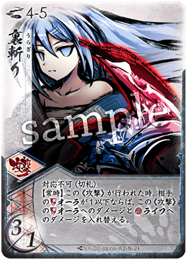](../assets/images/card/cards/na_02_o_n/na_02_a2_n_2.png){ .glightbox  }

    -   [:external-link: ](../assets/images/card/cards/na_02_o_n/na_02_o_n_3.png){ .glightbox  style="opacity: 0.8; filter: grayscale(20%);" }

    -   [:external-link: ](../assets/images/card/cards/na_02_o_n/na_02_o_n_4.png){ .glightbox  style="opacity: 0.8; filter: grayscale(20%);" }

    -   [:external-link: ](../assets/images/card/cards/na_02_o_n/na_02_o_n_5.png){ .glightbox  style="opacity: 0.8; filter: grayscale(20%);" }

    -   [:external-link: ](../assets/images/card/cards/na_02_o_n/na_02_o_n_6.png){ .glightbox  style="opacity: 0.8; filter: grayscale(20%);" }

    -   [:external-link: 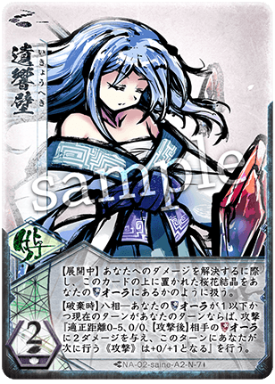](../assets/images/card/cards/na_02_o_n/na_02_a2_n_7.png){ .glightbox  }

    

    ### 切札

    

    -   [:external-link: ](../assets/images/card/cards/na_02_o_s/na_02_o_s_1.png){ .glightbox  style="opacity: 0.8; filter: grayscale(20%);" }

    -   [:external-link: ](../assets/images/card/cards/na_02_o_s/na_02_o_s_2.png){ .glightbox  style="opacity: 0.8; filter: grayscale(20%);" }

    -   [:external-link: ](../assets/images/card/cards/na_02_o_s/na_02_o_s_3.png){ .glightbox  style="opacity: 0.8; filter: grayscale(20%);" }

    -   [:external-link: ](../assets/images/card/cards/na_02_o_s/na_02_o_s_4.png){ .glightbox  style="opacity: 0.8; filter: grayscale(20%);" }

    

## ヒミカ {: #himika }

=== "オリジン"

    ### 通常札

    

    -   [:external-link: 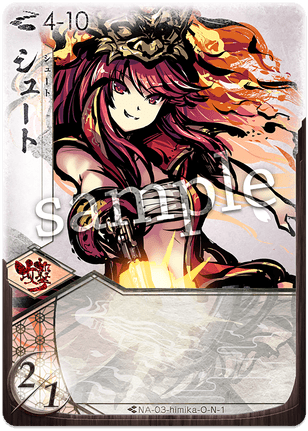](../assets/images/card/cards/na_03_o_n/na_03_o_n_1.png){ .glightbox  }

    -   [:external-link: 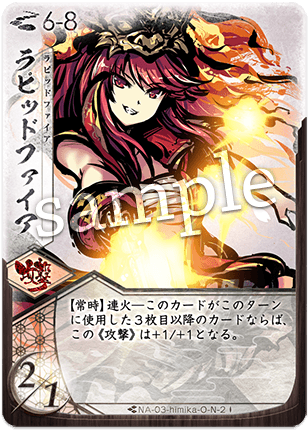](../assets/images/card/cards/na_03_o_n/na_03_o_n_2.png){ .glightbox  }

    -   [:external-link: 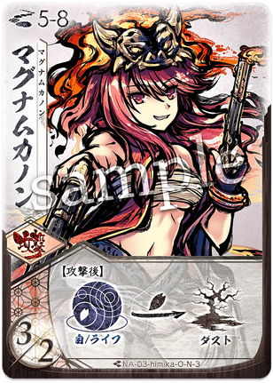](../assets/images/card/cards/na_03_o_n/na_03_o_n_3.png){ .glightbox  }

    -   [:external-link: 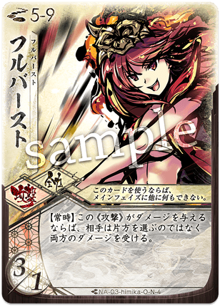](../assets/images/card/cards/na_03_o_n/na_03_o_n_4.png){ .glightbox  }

    -   [:external-link: 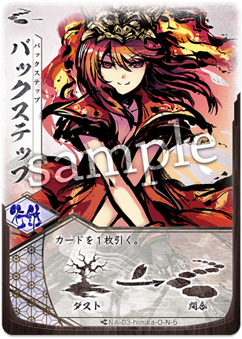](../assets/images/card/cards/na_03_o_n/na_03_o_n_5.png){ .glightbox  }

    -   [:external-link: 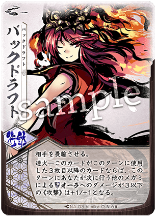](../assets/images/card/cards/na_03_o_n/na_03_o_n_6.png){ .glightbox  }

    -   [:external-link: 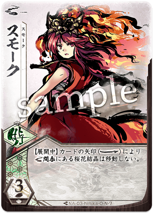](../assets/images/card/cards/na_03_o_n/na_03_o_n_7.png){ .glightbox  }

    

    ### 切札

    

    -   [:external-link: 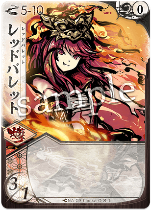](../assets/images/card/cards/na_03_o_s/na_03_o_s_1.png){ .glightbox  }

    -   [:external-link: 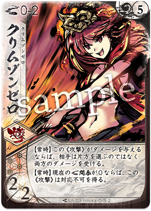](../assets/images/card/cards/na_03_o_s/na_03_o_s_2.png){ .glightbox  }

    -   [:external-link: 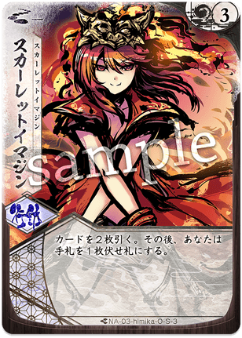](../assets/images/card/cards/na_03_o_s/na_03_o_s_3.png){ .glightbox  }

    -   [:external-link: 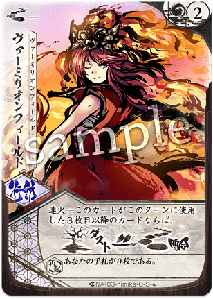](../assets/images/card/cards/na_03_o_s/na_03_o_s_4.png){ .glightbox  }

    

=== "アナザー1"

    ### 通常札

    

    -   [:external-link: ](../assets/images/card/cards/na_03_o_n/na_03_o_n_1.png){ .glightbox  style="opacity: 0.8; filter: grayscale(20%);" }

    -   [:external-link: 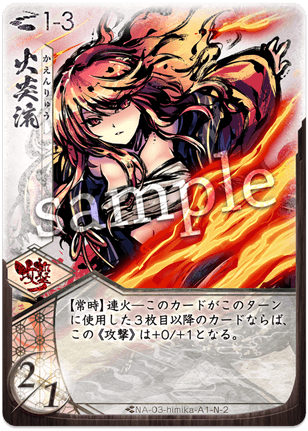](../assets/images/card/cards/na_03_o_n/na_03_a1_n_2.png){ .glightbox  }

    -   [:external-link: ](../assets/images/card/cards/na_03_o_n/na_03_o_n_3.png){ .glightbox  style="opacity: 0.8; filter: grayscale(20%);" }

    -   [:external-link: ](../assets/images/card/cards/na_03_o_n/na_03_o_n_4.png){ .glightbox  style="opacity: 0.8; filter: grayscale(20%);" }

    -   [:external-link: 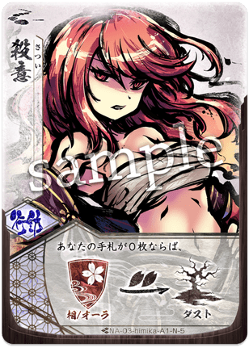](../assets/images/card/cards/na_03_o_n/na_03_a1_n_5.png){ .glightbox  }

    -   [:external-link: ](../assets/images/card/cards/na_03_o_n/na_03_o_n_6.png){ .glightbox  style="opacity: 0.8; filter: grayscale(20%);" }

    -   [:external-link: ](../assets/images/card/cards/na_03_o_n/na_03_o_n_7.png){ .glightbox  style="opacity: 0.8; filter: grayscale(20%);" }

    

    ### 切札

    

    -   [:external-link: ](../assets/images/card/cards/na_03_o_s/na_03_o_s_1.png){ .glightbox  style="opacity: 0.8; filter: grayscale(20%);" }

    -   [:external-link: ](../assets/images/card/cards/na_03_o_s/na_03_o_s_2.png){ .glightbox  style="opacity: 0.8; filter: grayscale(20%);" }

    -   [:external-link: ](../assets/images/card/cards/na_03_o_s/na_03_o_s_3.png){ .glightbox  style="opacity: 0.8; filter: grayscale(20%);" }

    -   [:external-link: ](../assets/images/card/cards/na_03_o_s/na_03_o_s_4.png){ .glightbox  style="opacity: 0.8; filter: grayscale(20%);" }

    

## トコヨ {: #tokoyo }

=== "オリジン"

    ### 通常札

    

    -   [:external-link: 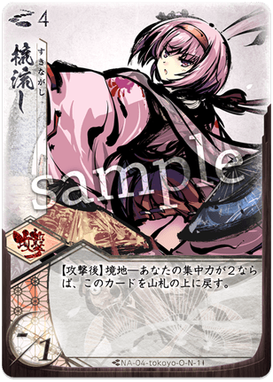](../assets/images/card/cards/na_04_o_n/na_04_o_n_1.png){ .glightbox  }

    -   [:external-link: 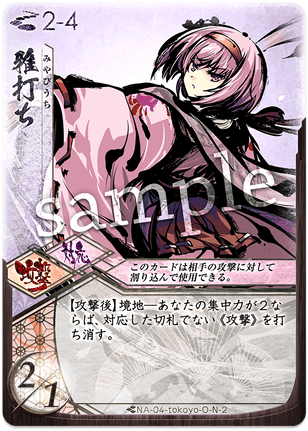](../assets/images/card/cards/na_04_o_n/na_04_o_n_2.png){ .glightbox  }

    -   [:external-link: 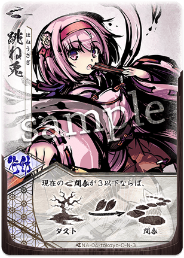](../assets/images/card/cards/na_04_o_n/na_04_o_n_3.png){ .glightbox  }

    -   [:external-link: 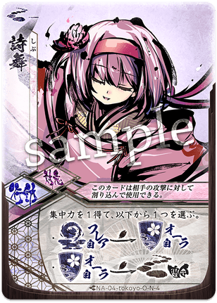](../assets/images/card/cards/na_04_o_n/na_04_o_n_4.png){ .glightbox  }

    -   [:external-link: 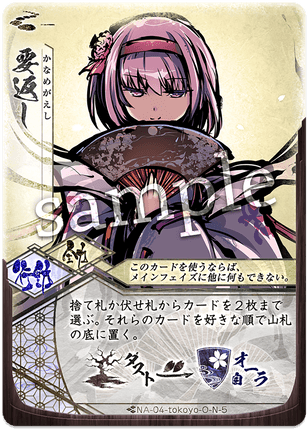](../assets/images/card/cards/na_04_o_n/na_04_o_n_5.png){ .glightbox  }

    -   [:external-link: 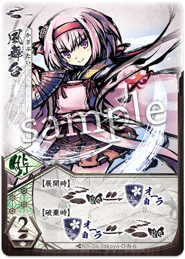](../assets/images/card/cards/na_04_o_n/na_04_o_n_6.png){ .glightbox  }

    -   [:external-link: 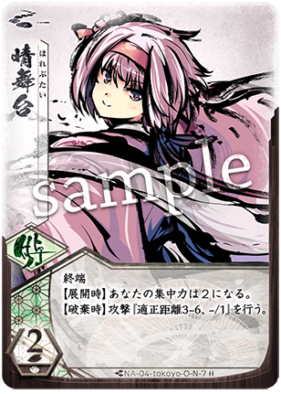](../assets/images/card/cards/na_04_o_n/na_04_o_n_7.png){ .glightbox  }

    

    ### 切札

    

    -   [:external-link: 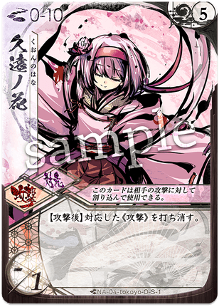](../assets/images/card/cards/na_04_o_s/na_04_o_s_1.png){ .glightbox  }

    -   [:external-link: 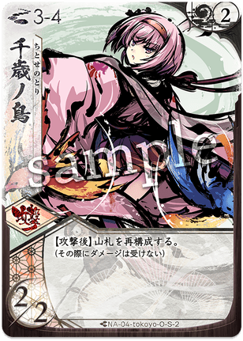](../assets/images/card/cards/na_04_o_s/na_04_o_s_2.png){ .glightbox  }

    -   [:external-link: 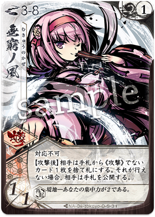](../assets/images/card/cards/na_04_o_s/na_04_o_s_3.png){ .glightbox  }

    -   [:external-link: 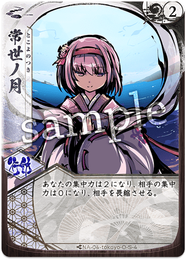](../assets/images/card/cards/na_04_o_s/na_04_o_s_4.png){ .glightbox  }

    

=== "アナザー1"

    ### 通常札

    

    -   [:external-link: 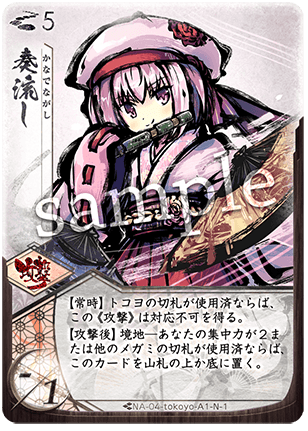](../assets/images/card/cards/na_04_o_n/na_04_a1_n_1.png){ .glightbox  }

    -   [:external-link: ](../assets/images/card/cards/na_04_o_n/na_04_o_n_2.png){ .glightbox  style="opacity: 0.8; filter: grayscale(20%);" }

    -   [:external-link: ](../assets/images/card/cards/na_04_o_n/na_04_o_n_3.png){ .glightbox  style="opacity: 0.8; filter: grayscale(20%);" }

    -   [:external-link: 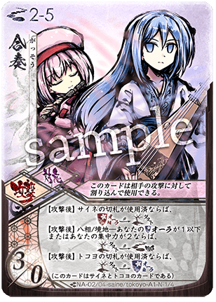](../assets/images/card/cards/na_04_o_n/na_04_a1_n_4.png){ .glightbox  }

    -   [:external-link: ](../assets/images/card/cards/na_04_o_n/na_04_o_n_5.png){ .glightbox  style="opacity: 0.8; filter: grayscale(20%);" }

    -   [:external-link: ](../assets/images/card/cards/na_04_o_n/na_04_o_n_6.png){ .glightbox  style="opacity: 0.8; filter: grayscale(20%);" }

    -   [:external-link: ](../assets/images/card/cards/na_04_o_n/na_04_o_n_7.png){ .glightbox  style="opacity: 0.8; filter: grayscale(20%);" }

    

    ### 切札

    

    -   [:external-link: ](../assets/images/card/cards/na_04_o_s/na_04_o_s_1.png){ .glightbox  style="opacity: 0.8; filter: grayscale(20%);" }

    -   [:external-link: ](../assets/images/card/cards/na_04_o_s/na_04_o_s_2.png){ .glightbox  style="opacity: 0.8; filter: grayscale(20%);" }

    -   [:external-link: ](../assets/images/card/cards/na_04_o_s/na_04_o_s_3.png){ .glightbox  style="opacity: 0.8; filter: grayscale(20%);" }

    -   [:external-link: ](../assets/images/card/cards/na_04_o_s/na_04_o_s_4.png){ .glightbox  style="opacity: 0.8; filter: grayscale(20%);" }

    

=== "アナザー2"

    ### 通常札

    

    -   [:external-link: ](../assets/images/card/cards/na_04_o_n/na_04_o_n_1.png){ .glightbox  style="opacity: 0.8; filter: grayscale(20%);" }

    -   [:external-link: 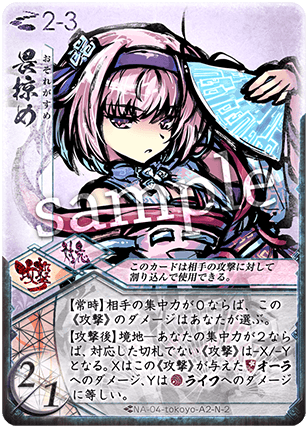](../assets/images/card/cards/na_04_o_n/na_04_a2_n_2.png){ .glightbox  }

    -   [:external-link: ](../assets/images/card/cards/na_04_o_n/na_04_o_n_3.png){ .glightbox  style="opacity: 0.8; filter: grayscale(20%);" }

    -   [:external-link: ](../assets/images/card/cards/na_04_o_n/na_04_o_n_4.png){ .glightbox  style="opacity: 0.8; filter: grayscale(20%);" }

    -   [:external-link: ](../assets/images/card/cards/na_04_o_n/na_04_o_n_5.png){ .glightbox  style="opacity: 0.8; filter: grayscale(20%);" }

    -   [:external-link: ](../assets/images/card/cards/na_04_o_n/na_04_o_n_6.png){ .glightbox  style="opacity: 0.8; filter: grayscale(20%);" }

    -   [:external-link: ](../assets/images/card/cards/na_04_o_n/na_04_o_n_7.png){ .glightbox  style="opacity: 0.8; filter: grayscale(20%);" }

    

    ### 切札

    

    -   [:external-link: ](../assets/images/card/cards/na_04_o_s/na_04_o_s_1.png){ .glightbox  style="opacity: 0.8; filter: grayscale(20%);" }

    -   [:external-link: ](../assets/images/card/cards/na_04_o_s/na_04_o_s_2.png){ .glightbox  style="opacity: 0.8; filter: grayscale(20%);" }

    -   [:external-link: ](../assets/images/card/cards/na_04_o_s/na_04_o_s_3.png){ .glightbox  style="opacity: 0.8; filter: grayscale(20%);" }

    -   [:external-link: ](../assets/images/card/cards/na_04_o_s/na_04_o_s_4.png){ .glightbox  style="opacity: 0.8; filter: grayscale(20%);" }

    

## オボロ {: #oboro }

=== "オリジン"

    ### 通常札

    

    -   [:external-link: 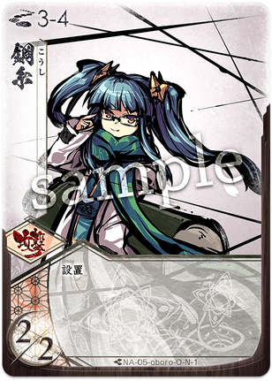](../assets/images/card/cards/na_05_o_n/na_05_o_n_1.png){ .glightbox  }

    -   [:external-link: 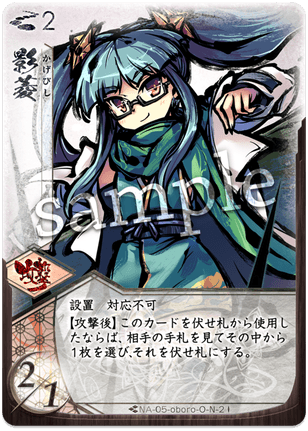](../assets/images/card/cards/na_05_o_n/na_05_o_n_2.png){ .glightbox  }

    -   [:external-link: 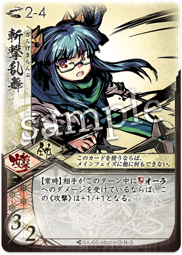](../assets/images/card/cards/na_05_o_n/na_05_o_n_3.png){ .glightbox  }

    -   [:external-link: 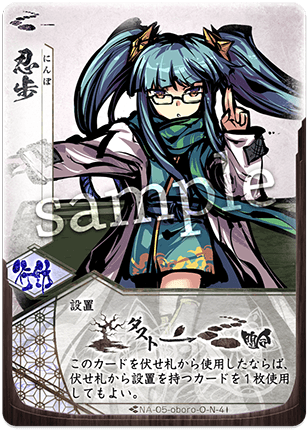](../assets/images/card/cards/na_05_o_n/na_05_o_n_4.png){ .glightbox  }

    -   [:external-link: 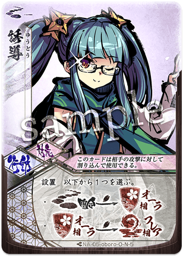](../assets/images/card/cards/na_05_o_n/na_05_o_n_5.png){ .glightbox  }

    -   [:external-link: 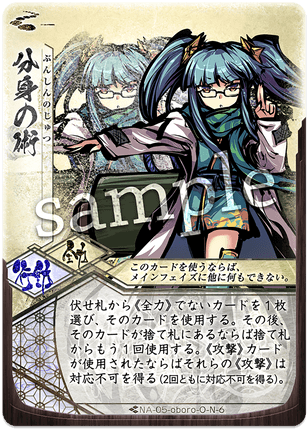](../assets/images/card/cards/na_05_o_n/na_05_o_n_6.png){ .glightbox  }

    -   [:external-link: 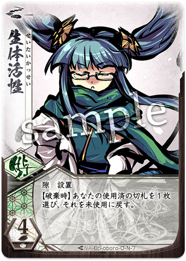](../assets/images/card/cards/na_05_o_n/na_05_o_n_7.png){ .glightbox  }

    

    ### 切札

    

    -   [:external-link: 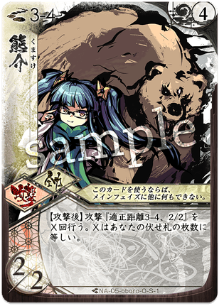](../assets/images/card/cards/na_05_o_s/na_05_o_s_1.png){ .glightbox  }

    -   [:external-link: 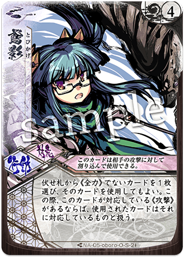](../assets/images/card/cards/na_05_o_s/na_05_o_s_2.png){ .glightbox  }

    -   [:external-link: 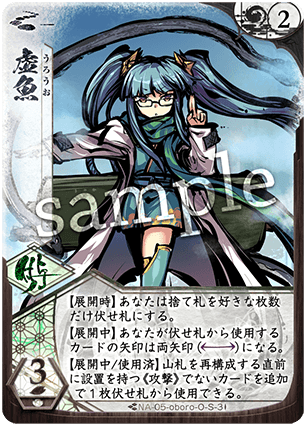](../assets/images/card/cards/na_05_o_s/na_05_o_s_3.png){ .glightbox  }

    -   [:external-link: 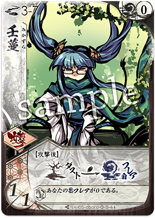](../assets/images/card/cards/na_05_o_s/na_05_o_s_4.png){ .glightbox  }

    

=== "アナザー1"

    ### 通常札

    

    -   [:external-link: ](../assets/images/card/cards/na_05_o_n/na_05_o_n_1.png){ .glightbox  style="opacity: 0.8; filter: grayscale(20%);" }

    -   [:external-link: 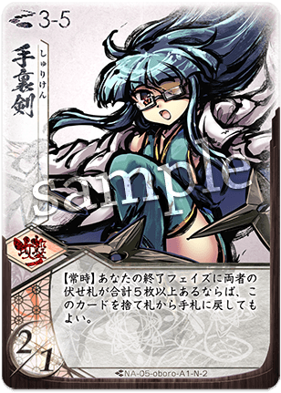](../assets/images/card/cards/na_05_o_n/na_05_a1_n_2.png){ .glightbox  }

    -   [:external-link: 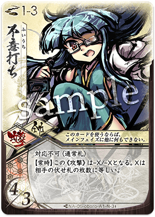](../assets/images/card/cards/na_05_o_n/na_05_a1_n_3.png){ .glightbox  }

    -   [:external-link: ](../assets/images/card/cards/na_05_o_n/na_05_o_n_4.png){ .glightbox  style="opacity: 0.8; filter: grayscale(20%);" }

    -   [:external-link: ](../assets/images/card/cards/na_05_o_n/na_05_o_n_5.png){ .glightbox  style="opacity: 0.8; filter: grayscale(20%);" }

    -   [:external-link: ](../assets/images/card/cards/na_05_o_n/na_05_o_n_6.png){ .glightbox  style="opacity: 0.8; filter: grayscale(20%);" }

    -   [:external-link: ](../assets/images/card/cards/na_05_o_n/na_05_o_n_7.png){ .glightbox  style="opacity: 0.8; filter: grayscale(20%);" }

    

    ### 切札

    

    -   [:external-link: ](../assets/images/card/cards/na_05_o_s/na_05_o_s_1.png){ .glightbox  style="opacity: 0.8; filter: grayscale(20%);" }

    -   [:external-link: ](../assets/images/card/cards/na_05_o_s/na_05_o_s_2.png){ .glightbox  style="opacity: 0.8; filter: grayscale(20%);" }

    -   [:external-link: ](../assets/images/card/cards/na_05_o_s/na_05_o_s_3.png){ .glightbox  style="opacity: 0.8; filter: grayscale(20%);" }

    -   [:external-link: ](../assets/images/card/cards/na_05_o_s/na_05_o_s_4.png){ .glightbox  style="opacity: 0.8; filter: grayscale(20%);" }

    

=== "アナザー2"

    ### 通常札

    

    -   [:external-link: 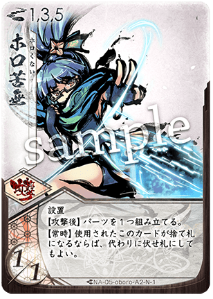](../assets/images/card/cards/na_05_o_n/na_05_a2_n_1.png){ .glightbox  }

    -   [:external-link: ](../assets/images/card/cards/na_05_o_n/na_05_o_n_2.png){ .glightbox  style="opacity: 0.8; filter: grayscale(20%);" }

    -   [:external-link: ](../assets/images/card/cards/na_05_o_n/na_05_o_n_3.png){ .glightbox  style="opacity: 0.8; filter: grayscale(20%);" }

    -   [:external-link: ](../assets/images/card/cards/na_05_o_n/na_05_o_n_4.png){ .glightbox  style="opacity: 0.8; filter: grayscale(20%);" }

    -   [:external-link: ](../assets/images/card/cards/na_05_o_n/na_05_o_n_5.png){ .glightbox  style="opacity: 0.8; filter: grayscale(20%);" }

    -   [:external-link: ](../assets/images/card/cards/na_05_o_n/na_05_o_n_6.png){ .glightbox  style="opacity: 0.8; filter: grayscale(20%);" }

    -   [:external-link: ](../assets/images/card/cards/na_05_o_n/na_05_o_n_7.png){ .glightbox  style="opacity: 0.8; filter: grayscale(20%);" }

    

    ### 切札

    

    -   [:external-link: ](../assets/images/card/cards/na_05_o_s/na_05_o_s_1.png){ .glightbox  style="opacity: 0.8; filter: grayscale(20%);" }

    -   [:external-link: ](../assets/images/card/cards/na_05_o_s/na_05_o_s_2.png){ .glightbox  style="opacity: 0.8; filter: grayscale(20%);" }

    -   [:external-link: ](../assets/images/card/cards/na_05_o_s/na_05_o_s_3.png){ .glightbox  style="opacity: 0.8; filter: grayscale(20%);" }

    -   [:external-link: ](../assets/images/card/cards/na_05_o_s/na_05_o_s_4.png){ .glightbox  style="opacity: 0.8; filter: grayscale(20%);" }

    

## ユキヒ {: #yukihi }

=== "オリジン"

    ### 通常札

    

    -   [:external-link: 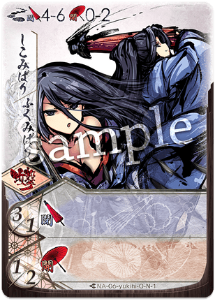](../assets/images/card/cards/na_06_o_n/na_06_o_n_1.png){ .glightbox  }

    -   [:external-link: 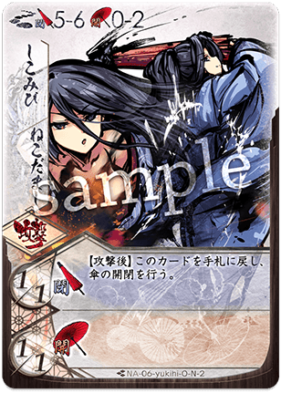](../assets/images/card/cards/na_06_o_n/na_06_o_n_2.png){ .glightbox  }

    -   [:external-link: 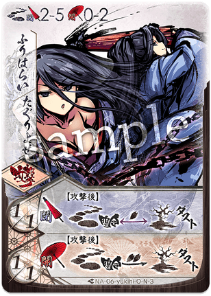](../assets/images/card/cards/na_06_o_n/na_06_o_n_3.png){ .glightbox  }

    -   [:external-link: 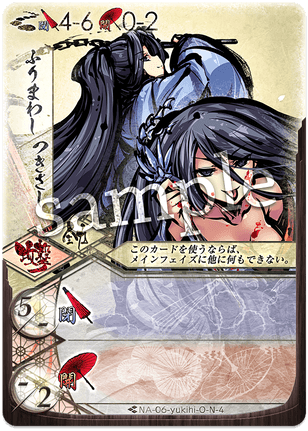](../assets/images/card/cards/na_06_o_n/na_06_o_n_4.png){ .glightbox  }

    -   [:external-link: 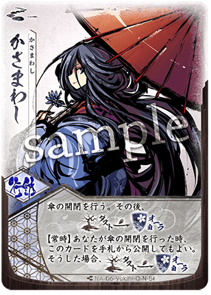](../assets/images/card/cards/na_06_o_n/na_06_o_n_5.png){ .glightbox  }

    -   [:external-link: 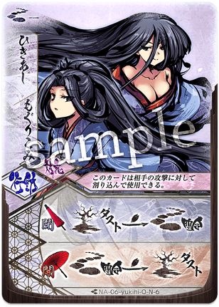](../assets/images/card/cards/na_06_o_n/na_06_o_n_6.png){ .glightbox  }

    -   [:external-link: 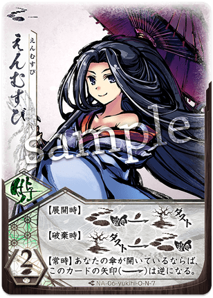](../assets/images/card/cards/na_06_o_n/na_06_o_n_7.png){ .glightbox  }

    

    ### 切札

    

    -   [:external-link: 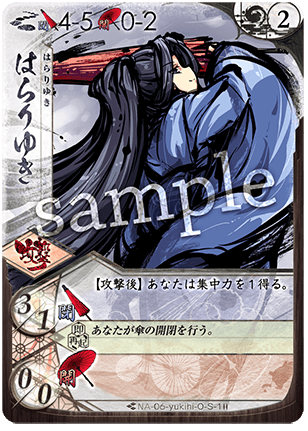](../assets/images/card/cards/na_06_o_s/na_06_o_s_1.png){ .glightbox  }

    -   [:external-link: 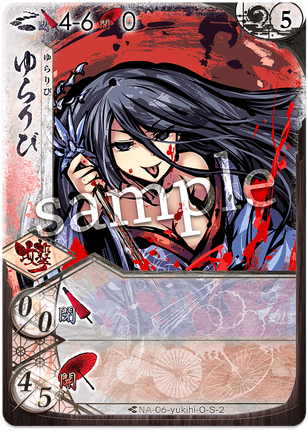](../assets/images/card/cards/na_06_o_s/na_06_o_s_2.png){ .glightbox  }

    -   [:external-link: 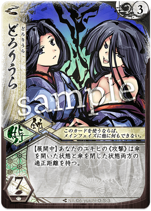](../assets/images/card/cards/na_06_o_s/na_06_o_s_3.png){ .glightbox  }

    -   [:external-link: 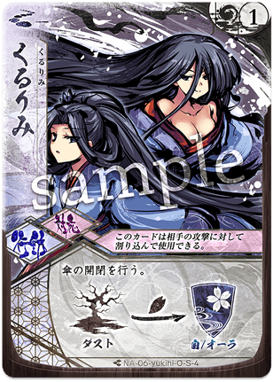](../assets/images/card/cards/na_06_o_s/na_06_o_s_4.png){ .glightbox  }

    

=== "アナザー1"

    ### 通常札

    

    -   [:external-link: ](../assets/images/card/cards/na_06_o_n/na_06_o_n_1.png){ .glightbox  style="opacity: 0.8; filter: grayscale(20%);" }

    -   [:external-link: 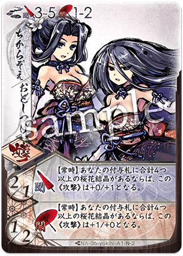](../assets/images/card/cards/na_06_o_n/na_06_a1_n_2.png){ .glightbox  }

    -   [:external-link: ](../assets/images/card/cards/na_06_o_n/na_06_o_n_3.png){ .glightbox  style="opacity: 0.8; filter: grayscale(20%);" }

    -   [:external-link: 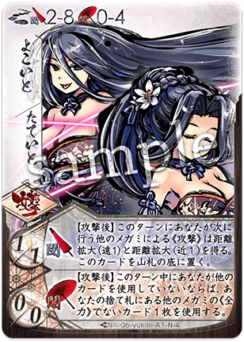](../assets/images/card/cards/na_06_o_n/na_06_a1_n_4.png){ .glightbox  }

    -   [:external-link: ](../assets/images/card/cards/na_06_o_n/na_06_o_n_5.png){ .glightbox  style="opacity: 0.8; filter: grayscale(20%);" }

    -   [:external-link: ](../assets/images/card/cards/na_06_o_n/na_06_o_n_6.png){ .glightbox  style="opacity: 0.8; filter: grayscale(20%);" }

    -   [:external-link: ](../assets/images/card/cards/na_06_o_n/na_06_o_n_7.png){ .glightbox  style="opacity: 0.8; filter: grayscale(20%);" }

    

    ### 切札

    

    -   [:external-link: ](../assets/images/card/cards/na_06_o_s/na_06_o_s_1.png){ .glightbox  style="opacity: 0.8; filter: grayscale(20%);" }

    -   [:external-link: ](../assets/images/card/cards/na_06_o_s/na_06_o_s_2.png){ .glightbox  style="opacity: 0.8; filter: grayscale(20%);" }

    -   [:external-link: ](../assets/images/card/cards/na_06_o_s/na_06_o_s_3.png){ .glightbox  style="opacity: 0.8; filter: grayscale(20%);" }

    -   [:external-link: ](../assets/images/card/cards/na_06_o_s/na_06_o_s_4.png){ .glightbox  style="opacity: 0.8; filter: grayscale(20%);" }

    

## シンラ {: #shinra }

=== "オリジン"

    ### 通常札

    

    -   [:external-link: 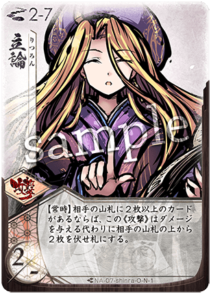](../assets/images/card/cards/na_07_o_n/na_07_o_n_1.png){ .glightbox  }

    -   [:external-link: 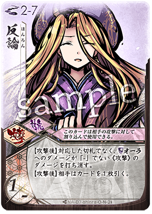](../assets/images/card/cards/na_07_o_n/na_07_o_n_2.png){ .glightbox  }

    -   [:external-link: 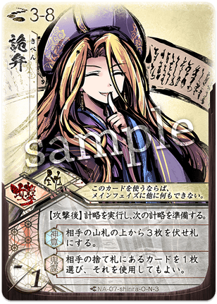](../assets/images/card/cards/na_07_o_n/na_07_o_n_3.png){ .glightbox  }

    -   [:external-link: 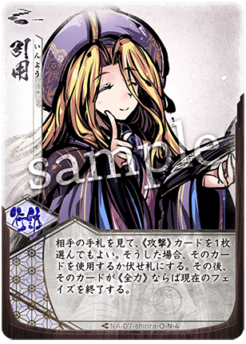](../assets/images/card/cards/na_07_o_n/na_07_o_n_4.png){ .glightbox  }

    -   [:external-link: 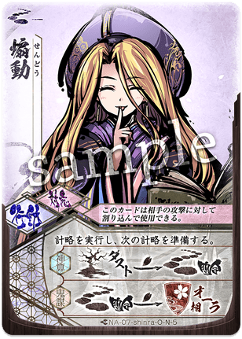](../assets/images/card/cards/na_07_o_n/na_07_o_n_5.png){ .glightbox  }

    -   [:external-link: 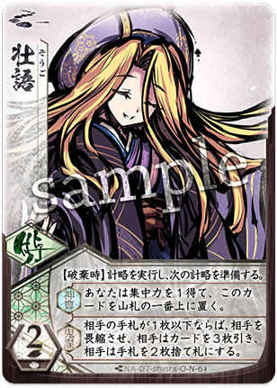](../assets/images/card/cards/na_07_o_n/na_07_o_n_6.png){ .glightbox  }

    -   [:external-link: 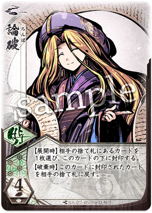](../assets/images/card/cards/na_07_o_n/na_07_o_n_7.png){ .glightbox  }

    

    ### 切札

    

    -   [:external-link: 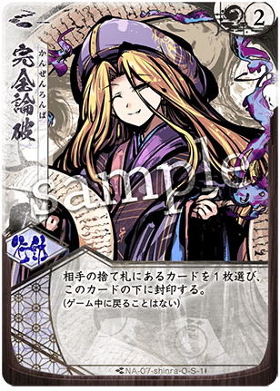](../assets/images/card/cards/na_07_o_s/na_07_o_s_1.png){ .glightbox  }

    -   [:external-link: 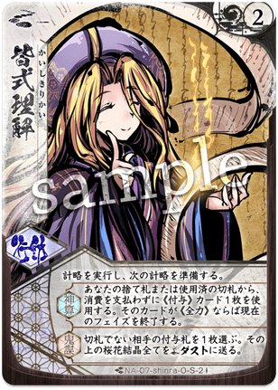](../assets/images/card/cards/na_07_o_s/na_07_o_s_2.png){ .glightbox  }

    -   [:external-link: 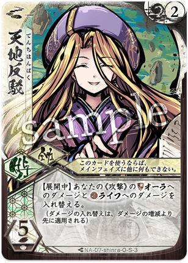](../assets/images/card/cards/na_07_o_s/na_07_o_s_3.png){ .glightbox  }

    -   [:external-link: 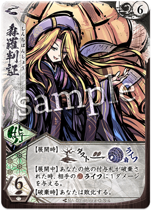](../assets/images/card/cards/na_07_o_s/na_07_o_s_4.png){ .glightbox  }

    

=== "アナザー1"

    ### 通常札

    

    -   [:external-link: ](../assets/images/card/cards/na_07_o_n/na_07_o_n_1.png){ .glightbox  style="opacity: 0.8; filter: grayscale(20%);" }

    -   [:external-link: 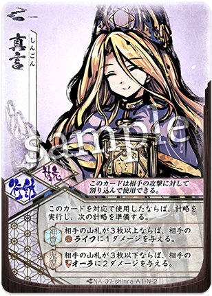](../assets/images/card/cards/na_07_o_n/na_07_a1_n_2.png){ .glightbox  }

    -   [:external-link: ](../assets/images/card/cards/na_07_o_n/na_07_o_n_3.png){ .glightbox  style="opacity: 0.8; filter: grayscale(20%);" }

    -   [:external-link: ](../assets/images/card/cards/na_07_o_n/na_07_o_n_4.png){ .glightbox  style="opacity: 0.8; filter: grayscale(20%);" }

    -   [:external-link: ](../assets/images/card/cards/na_07_o_n/na_07_o_n_5.png){ .glightbox  style="opacity: 0.8; filter: grayscale(20%);" }

    -   [:external-link: ](../assets/images/card/cards/na_07_o_n/na_07_o_n_6.png){ .glightbox  style="opacity: 0.8; filter: grayscale(20%);" }

    -   [:external-link: 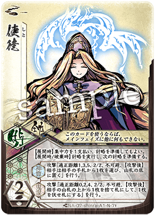](../assets/images/card/cards/na_07_o_n/na_07_a1_n_7.png){ .glightbox  }

    

    ### 切札

    

    -   [:external-link: ](../assets/images/card/cards/na_07_o_s/na_07_o_s_1.png){ .glightbox  style="opacity: 0.8; filter: grayscale(20%);" }

    -   [:external-link: ](../assets/images/card/cards/na_07_o_s/na_07_o_s_2.png){ .glightbox  style="opacity: 0.8; filter: grayscale(20%);" }

    -   [:external-link: ](../assets/images/card/cards/na_07_o_s/na_07_o_s_3.png){ .glightbox  style="opacity: 0.8; filter: grayscale(20%);" }

    -   [:external-link: ](../assets/images/card/cards/na_07_o_s/na_07_o_s_4.png){ .glightbox  style="opacity: 0.8; filter: grayscale(20%);" }

    

## ハガネ {: #hagane }

=== "オリジン"

    ### 通常札

    

    -   [:external-link: 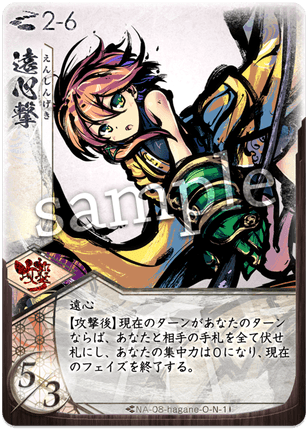](../assets/images/card/cards/na_08_o_n/na_08_o_n_1.png){ .glightbox  }

    -   [:external-link: 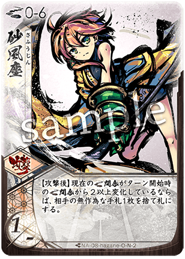](../assets/images/card/cards/na_08_o_n/na_08_o_n_2.png){ .glightbox  }

    -   [:external-link: 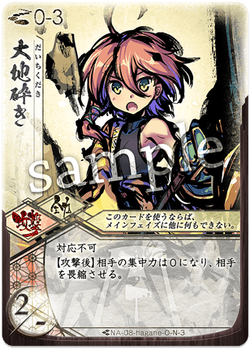](../assets/images/card/cards/na_08_o_n/na_08_o_n_3.png){ .glightbox  }

    -   [:external-link: 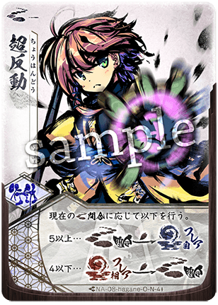](../assets/images/card/cards/na_08_o_n/na_08_o_n_4.png){ .glightbox  }

    -   [:external-link: 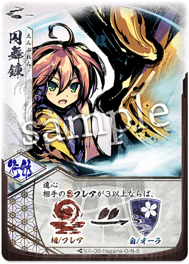](../assets/images/card/cards/na_08_o_n/na_08_o_n_5.png){ .glightbox  }

    -   [:external-link: 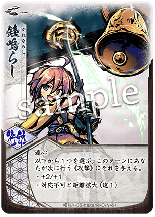](../assets/images/card/cards/na_08_o_n/na_08_o_n_6.png){ .glightbox  }

    -   [:external-link: 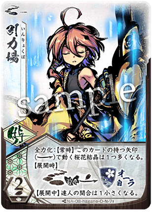](../assets/images/card/cards/na_08_o_n/na_08_o_n_7.png){ .glightbox  }

    

    ### 切札

    

    -   [:external-link: 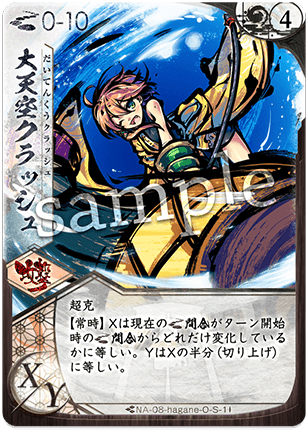](../assets/images/card/cards/na_08_o_s/na_08_o_s_1.png){ .glightbox  }

    -   [:external-link: 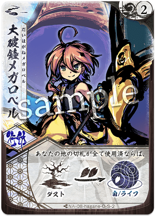](../assets/images/card/cards/na_08_o_s/na_08_o_s_2.png){ .glightbox  }

    -   [:external-link: 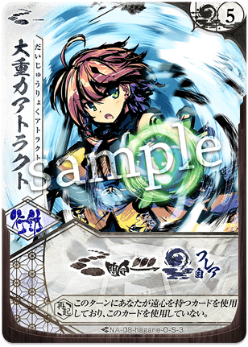](../assets/images/card/cards/na_08_o_s/na_08_o_s_3.png){ .glightbox  }

    -   [:external-link: 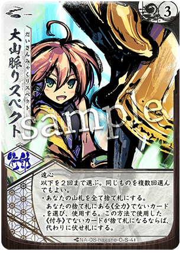](../assets/images/card/cards/na_08_o_s/na_08_o_s_4.png){ .glightbox  }

    

## チカゲ {: #chikage }

=== "オリジン"

    ### 通常札

    

    -   [:external-link: 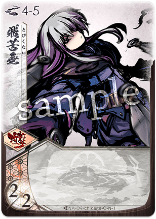](../assets/images/card/cards/na_09_o_n/na_09_o_n_1.png){ .glightbox  }

    -   [:external-link: 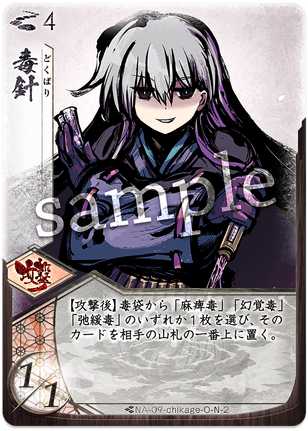](../assets/images/card/cards/na_09_o_n/na_09_o_n_2.png){ .glightbox  }

    -   [:external-link: 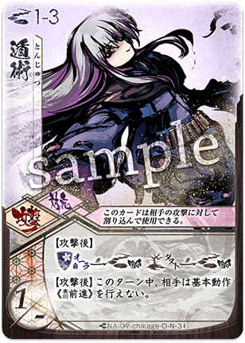](../assets/images/card/cards/na_09_o_n/na_09_o_n_3.png){ .glightbox  }

    -   [:external-link: 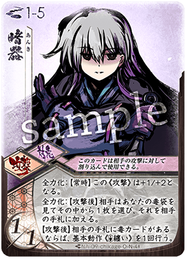](../assets/images/card/cards/na_09_o_n/na_09_o_n_4.png){ .glightbox  }

    -   [:external-link: 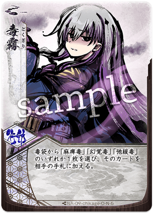](../assets/images/card/cards/na_09_o_n/na_09_o_n_5.png){ .glightbox  }

    -   [:external-link: 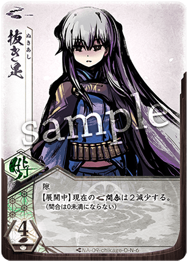](../assets/images/card/cards/na_09_o_n/na_09_o_n_6.png){ .glightbox  }

    -   [:external-link: 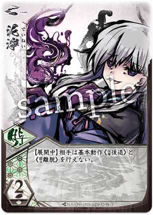](../assets/images/card/cards/na_09_o_n/na_09_o_n_7.png){ .glightbox  }

    

    ### 切札

    

    -   [:external-link: 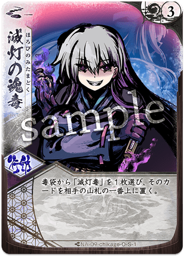](../assets/images/card/cards/na_09_o_s/na_09_o_s_1.png){ .glightbox  }

    -   [:external-link: 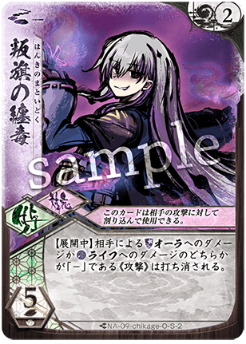](../assets/images/card/cards/na_09_o_s/na_09_o_s_2.png){ .glightbox  }

    -   [:external-link: 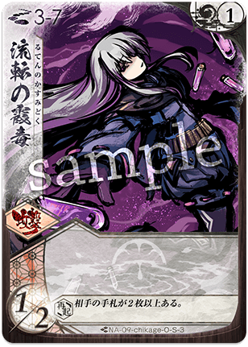](../assets/images/card/cards/na_09_o_s/na_09_o_s_3.png){ .glightbox  }

    -   [:external-link: 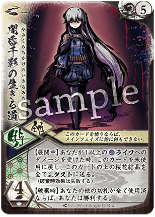](../assets/images/card/cards/na_09_o_s/na_09_o_s_4.png){ .glightbox  }

    

## クルル {: #kururu }

=== "オリジン"

    ### 通常札

    

    -   [:external-link: 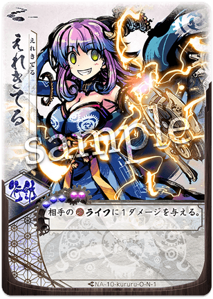](../assets/images/card/cards/na_10_o_n/na_10_o_n_1.png){ .glightbox  }

    -   [:external-link: 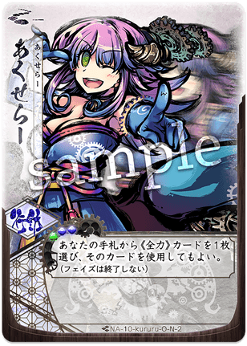](../assets/images/card/cards/na_10_o_n/na_10_o_n_2.png){ .glightbox  }

    -   [:external-link: 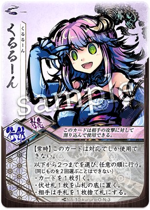](../assets/images/card/cards/na_10_o_n/na_10_o_n_3.png){ .glightbox  }

    -   [:external-link: 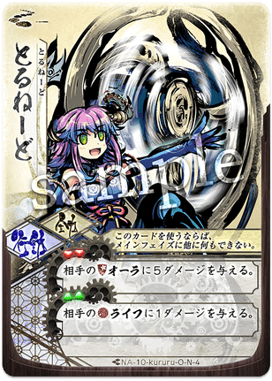](../assets/images/card/cards/na_10_o_n/na_10_o_n_4.png){ .glightbox  }

    -   [:external-link: 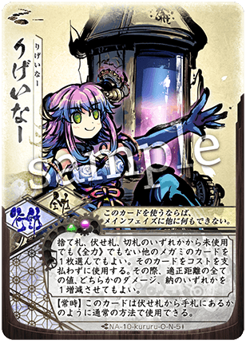](../assets/images/card/cards/na_10_o_n/na_10_o_n_5.png){ .glightbox  }

    -   [:external-link: 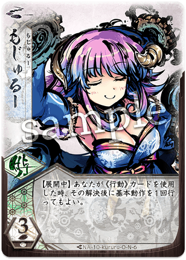](../assets/images/card/cards/na_10_o_n/na_10_o_n_6.png){ .glightbox  }

    -   [:external-link: 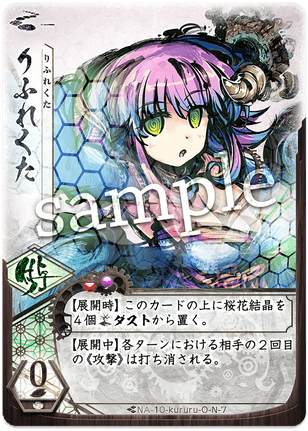](../assets/images/card/cards/na_10_o_n/na_10_o_n_7.png){ .glightbox  }

    

    ### 切札

    

    -   [:external-link: 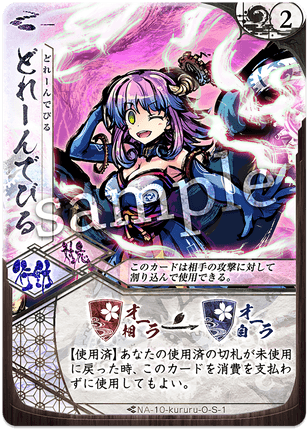](../assets/images/card/cards/na_10_o_s/na_10_o_s_1.png){ .glightbox  }

    -   [:external-link: 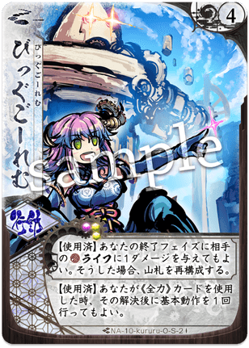](../assets/images/card/cards/na_10_o_s/na_10_o_s_2.png){ .glightbox  }

    -   [:external-link: 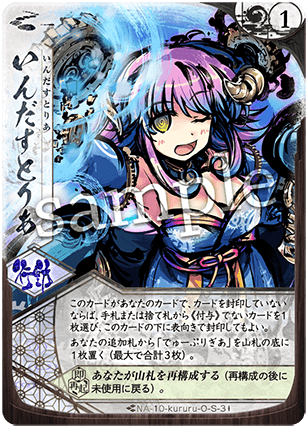](../assets/images/card/cards/na_10_o_s/na_10_o_s_3.png){ .glightbox  }

    -   [:external-link: 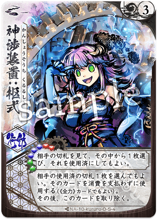](../assets/images/card/cards/na_10_o_s/na_10_o_s_4.png){ .glightbox  }

    

## サリヤ {: #sariya }

=== "オリジン"

    ### 通常札

    

    -   [:external-link: 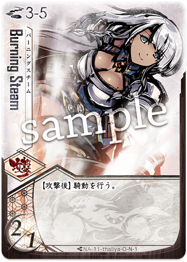](../assets/images/card/cards/na_11_o_n/na_11_o_n_1.png){ .glightbox  }

    -   [:external-link: 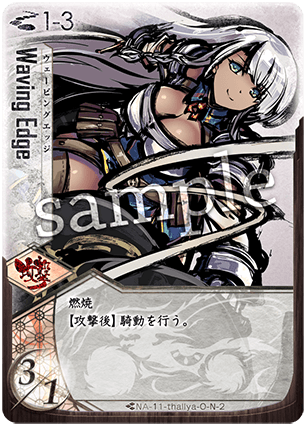](../assets/images/card/cards/na_11_o_n/na_11_o_n_2.png){ .glightbox  }

    -   [:external-link: 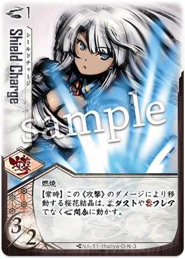](../assets/images/card/cards/na_11_o_n/na_11_o_n_3.png){ .glightbox  }

    -   [:external-link: 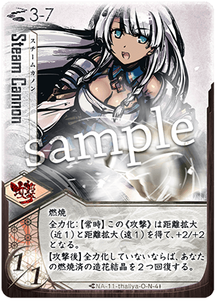](../assets/images/card/cards/na_11_o_n/na_11_o_n_4.png){ .glightbox  }

    -   [:external-link: 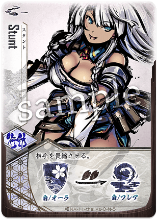](../assets/images/card/cards/na_11_o_n/na_11_o_n_5.png){ .glightbox  }

    -   [:external-link: 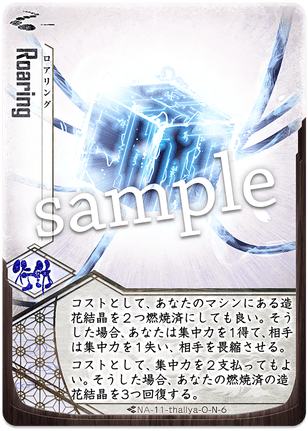](../assets/images/card/cards/na_11_o_n/na_11_o_n_6.png){ .glightbox  }

    -   [:external-link: 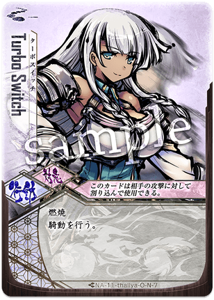](../assets/images/card/cards/na_11_o_n/na_11_o_n_7.png){ .glightbox  }

    

    ### 切札

    

    -   [:external-link: 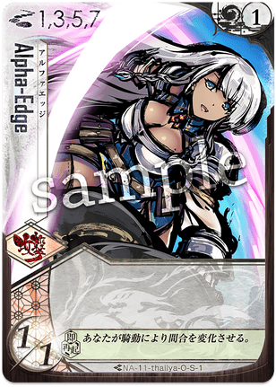](../assets/images/card/cards/na_11_o_s/na_11_o_s_1.png){ .glightbox  }

    -   [:external-link: 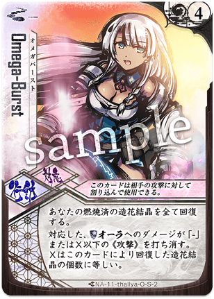](../assets/images/card/cards/na_11_o_s/na_11_o_s_2.png){ .glightbox  }

    -   [:external-link: 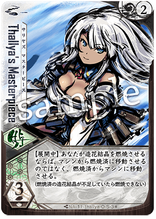](../assets/images/card/cards/na_11_o_s/na_11_o_s_3.png){ .glightbox  }

    -   [:external-link: 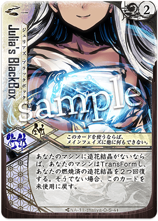](../assets/images/card/cards/na_11_o_s/na_11_o_s_4.png){ .glightbox  }

    

## ライラ {: #laila }

=== "オリジン"

    ### 通常札

    

    -   [:external-link: 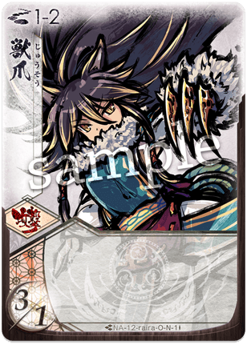](../assets/images/card/cards/na_12_o_n/na_12_o_n_1.png){ .glightbox  }

    -   [:external-link: 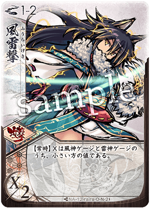](../assets/images/card/cards/na_12_o_n/na_12_o_n_2.png){ .glightbox  }

    -   [:external-link: 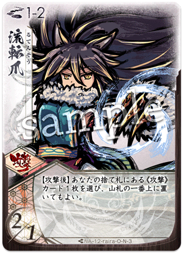](../assets/images/card/cards/na_12_o_n/na_12_o_n_3.png){ .glightbox  }

    -   [:external-link: 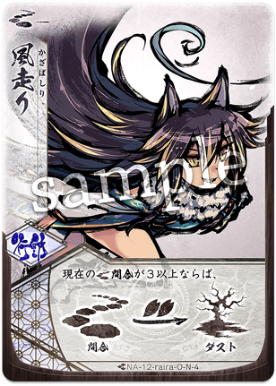](../assets/images/card/cards/na_12_o_n/na_12_o_n_4.png){ .glightbox  }

    -   [:external-link: 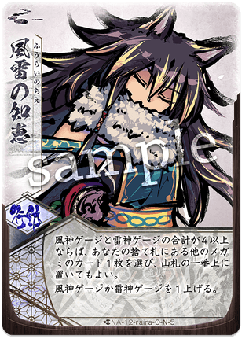](../assets/images/card/cards/na_12_o_n/na_12_o_n_5.png){ .glightbox  }

    -   [:external-link: 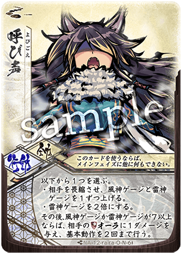](../assets/images/card/cards/na_12_o_n/na_12_o_n_6.png){ .glightbox  }

    -   [:external-link: 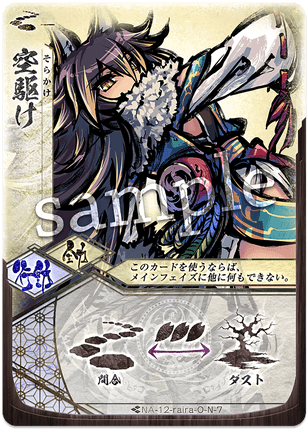](../assets/images/card/cards/na_12_o_n/na_12_o_n_7.png){ .glightbox  }

    

    ### 切札

    

    -   [:external-link: 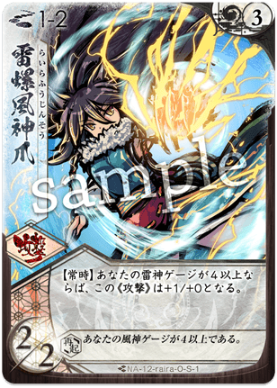](../assets/images/card/cards/na_12_o_s/na_12_o_s_1.png){ .glightbox  }

    -   [:external-link: 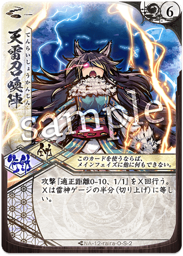](../assets/images/card/cards/na_12_o_s/na_12_o_s_2.png){ .glightbox  }

    -   [:external-link: 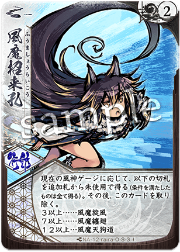](../assets/images/card/cards/na_12_o_s/na_12_o_s_3.png){ .glightbox  }

    -   [:external-link: 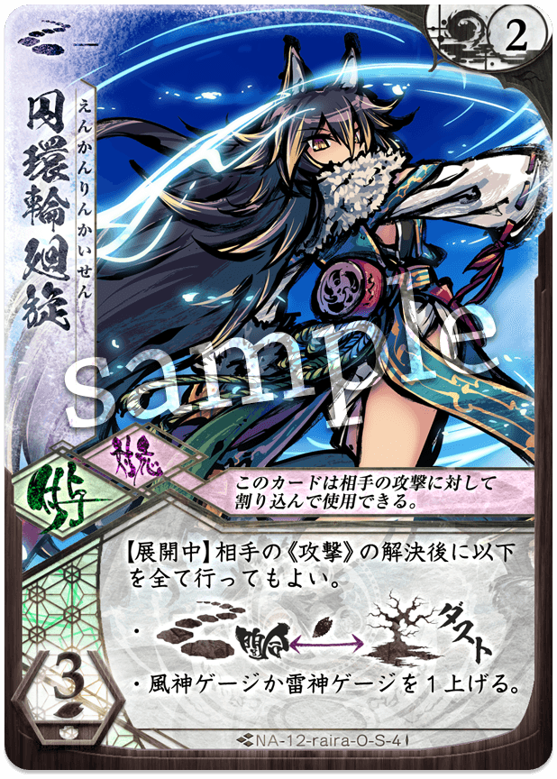](../assets/images/card/cards/na_12_o_s/na_12_o_s_4.png){ .glightbox  }

    

## ウツロ {: #utsuro }

=== "オリジン"

    ### 通常札

    

    -   [:external-link: 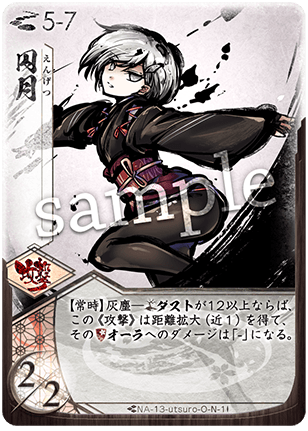](../assets/images/card/cards/na_13_o_n/na_13_o_n_1.png){ .glightbox  }

    -   [:external-link: 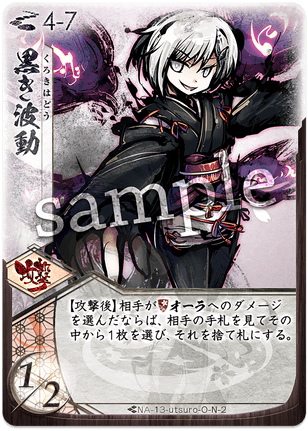](../assets/images/card/cards/na_13_o_n/na_13_o_n_2.png){ .glightbox  }

    -   [:external-link: 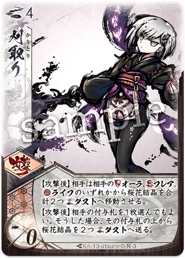](../assets/images/card/cards/na_13_o_n/na_13_o_n_3.png){ .glightbox  }

    -   [:external-link: 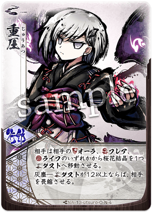](../assets/images/card/cards/na_13_o_n/na_13_o_n_4.png){ .glightbox  }

    -   [:external-link: 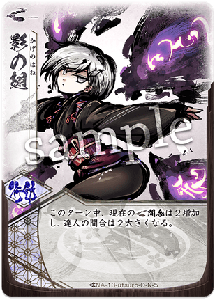](../assets/images/card/cards/na_13_o_n/na_13_o_n_5.png){ .glightbox  }

    -   [:external-link: 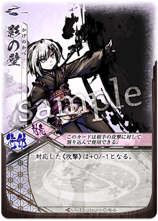](../assets/images/card/cards/na_13_o_n/na_13_o_n_6.png){ .glightbox  }

    -   [:external-link: 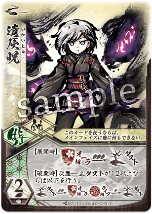](../assets/images/card/cards/na_13_o_n/na_13_o_n_7.png){ .glightbox  }

    

    ### 切札

    

    -   [:external-link: 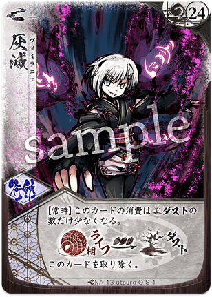](../assets/images/card/cards/na_13_o_s/na_13_o_s_1.png){ .glightbox  }

    -   [:external-link: 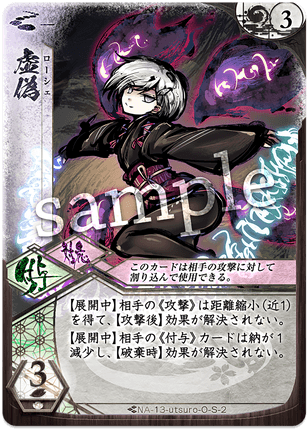](../assets/images/card/cards/na_13_o_s/na_13_o_s_2.png){ .glightbox  }

    -   [:external-link: 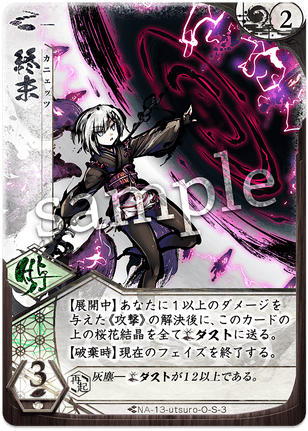](../assets/images/card/cards/na_13_o_s/na_13_o_s_3.png){ .glightbox  }

    -   [:external-link: 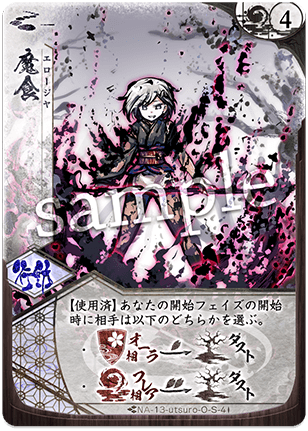](../assets/images/card/cards/na_13_o_s/na_13_o_s_4.png){ .glightbox  }

    

## ホノカ {: #honoka }

=== "オリジン"

    ### 通常札

    

    -   [:external-link: 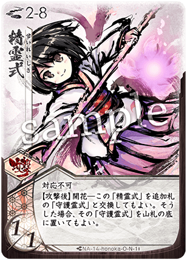](../assets/images/card/cards/na_14_o_n/na_14_o_n_1.png){ .glightbox  }

    -   [:external-link: 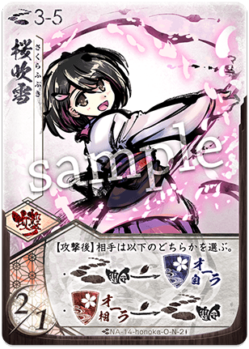](../assets/images/card/cards/na_14_o_n/na_14_o_n_2.png){ .glightbox  }

    -   [:external-link: 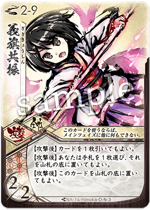](../assets/images/card/cards/na_14_o_n/na_14_o_n_3.png){ .glightbox  }

    -   [:external-link: 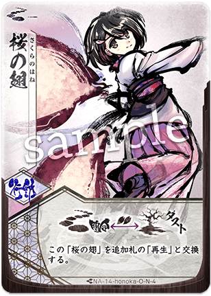](../assets/images/card/cards/na_14_o_n/na_14_o_n_4.png){ .glightbox  }

    -   [:external-link: 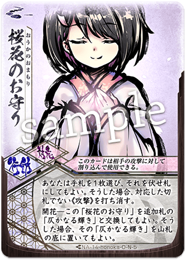](../assets/images/card/cards/na_14_o_n/na_14_o_n_5.png){ .glightbox  }

    -   [:external-link: 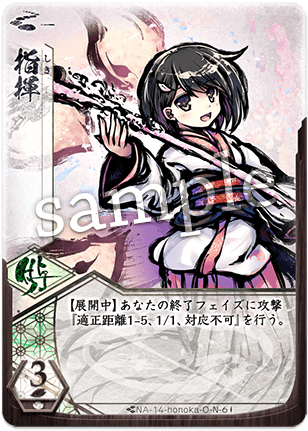](../assets/images/card/cards/na_14_o_n/na_14_o_n_6.png){ .glightbox  }

    -   [:external-link: 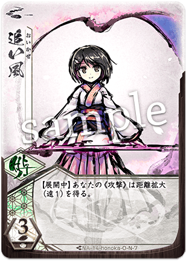](../assets/images/card/cards/na_14_o_n/na_14_o_n_7.png){ .glightbox  }

    

    ### 切札

    

    -   [:external-link: 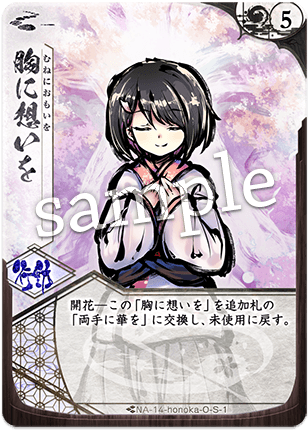](../assets/images/card/cards/na_14_o_s/na_14_o_s_1.png){ .glightbox  }

    -   [:external-link: 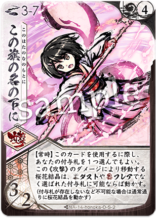](../assets/images/card/cards/na_14_o_s/na_14_o_s_2.png){ .glightbox  }

    -   [:external-link: 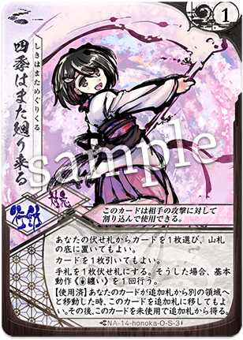](../assets/images/card/cards/na_14_o_s/na_14_o_s_3.png){ .glightbox  }

    -   [:external-link: 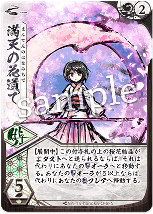](../assets/images/card/cards/na_14_o_s/na_14_o_s_4.png){ .glightbox  }

    

## コルヌ {: #korunu }

=== "オリジン"

    ### 通常札

    

    -   [:external-link: 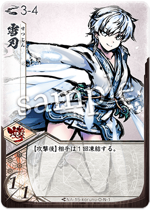](../assets/images/card/cards/na_15_o_n/na_15_o_n_1.png){ .glightbox  }

    -   [:external-link: 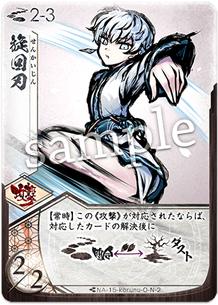](../assets/images/card/cards/na_15_o_n/na_15_o_n_2.png){ .glightbox  }

    -   [:external-link: 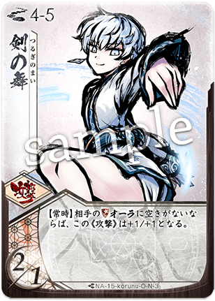](../assets/images/card/cards/na_15_o_n/na_15_o_n_3.png){ .glightbox  }

    -   [:external-link: 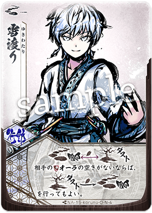](../assets/images/card/cards/na_15_o_n/na_15_o_n_4.png){ .glightbox  }

    -   [:external-link: 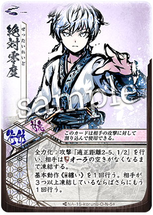](../assets/images/card/cards/na_15_o_n/na_15_o_n_5.png){ .glightbox  }

    -   [:external-link: 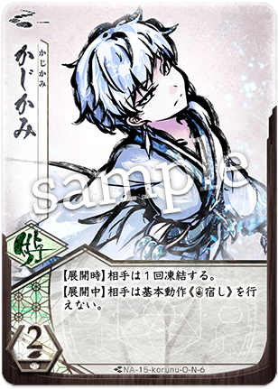](../assets/images/card/cards/na_15_o_n/na_15_o_n_6.png){ .glightbox  }

    -   [:external-link: 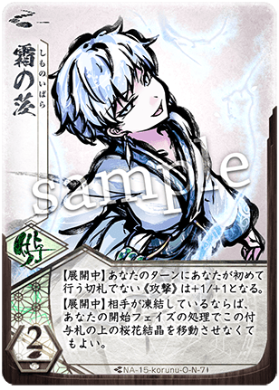](../assets/images/card/cards/na_15_o_n/na_15_o_n_7.png){ .glightbox  }

    

    ### 切札

    

    -   [:external-link: 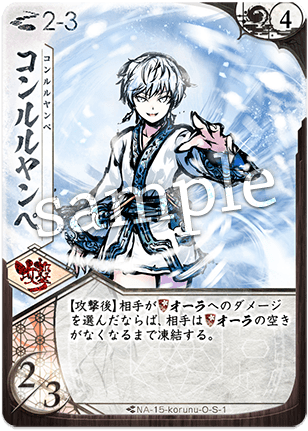](../assets/images/card/cards/na_15_o_s/na_15_o_s_1.png){ .glightbox  }

    -   [:external-link: 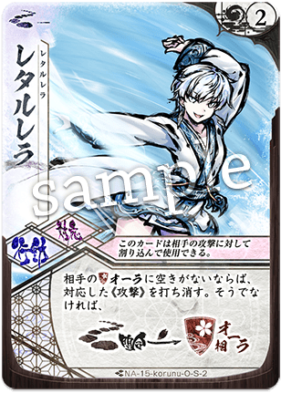](../assets/images/card/cards/na_15_o_s/na_15_o_s_2.png){ .glightbox  }

    -   [:external-link: 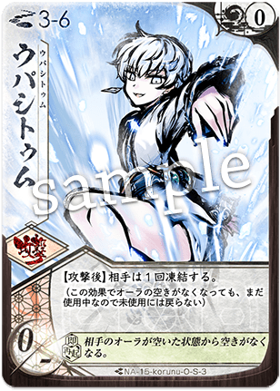](../assets/images/card/cards/na_15_o_s/na_15_o_s_3.png){ .glightbox  }

    -   [:external-link: 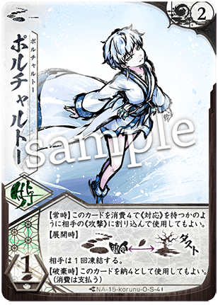](../assets/images/card/cards/na_15_o_s/na_15_o_s_4.png){ .glightbox  }

    

## ヤツハ {: #yatsuha }

=== "オリジン"

    ### 通常札

    

    -   [:external-link: 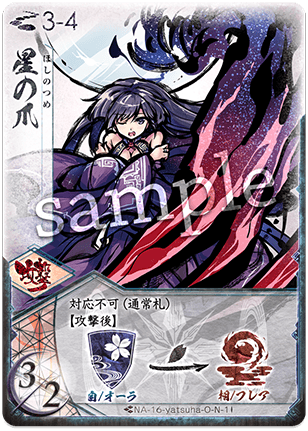](../assets/images/card/cards/na_16_o_n/na_16_o_n_1.png){ .glightbox  }

    -   [:external-link: 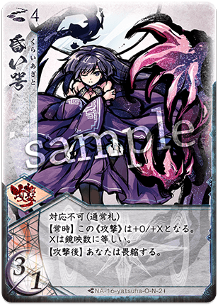](../assets/images/card/cards/na_16_o_n/na_16_o_n_2.png){ .glightbox  }

    -   [:external-link: 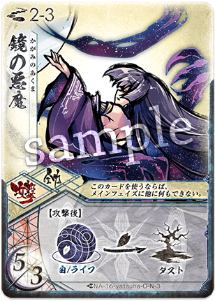](../assets/images/card/cards/na_16_o_n/na_16_o_n_3.png){ .glightbox  }

    -   [:external-link: 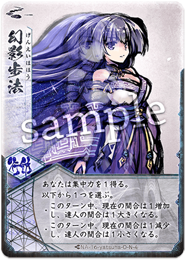](../assets/images/card/cards/na_16_o_n/na_16_o_n_4.png){ .glightbox  }

    -   [:external-link: 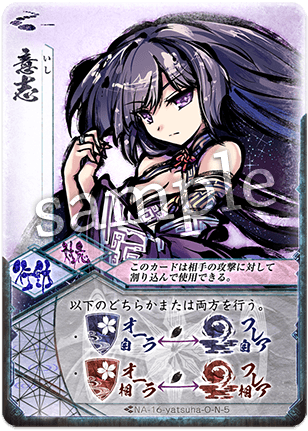](../assets/images/card/cards/na_16_o_n/na_16_o_n_5.png){ .glightbox  }

    -   [:external-link: 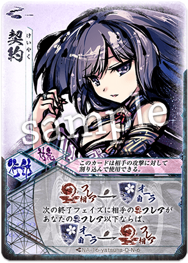](../assets/images/card/cards/na_16_o_n/na_16_o_n_6.png){ .glightbox  }

    -   [:external-link: 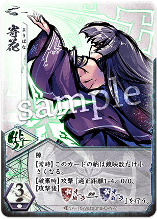](../assets/images/card/cards/na_16_o_n/na_16_o_n_7.png){ .glightbox  }

    

    ### 切札

    

    -   [:external-link: 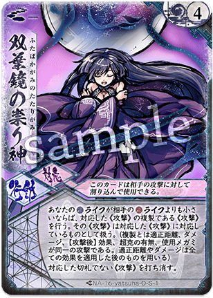](../assets/images/card/cards/na_16_o_s/na_16_o_s_1.png){ .glightbox  }

    -   [:external-link: 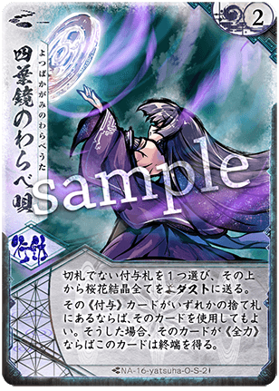](../assets/images/card/cards/na_16_o_s/na_16_o_s_2.png){ .glightbox  }

    -   [:external-link: 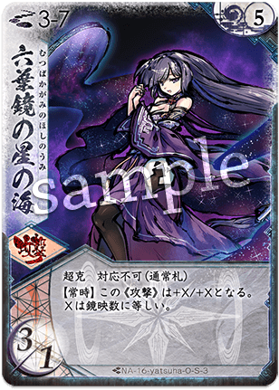](../assets/images/card/cards/na_16_o_s/na_16_o_s_3.png){ .glightbox  }

    -   [:external-link: 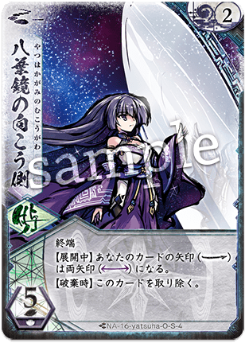](../assets/images/card/cards/na_16_o_s/na_16_o_s_4.png){ .glightbox  }

    

## ハツミ {: #hatsumi }

=== "オリジン"

    ### 通常札

    

    -   [:external-link: 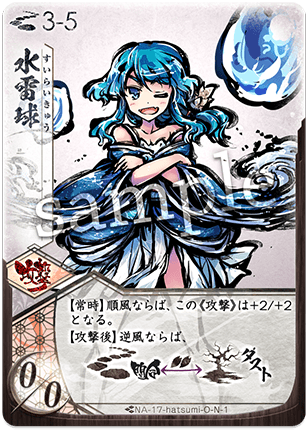](../assets/images/card/cards/na_17_o_n/na_17_o_n_1.png){ .glightbox  }

    -   [:external-link: 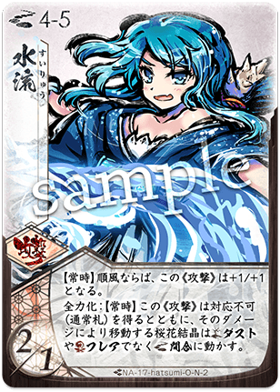](../assets/images/card/cards/na_17_o_n/na_17_o_n_2.png){ .glightbox  }

    -   [:external-link: 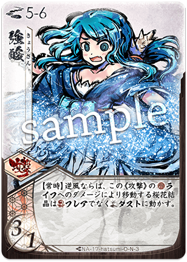](../assets/images/card/cards/na_17_o_n/na_17_o_n_3.png){ .glightbox  }

    -   [:external-link: 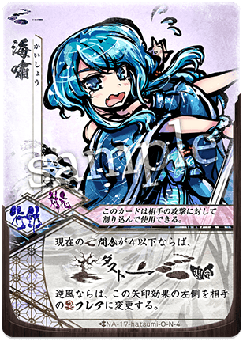](../assets/images/card/cards/na_17_o_n/na_17_o_n_4.png){ .glightbox  }

    -   [:external-link: 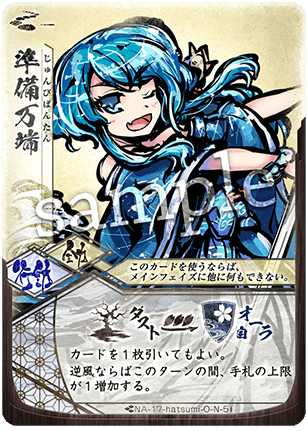](../assets/images/card/cards/na_17_o_n/na_17_o_n_5.png){ .glightbox  }

    -   [:external-link: 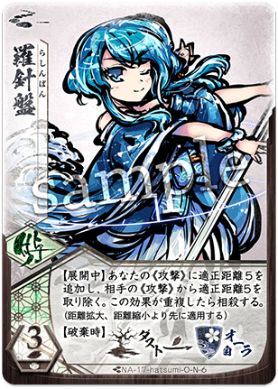](../assets/images/card/cards/na_17_o_n/na_17_o_n_6.png){ .glightbox  }

    -   [:external-link: 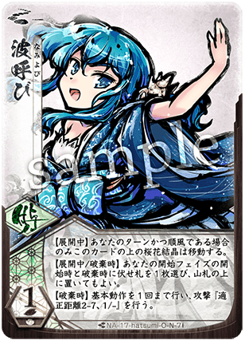](../assets/images/card/cards/na_17_o_n/na_17_o_n_7.png){ .glightbox  }

    

    ### 切札

    

    -   [:external-link: 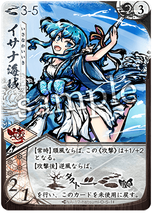](../assets/images/card/cards/na_17_o_s/na_17_o_s_1.png){ .glightbox  }

    -   [:external-link: 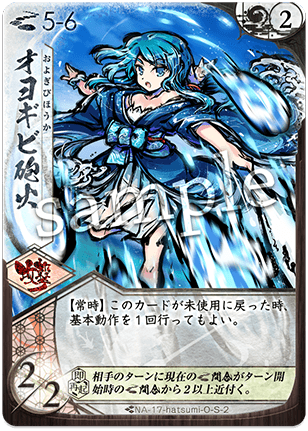](../assets/images/card/cards/na_17_o_s/na_17_o_s_2.png){ .glightbox  }

    -   [:external-link: 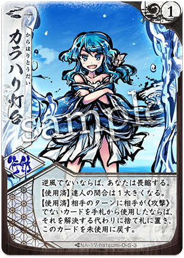](../assets/images/card/cards/na_17_o_s/na_17_o_s_3.png){ .glightbox  }

    -   [:external-link: 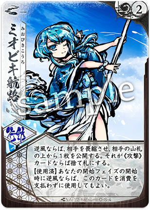](../assets/images/card/cards/na_17_o_s/na_17_o_s_4.png){ .glightbox  }

    

## ミズキ {: #mizuki }

=== "オリジン"

    ### 通常札

    

    -   [:external-link: 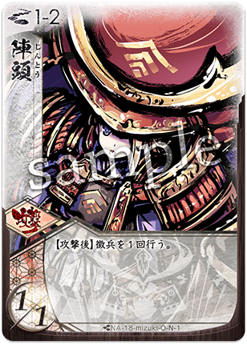](../assets/images/card/cards/na_18_o_n/na_18_o_n_1.png){ .glightbox  }

    -   [:external-link: 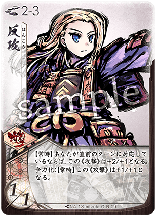](../assets/images/card/cards/na_18_o_n/na_18_o_n_2.png){ .glightbox  }

    -   [:external-link: 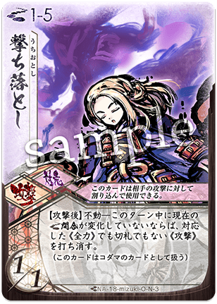](../assets/images/card/cards/na_18_o_n/na_18_o_n_3.png){ .glightbox  }

    -   [:external-link: 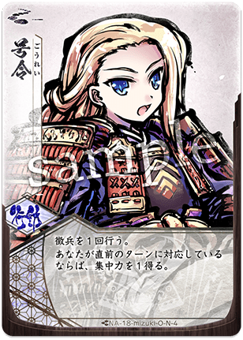](../assets/images/card/cards/na_18_o_n/na_18_o_n_4.png){ .glightbox  }

    -   [:external-link: 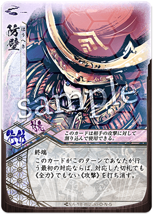](../assets/images/card/cards/na_18_o_n/na_18_o_n_5.png){ .glightbox  }

    -   [:external-link: 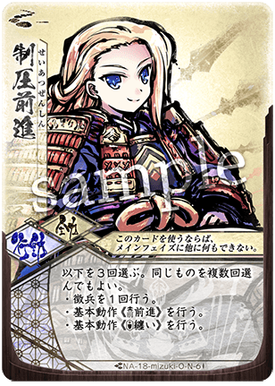](../assets/images/card/cards/na_18_o_n/na_18_o_n_6.png){ .glightbox  }

    -   [:external-link: 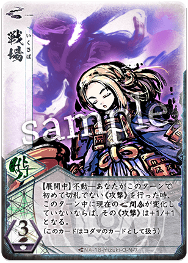](../assets/images/card/cards/na_18_o_n/na_18_o_n_7.png){ .glightbox  }

    

    ### 切札

    

    -   [:external-link: 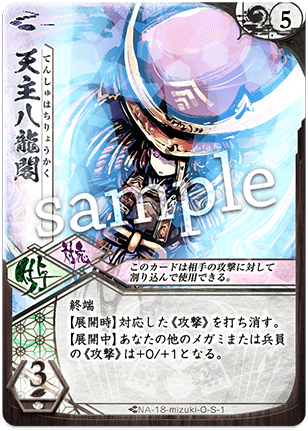](../assets/images/card/cards/na_18_o_s/na_18_o_s_1.png){ .glightbox  }

    -   [:external-link: 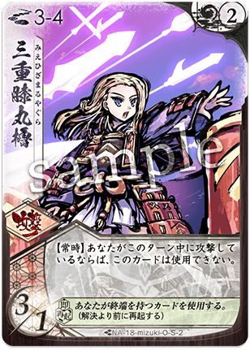](../assets/images/card/cards/na_18_o_s/na_18_o_s_2.png){ .glightbox  }

    -   [:external-link: 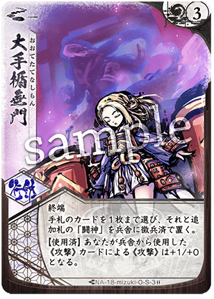](../assets/images/card/cards/na_18_o_s/na_18_o_s_3.png){ .glightbox  }

    -   [:external-link: 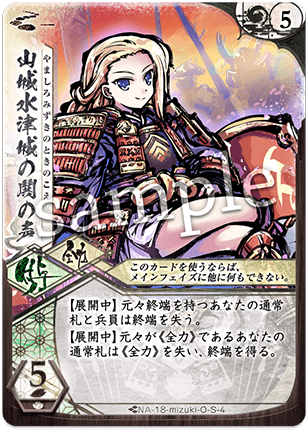](../assets/images/card/cards/na_18_o_s/na_18_o_s_4.png){ .glightbox  }

    

## メグミ {: #megumi }

=== "オリジン"

    ### 通常札

    

    -   [:external-link: 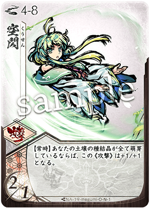](../assets/images/card/cards/na_19_o_n/na_19_o_n_1.png){ .glightbox  }

    -   [:external-link: 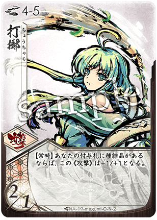](../assets/images/card/cards/na_19_o_n/na_19_o_n_2.png){ .glightbox  }

    -   [:external-link: 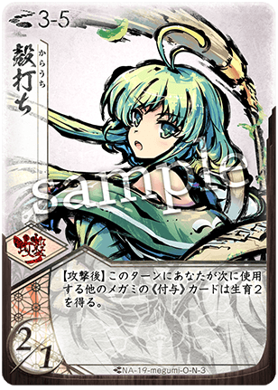](../assets/images/card/cards/na_19_o_n/na_19_o_n_3.png){ .glightbox  }

    -   [:external-link: 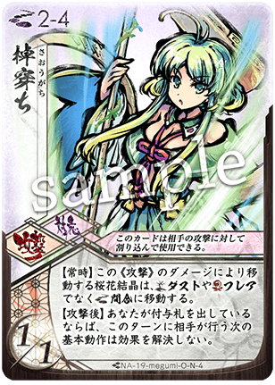](../assets/images/card/cards/na_19_o_n/na_19_o_n_4.png){ .glightbox  }

    -   [:external-link: 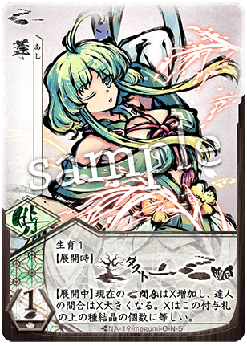](../assets/images/card/cards/na_19_o_n/na_19_o_n_5.png){ .glightbox  }

    -   [:external-link: 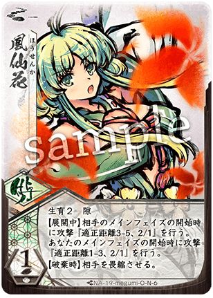](../assets/images/card/cards/na_19_o_n/na_19_o_n_6.png){ .glightbox  }

    -   [:external-link: 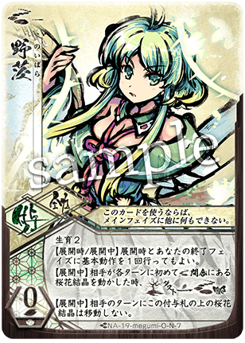](../assets/images/card/cards/na_19_o_n/na_19_o_n_7.png){ .glightbox  }

    

    ### 切札

    

    -   [:external-link: 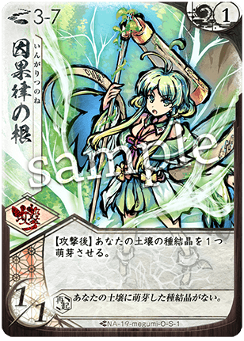](../assets/images/card/cards/na_19_o_s/na_19_o_s_1.png){ .glightbox  }

    -   [:external-link: 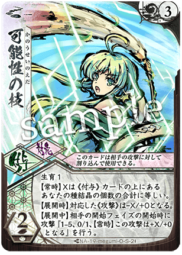](../assets/images/card/cards/na_19_o_s/na_19_o_s_2.png){ .glightbox  }

    -   [:external-link: 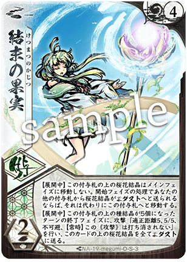](../assets/images/card/cards/na_19_o_s/na_19_o_s_3.png){ .glightbox  }

    -   [:external-link: 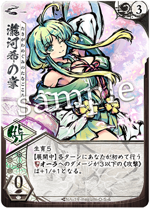](../assets/images/card/cards/na_19_o_s/na_19_o_s_4.png){ .glightbox  }

    

## カナヱ {: #kanawe }

=== "オリジン"

    ### 通常札

    

    -   [:external-link: 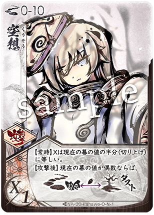](../assets/images/card/cards/na_20_o_n/na_20_o_n_1.png){ .glightbox  }

    -   [:external-link: 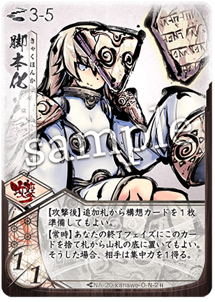](../assets/images/card/cards/na_20_o_n/na_20_o_n_2.png){ .glightbox  }

    -   [:external-link: 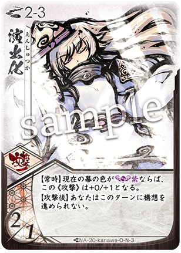](../assets/images/card/cards/na_20_o_n/na_20_o_n_3.png){ .glightbox  }

    -   [:external-link: 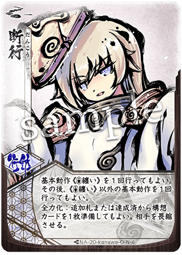](../assets/images/card/cards/na_20_o_n/na_20_o_n_4.png){ .glightbox  }

    -   [:external-link: 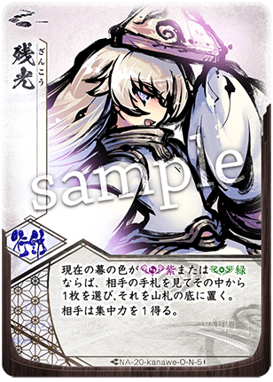](../assets/images/card/cards/na_20_o_n/na_20_o_n_5.png){ .glightbox  }

    -   [:external-link: 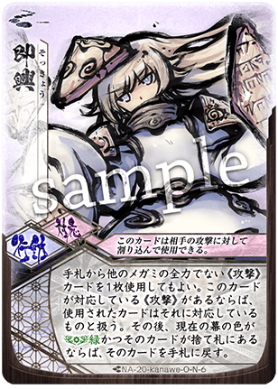](../assets/images/card/cards/na_20_o_n/na_20_o_n_6.png){ .glightbox  }

    -   [:external-link: 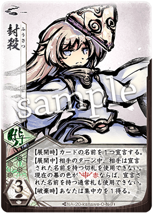](../assets/images/card/cards/na_20_o_n/na_20_o_n_7.png){ .glightbox  }

    

    ### 切札

    

    -   [:external-link: 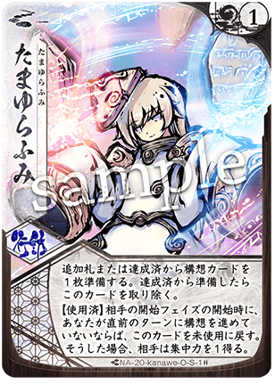](../assets/images/card/cards/na_20_o_s/na_20_o_s_1.png){ .glightbox  }

    -   [:external-link: 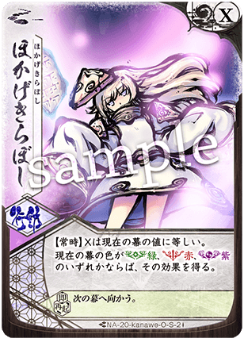](../assets/images/card/cards/na_20_o_s/na_20_o_s_2.png){ .glightbox  }

    -   [:external-link: 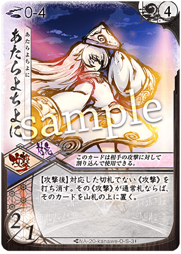](../assets/images/card/cards/na_20_o_s/na_20_o_s_3.png){ .glightbox  }

    -   [:external-link: 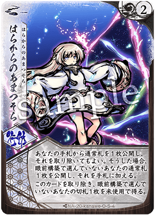](../assets/images/card/cards/na_20_o_s/na_20_o_s_4.png){ .glightbox  }

    

## カムヰ {: #kamui }

=== "オリジン"

    ### 通常札

    

    -   [:external-link: 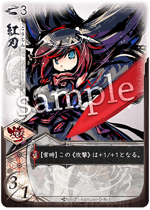](../assets/images/card/cards/na_21_o_n/na_21_o_n_1.png){ .glightbox  }

    -   [:external-link: 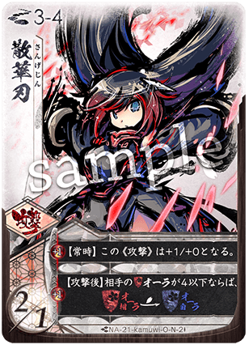](../assets/images/card/cards/na_21_o_n/na_21_o_n_2.png){ .glightbox  }

    -   [:external-link: 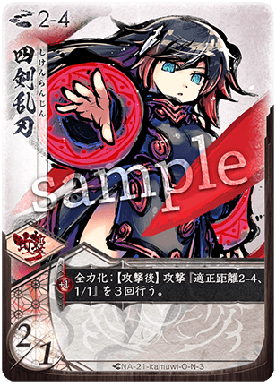](../assets/images/card/cards/na_21_o_n/na_21_o_n_3.png){ .glightbox  }

    -   [:external-link: 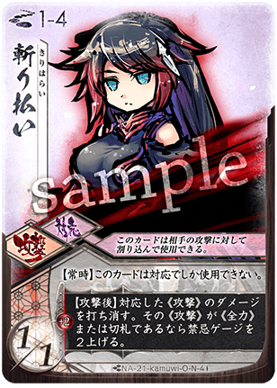](../assets/images/card/cards/na_21_o_n/na_21_o_n_4.png){ .glightbox  }

    -   [:external-link: 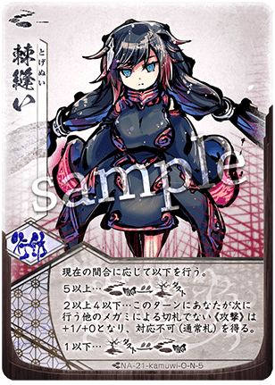](../assets/images/card/cards/na_21_o_n/na_21_o_n_5.png){ .glightbox  }

    -   [:external-link: 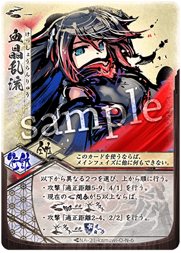](../assets/images/card/cards/na_21_o_n/na_21_o_n_6.png){ .glightbox  }

    -   [:external-link: 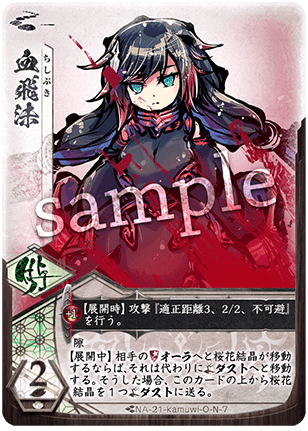](../assets/images/card/cards/na_21_o_n/na_21_o_n_7.png){ .glightbox  }

    

    ### 切札

    

    -   [:external-link: 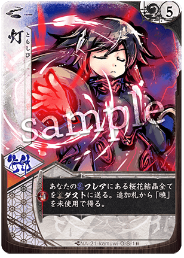](../assets/images/card/cards/na_21_o_s/na_21_o_s_1.png){ .glightbox  }

    -   [:external-link: 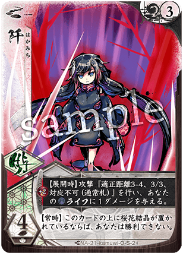](../assets/images/card/cards/na_21_o_s/na_21_o_s_2.png){ .glightbox  }

    -   [:external-link: 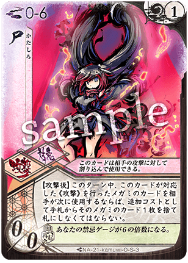](../assets/images/card/cards/na_21_o_s/na_21_o_s_3.png){ .glightbox  }

    -   [:external-link: 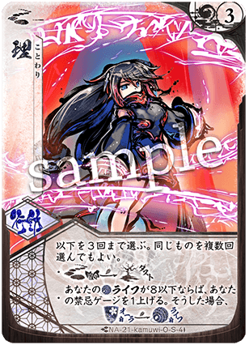](../assets/images/card/cards/na_21_o_s/na_21_o_s_4.png){ .glightbox  }

    

## レンリ {: #renri }

=== "オリジン"

    ### 通常札

    

    -   [:external-link: 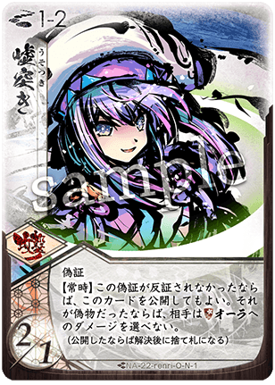](../assets/images/card/cards/na_22_o_n/na_22_o_n_1.png){ .glightbox  }

    -   [:external-link: 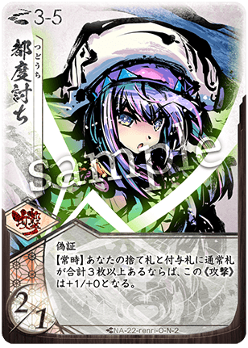](../assets/images/card/cards/na_22_o_n/na_22_o_n_2.png){ .glightbox  }

    -   [:external-link: 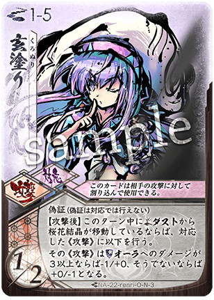](../assets/images/card/cards/na_22_o_n/na_22_o_n_3.png){ .glightbox  }

    -   [:external-link: 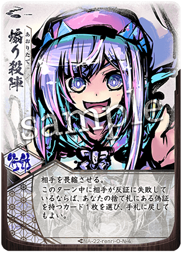](../assets/images/card/cards/na_22_o_n/na_22_o_n_4.png){ .glightbox  }

    -   [:external-link: 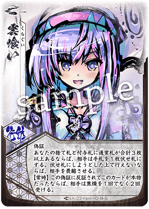](../assets/images/card/cards/na_22_o_n/na_22_o_n_5.png){ .glightbox  }

    -   [:external-link: 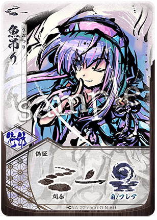](../assets/images/card/cards/na_22_o_n/na_22_o_n_6.png){ .glightbox  }

    -   [:external-link: 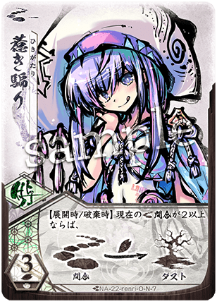](../assets/images/card/cards/na_22_o_n/na_22_o_n_7.png){ .glightbox  }

    

    ### 切札

    

    -   [:external-link: 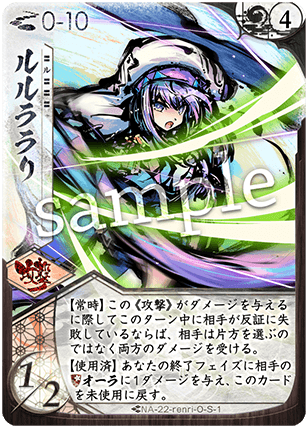](../assets/images/card/cards/na_22_o_s/na_22_o_s_1.png){ .glightbox  }

    -   [:external-link: 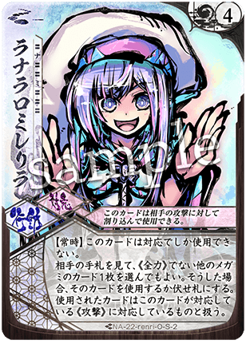](../assets/images/card/cards/na_22_o_s/na_22_o_s_2.png){ .glightbox  }

    -   [:external-link: 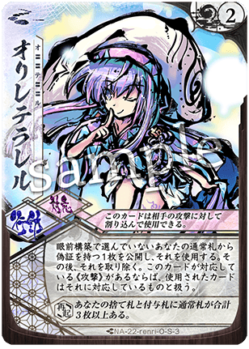](../assets/images/card/cards/na_22_o_s/na_22_o_s_3.png){ .glightbox  }

    -   [:external-link: 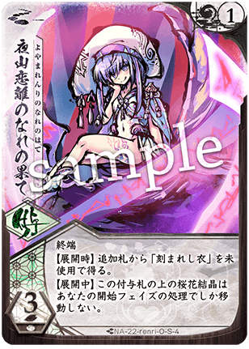](../assets/images/card/cards/na_22_o_s/na_22_o_s_4.png){ .glightbox  }

    

## アキナ {: #akina }

=== "オリジン"

    ### 通常札

    

    -   [:external-link: 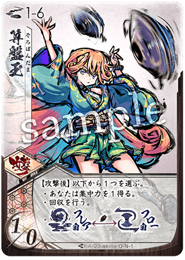](../assets/images/card/cards/na_23_o_n/na_23_o_n_1.png){ .glightbox  }

    -   [:external-link: 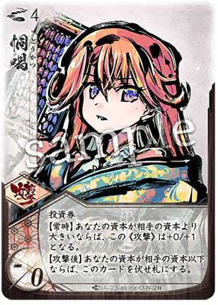](../assets/images/card/cards/na_23_o_n/na_23_o_n_2.png){ .glightbox  }

    -   [:external-link: 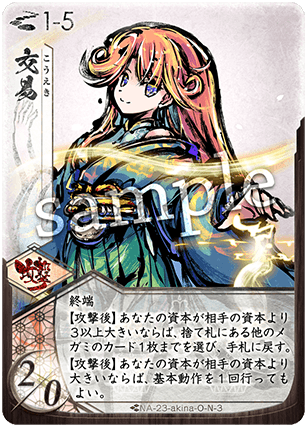](../assets/images/card/cards/na_23_o_n/na_23_o_n_3.png){ .glightbox  }

    -   [:external-link: 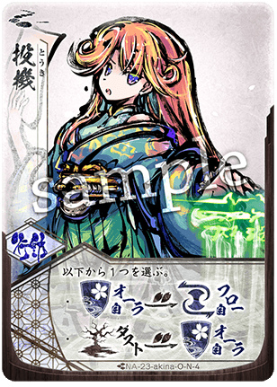](../assets/images/card/cards/na_23_o_n/na_23_o_n_4.png){ .glightbox  }

    -   [:external-link: 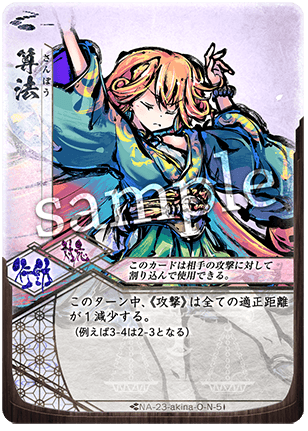](../assets/images/card/cards/na_23_o_n/na_23_o_n_5.png){ .glightbox  }

    -   [:external-link: 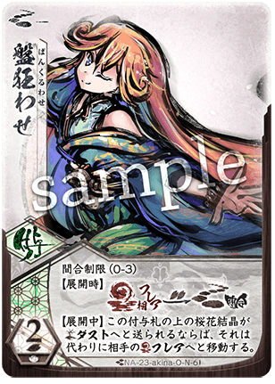](../assets/images/card/cards/na_23_o_n/na_23_o_n_6.png){ .glightbox  }

    -   [:external-link: 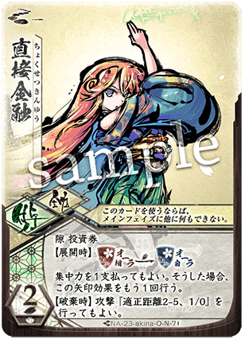](../assets/images/card/cards/na_23_o_n/na_23_o_n_7.png){ .glightbox  }

    

    ### 切札

    

    -   [:external-link: 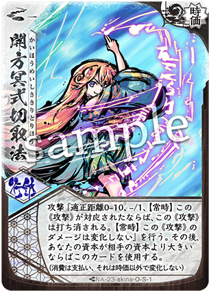](../assets/images/card/cards/na_23_o_s/na_23_o_s_1.png){ .glightbox  }

    -   [:external-link: 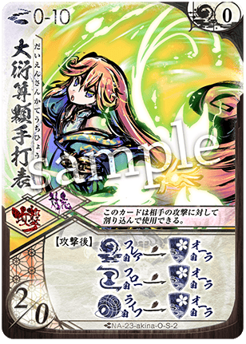](../assets/images/card/cards/na_23_o_s/na_23_o_s_2.png){ .glightbox  }

    -   [:external-link: 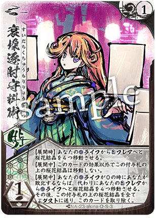](../assets/images/card/cards/na_23_o_s/na_23_o_s_3.png){ .glightbox  }

    -   [:external-link: 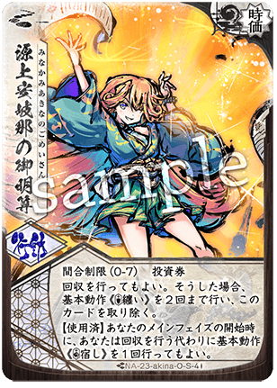](../assets/images/card/cards/na_23_o_s/na_23_o_s_4.png){ .glightbox  }

    

## シスイ {: #shisui }

=== "オリジン"

    ### 通常札

    

    -   [:external-link: 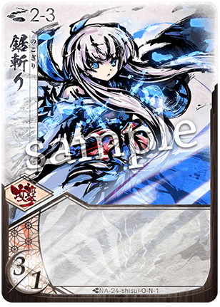](../assets/images/card/cards/na_24_o_n/na_24_o_n_1.png){ .glightbox  }

    -   [:external-link: 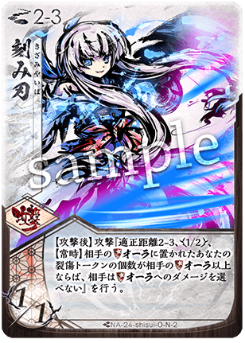](../assets/images/card/cards/na_24_o_n/na_24_o_n_2.png){ .glightbox  }

    -   [:external-link: 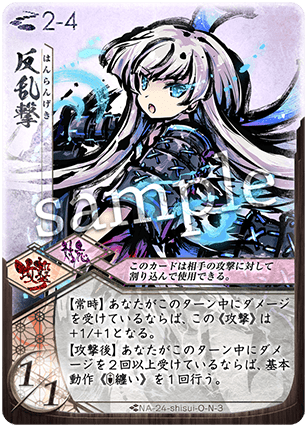](../assets/images/card/cards/na_24_o_n/na_24_o_n_3.png){ .glightbox  }

    -   [:external-link: 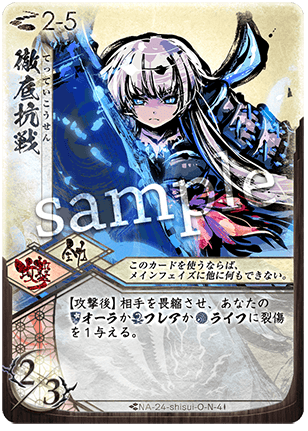](../assets/images/card/cards/na_24_o_n/na_24_o_n_4.png){ .glightbox  }

    -   [:external-link: 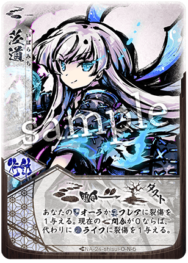](../assets/images/card/cards/na_24_o_n/na_24_o_n_5.png){ .glightbox  }

    -   [:external-link: 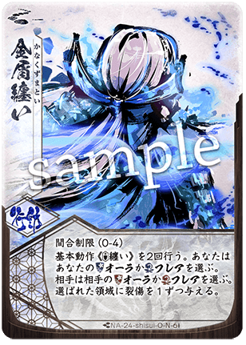](../assets/images/card/cards/na_24_o_n/na_24_o_n_6.png){ .glightbox  }

    -   [:external-link: 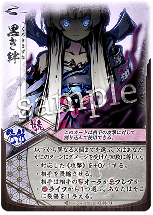](../assets/images/card/cards/na_24_o_n/na_24_o_n_7.png){ .glightbox  }

    

    ### 切札

    

    -   [:external-link: 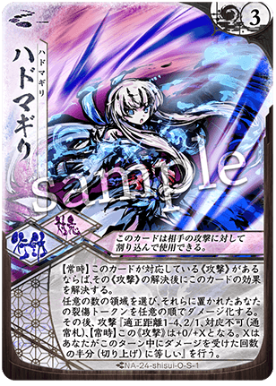](../assets/images/card/cards/na_24_o_s/na_24_o_s_1.png){ .glightbox  }

    -   [:external-link: 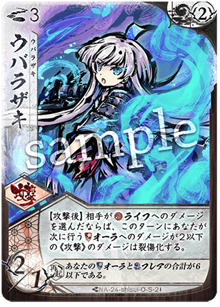](../assets/images/card/cards/na_24_o_s/na_24_o_s_2.png){ .glightbox  }

    -   [:external-link: 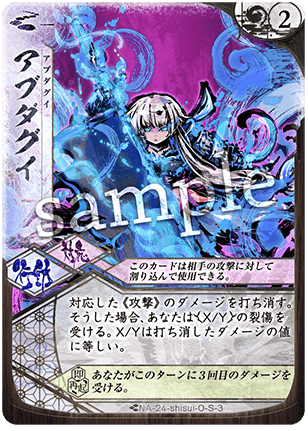](../assets/images/card/cards/na_24_o_s/na_24_o_s_3.png){ .glightbox  }

    -   [:external-link: 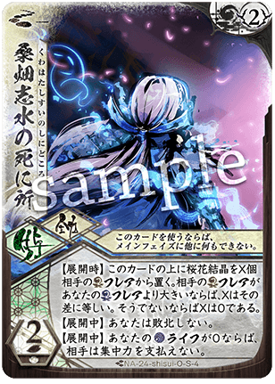](../assets/images/card/cards/na_24_o_s/na_24_o_s_4.png){ .glightbox  }

    

